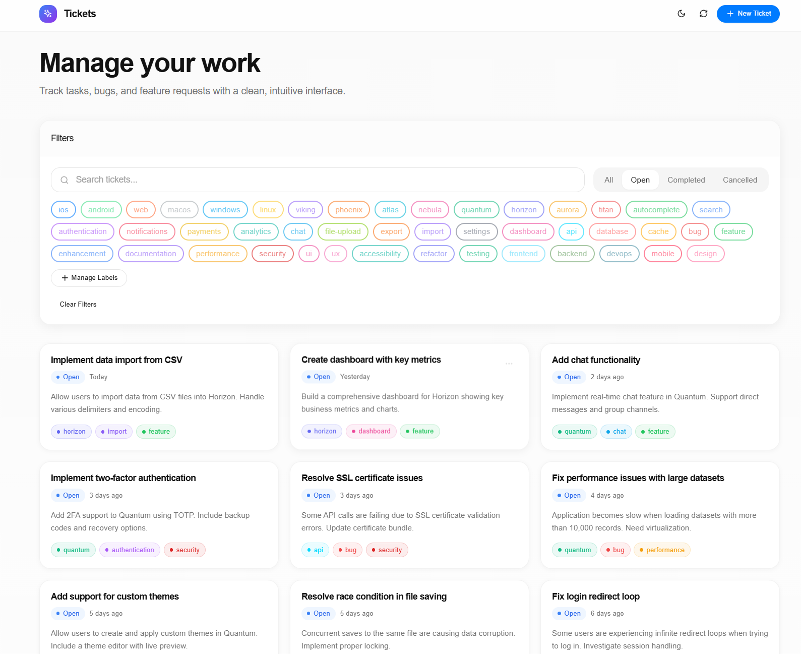

# AI-Coding-ZeroToOne
AI辅助编程-走向全能独立开发者

## week01 - AI 工具实践与全栈项目开发

### AI 工具学习
- **NotebookLM**：资料搜索、智能对话、Studio 工作台使用
- **Cursor**：AI 辅助编程工具
- **Trae**：AI 辅助编程工具

### 项目实战：Project Alpha - Ticket 标签管理系统

**技术栈**：
- 后端：FastAPI + PostgreSQL + Alembic
- 前端：React + TypeScript + Vite + Tailwind CSS + Shadcn/UI
- API 规范：RESTful

**核心功能**：
- Ticket 完整生命周期管理（创建/编辑/删除/完成/取消完成）
- 标签系统（创建/关联/筛选）
- 多维度筛选与搜索（按标签、按标题、按状态）
- 分页与排序支持

**项目亮点**：
- 完整的需求文档（由多个 AI 模型生成详细规格）
- 分阶段开发计划（Phase 1-5）
- 数据库迁移管理（Alembic）
- 完整的测试覆盖
- 50 个 meaningful 的 seed 数据
- 前后端分离架构
- 响应式 UI 设计


**文档与规格**：
- 详细的 ER 图与数据库设计
- 完整的 API 接口文档
- 前端组件设计规范
- 分阶段实施计划

**项目效果截图**:



## week02 - SpecKit 工作流实践 & LLM 集成

### SpecKit 工作流学习
完整实践 AI 辅助开发的标准化工作流程：
- **Constitution**: 定义项目原则和技术规范
- **Spec**: 编写功能规格说明书（User Stories + Acceptance Criteria）
- **Plan**: 技术选型、架构设计、API 契约、数据模型
- **Task**: 自动化任务拆解（7 个阶段、63 个任务）
- **Implement**: 分阶段实施与代码生成

### 前端设计系统
深度学习 MotherDuck 设计风格：
- **Design Tokens**: Duck Blue (#1A2B6B)、Duck Orange (#F4820A)、Yellow accent (#FFE234)
- **Typography**: DM Sans (UI) + DM Mono (代码)
- **Components**: 自定义卡片、按钮、表单样式
- **Monaco Editor**: 自定义 SQL 语法高亮主题

### 项目实战：Database Query Tool

**技术栈**：
- 后端：FastAPI + SQLAlchemy + sqlglot + Pydantic + Deepseek API
- 前端：React 19 + Vite + Tailwind CSS + Ant Design + Monaco Editor
- 存储：SQLite（元数据缓存）+ PostgreSQL（目标数据库）
- API 规范：RESTful + camelCase 响应格式

**核心功能**：
1. **数据库连接管理**：添加/删除/列出 PostgreSQL 连接
2. **元数据浏览器**：查看表、视图、列信息（类型、约束等）
3. **SQL 查询执行**：Monaco 编辑器 + 结果分页展示
4. **自然语言转 SQL**：基于 Deepseek API，支持中英文查询

**技术亮点**：
- SQL 安全验证（仅允许 SELECT，自动添加 LIMIT 1000）
- 元数据缓存（SQLite 持久化，减少数据库查询）
- 连接 URL 脱敏（API 响应隐藏凭据）
- 全局错误处理与用户友好提示
- 响应式布局（移动端适配）
- 自定义 Monaco SQL 语法高亮主题

**项目结构**：
```
week02/db_query/
├── backend/           # FastAPI 后端
│   ├── src/api/       # API 端点
│   ├── src/services/  # 业务逻辑
│   ├── src/models/    # Pydantic 模型
│   └── src/db/        # SQLite 存储
├── frontend/          # React 前端
│   ├── src/components/  # 可复用组件
│   ├── src/pages/       # 页面组件
│   └── src/services/    # API 客户端
└── specs/001-db-query/  # 完整规格文档
```

**文档与规格**：
- 完整的用户故事与验收标准
- 详细的 ER 图与数据模型设计
- API 契约文档
- 分阶段实施计划（Phase 1-7）
- 快速开始指南

**项目效果截图**:


## week03


## week04


## week05


## week06


## week07


## week08


