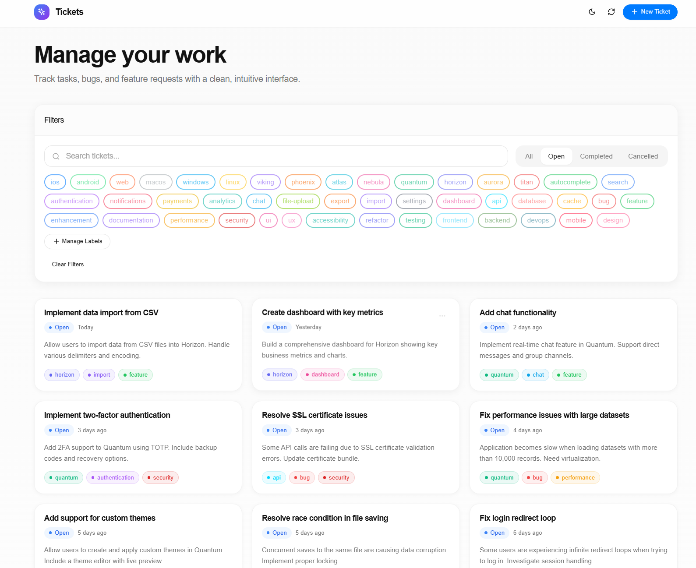
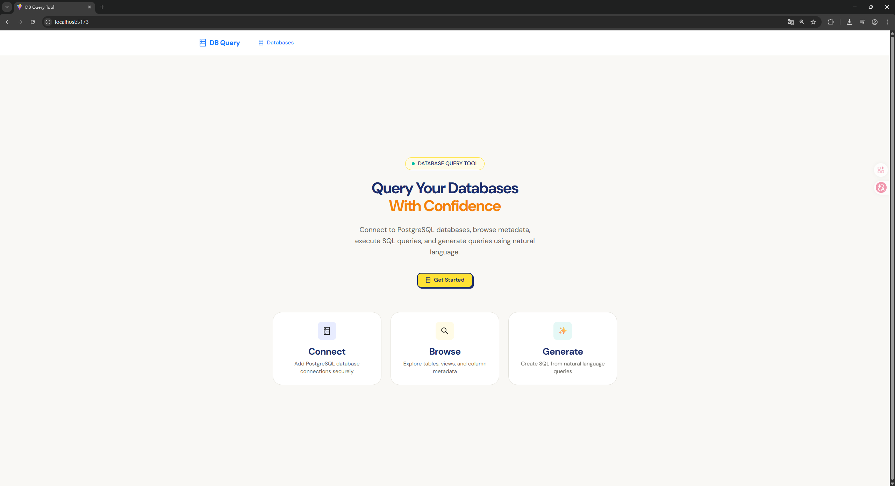

# AI-Coding-ZeroToOne
AI辅助编程-走向全能独立开发者

## week01 - AI 工具实践与全栈项目开发

### AI 工具学习
- **NotebookLM**：资料搜索、智能对话、Studio 工作台使用
- **Cursor**：AI 辅助编程工具
- **Trae**：AI 辅助编程工具

### 项目实战：Project Alpha - Ticket 标签管理系统

**技术栈**：
- 后端：FastAPI + PostgreSQL + Alembic
- 前端：React + TypeScript + Vite + Tailwind CSS + Shadcn/UI
- API 规范：RESTful

**核心功能**：
- Ticket 完整生命周期管理（创建/编辑/删除/完成/取消完成）
- 标签系统（创建/关联/筛选）
- 多维度筛选与搜索（按标签、按标题、按状态）
- 分页与排序支持

**项目亮点**：
- 完整的需求文档（由多个 AI 模型生成详细规格）
- 分阶段开发计划（Phase 1-5）
- 数据库迁移管理（Alembic）
- 完整的测试覆盖
- 50 个 meaningful 的 seed 数据
- 前后端分离架构
- 响应式 UI 设计


**文档与规格**：
- 详细的 ER 图与数据库设计
- 完整的 API 接口文档
- 前端组件设计规范
- 分阶段实施计划

**项目效果截图**:



## week02 - SpecKit 工作流实践 & LLM 集成

### SpecKit 工作流学习
完整实践 AI 辅助开发的标准化工作流程：
- **Constitution**: 定义项目原则和技术规范
- **Spec**: 编写功能规格说明书（User Stories + Acceptance Criteria）
- **Plan**: 技术选型、架构设计、API 契约、数据模型
- **Task**: 自动化任务拆解（7 个阶段、63 个任务）
- **Implement**: 分阶段实施与代码生成

### 前端设计系统
深度学习 MotherDuck 设计风格：
- **Design Tokens**: Duck Blue (#1A2B6B)、Duck Orange (#F4820A)、Yellow accent (#FFE234)
- **Typography**: DM Sans (UI) + DM Mono (代码)
- **Components**: 自定义卡片、按钮、表单样式
- **Monaco Editor**: 自定义 SQL 语法高亮主题

### 项目实战：Database Query Tool

**技术栈**：
- 后端：FastAPI + SQLAlchemy + sqlglot + Pydantic + Deepseek API
- 前端：React 19 + Vite + Tailwind CSS + Ant Design + Monaco Editor
- 存储：SQLite（元数据缓存）+ PostgreSQL（目标数据库）
- API 规范：RESTful + camelCase 响应格式

**核心功能**：
1. **数据库连接管理**：添加/删除/列出 PostgreSQL 连接
2. **元数据浏览器**：查看表、视图、列信息（类型、约束等）
3. **SQL 查询执行**：Monaco 编辑器 + 结果分页展示
4. **自然语言转 SQL**：基于 Deepseek API，支持中英文查询

**技术亮点**：
- SQL 安全验证（仅允许 SELECT，自动添加 LIMIT 1000）
- 元数据缓存（SQLite 持久化，减少数据库查询）
- 连接 URL 脱敏（API 响应隐藏凭据）
- 全局错误处理与用户友好提示
- 响应式布局（移动端适配）
- 自定义 Monaco SQL 语法高亮主题

**项目结构**：
```
week02/db_query/
├── backend/           # FastAPI 后端
│   ├── src/api/       # API 端点
│   ├── src/services/  # 业务逻辑
│   ├── src/models/    # Pydantic 模型
│   └── src/db/        # SQLite 存储
├── frontend/          # React 前端
│   ├── src/components/  # 可复用组件
│   ├── src/pages/       # 页面组件
│   └── src/services/    # API 客户端
└── specs/001-db-query/  # 完整规格文档
```

**文档与规格**：
- 完整的用户故事与验收标准
- 详细的 ER 图与数据模型设计
- API 契约文档
- 分阶段实施计划（Phase 1-7）
- 快速开始指南

**项目效果截图**:



## week03 - 代码审查实践 & 架构改进设计

### 自定义代码审查 Command

借鉴 speckit.specify 命令结构，创建了针对 Python 和 TypeScript 代码的深度审查命令 `codereview.deep`。

**审查维度**：
- **架构和设计**：Python/TypeScript 最佳实践、接口设计、可扩展性
- **代码质量**：DRY、YAGNI、SOLID、KISS 原则
- **代码规范**：函数不超过 150 行、参数不超过 7 个

### 代码审查报告：Database Query Tool

使用 `/codereview.deep` 对 week02 项目进行深度审查：
[结果参考](specs/w3/0001-db-query-code-review-report.md)

### 增量功能开发实践

借助 speckit.task 实现 对新增功能 mysql support 的任务拆解与设计，形成 ./specs/002-mysql-support/ 目录下的 文件。

### 架构改进设计：可扩展数据库适配器

针对代码审查发现的扩展性问题，设计了完整的架构改进方案。

**设计目标**：
- **开闭原则 (OCP)**：添加新数据库只需新增适配器模块，无需修改现有代码
- **单一职责 (SRP)**：连接管理、元数据提取、查询执行职责分离
- **依赖倒置 (DIP)**：高层模块依赖抽象接口，不依赖具体实现

**核心设计模式**：

```
┌─────────────────────────────────────────────────────────────────┐
│                    Adapter Interface Layer                       │
│  ┌─────────────────────────────────────────────────────────────┐│
│  │              DatabaseAdapter (Abstract Base)                ││
│  │  ┌─────────────┐ ┌──────────────┐ ┌─────────────────────┐  ││
│  │  │IConnection  │ │ IMetadata    │ │ ISQLDialect         │  ││
│  │  │Adapter      │ │ Adapter      │ │                     │  ││
│  │  └─────────────┘ └──────────────┘ └─────────────────────┘  ││
│  └─────────────────────────────────────────────────────────────┘│
└─────────────────────────────────────────────────────────────────┘
            │                     │                    │
            ▼                     ▼                    ▼
┌─────────────────────────────────────────────────────────────────┐
│  ┌────────────┐  ┌────────────┐  ┌────────────┐  ┌───────────┐  │
│  │MySQLAdapter│  │SQLiteAdapt │  │PostgresAdpt│  │OracleAdapt│  │
│  └────────────┘  └────────────┘  └────────────┘  └───────────┘  │
└─────────────────────────────────────────────────────────────────┘
```

**架构改进文档**：
- [当前架构分析](specs/w3/db-query-architecture-improvement/01-current-analysis.md)
- [SOLID 原则应用](specs/w3/db-query-architecture-improvement/02-design-principles.md)
- [核心接口设计](specs/w3/db-query-architecture-improvement/03-interface-design.md)
- [适配器模式实现](specs/w3/db-query-architecture-improvement/04-adapter-pattern.md)
- [注册表模式](specs/w3/db-query-architecture-improvement/05-registry-pattern.md)
- [实现指南](specs/w3/db-query-architecture-improvement/06-implementation-guide.md)
- [迁移计划](specs/w3/db-query-architecture-improvement/07-migration-plan.md)


## week04 - AI 驱动的大型代码库深度理解

### 主题概述

本周聚焦于**利用 AI 工具对大型代码库进行深度理解与架构分析**，探索在 AI 辅助编程时代，如何高效地阅读、分析和理解百万行级别的复杂代码系统。

### 核心理念

**"顶尖开发者从不'硬读'代码，他们'导航'代码"**

基于业界最佳实践研究 ([blog.md](week04/research/big-codebase-read-research/blog.md))，总结出 5 个核心方法论：

1. **动态探测优于静态阅读** - 将调试器作为"编译语言的 REPL"，通过条件断点和调用栈逆向追踪
2. **双向理解策略** - 架构设计"自上而下"，代码实现"自下而上"
3. **汇聚型组件设计** - 拥抱 Sinks 架构，远离 Pipes 级联，让 AI 友好成为架构标准
4. **数据是永恒的** - 通过数据库 Schema 和数据生命周期理解系统骨架
5. **手绘图表的魔力** - 利用空间记忆构建心理模型，对抗 IDE 的"隧道视野"

### 实战项目 1: OpenAI Codex CLI 深度分析

**研究对象**: [OpenAI Codex](https://github.com/openai/codex) - OpenAI 开发的命令行编码代理工具

**代码规模**: 
- Rust 核心：67 个 crate，15,315+ commits
- 开发周期：11 个月（2025.04 - 2026.03）
- 技术栈：Rust (核心) + TypeScript (包装器) + MCP 协议

**分析维度**:

#### 1. 架构分析 ([codex-arch.md](specs/w4/codex-arch.md))

**整体架构**:
```
用户界面层 (CLI/TUI/SDK/IDE) 
    ↓
协议层 (JSON-RPC/MCP/JSONL)
    ↓
核心引擎层 (Codex Core/Thread Manager/Agent)
    ↓
工具系统 (Tool Router/Registry/Handlers)
    ↓
安全沙箱层 (Seatbelt/Landlock/Windows Sandbox)
    ↓
外部服务 (OpenAI API/MCP Servers/FileSystem/Shell)
```

**技术亮点**:
- **分层架构**: 清晰的职责分离，支持多种前端界面
- **工具系统**: 基于 `ToolHandler` trait 的可扩展设计
- **沙箱安全**: 跨平台沙箱支持 (macOS Seatbelt/Linux Landlock/Windows Sandbox)
- **MCP 集成**: 支持 Model Context Protocol 生态
- **异步优先**: 基于 Tokio 的完全异步架构

#### 2. 代码演进脉络 ([codex-changes.md](specs/w4/codex-changes.md))

**7 个发展阶段**:
1. **项目初始化** (2025.04) - TypeScript CLI 框架
2. **功能快速扩展** (2025.04-05) - 重试机制、Docker 支持
3. **Rust 重构期** (2025.05-06) - 核心重写为 Rust
4. **多代理协作** (2025.07-09) - Multi-Agent/Sub-agent 架构
5. **App Server 扩展** (2025.09-11) - Thread API、事件重放
6. **记忆与智能** (2025.11-2026.02) - Memory Rollout、遗忘机制
7. **TUI 增强** (2026.01-03) - 实时音频、语音转录

**关键洞察**:
- 平均每日 40-50 个 commits，高强度迭代
- 从 TypeScript 到 Rust 的架构升级
- 记忆系统成为智能演进核心

#### 3. 事件循环机制 ([codex-event-loop.md](specs/w4/codex-event-loop.md))

**四层嵌套循环**:
```
submission_loop (事件分发循环)
    └─ run_turn (Turn 执行循环)
        └─ run_sampling_request (采样请求循环)
            └─ run_agent_job_loop (批量任务循环)
```

**核心流程**:
1. 用户任务 → submission_loop 接收
2. 创建 TurnContext → run_turn 启动
3. 流式 SSE 响应 → 工具调用 → needs_follow_up 判断
4. 迭代执行直到任务完成

**设计模式**:
- **事件驱动**: Tokio 异步运行时
- **流式处理**: SSE 处理 LLM 响应
- **迭代执行**: needs_follow_up 标志控制
- **取消支持**: CancellationToken 优雅取消

#### 4. 工具调用系统 ([codex-tool-call.md](specs/w4/codex-tool-call.md))

**分层架构**:
```
ToolRouter (工具路由器)
    ↓
ToolRegistry (工具注册表)
    ↓
ToolHandler Trait (工具处理器接口)
    ├─ Shell Handler
    ├─ ReadFile Handler
    ├─ MCP Handler
    ├─ Multi Agent Handler
    └─ Dynamic Tool Handler
```

**核心机制**:
- **工具发现**: 基于 `ToolHandler` trait 的自动注册
- **工具选择**: LLM 根据 JSON Schema 动态选择
- **并行执行**: 支持并发工具调用
- **沙箱审批**: 多层审批机制 (auto/approve_once/always_ask)

#### 5. apply_patch 工具深度解析 ([codex-apply-patch.md](specs/w4/codex-apply-patch.md))

**Patch 格式**:
```
*** Begin Patch
*** Add File: hello.txt
+Hello world
*** Update File: src/app.py
@@ def greet():
-    print("Hi")
+    print("Hello, world!")
*** Delete File: obsolete.txt
*** End Patch
```

**三种操作**:
| 操作 | 语法 | 说明 |
|------|------|------|
| Add File | `*** Add File: <path>` | 创建新文件 |
| Delete File | `*** Delete File: <path>` | 删除文件 |
| Update File | `*** Update File: <path>` | 修改文件 (支持重命名) |

**核心技术**:
- **智能文本匹配**: 4 级回退策略 (精确/rstrip/trim/Unicode 标准化)
- **安全性**: 独立 crate 设计，与核心系统隔离
- **GPT-4.1 优化**: 专用指令文件指导 AI 生成正确格式
- **测试覆盖**: 场景测试 + CLI 测试 + 工具测试

**集成指南** ([codex-apply-patch-integration.md](specs/w4/codex-apply-patch-integration.md)):
1. 引入 `apply-patch` crate
2. 定义 Patch 解析器
3. 实现文件变更应用逻辑
4. 集成沙箱审批机制

---

### 实战项目 2: Open Notebook 架构分析

**研究对象**: [Open Notebook](https://github.com/lfnovo/open-notebook) - 开源版 Google Notebook LM

**技术栈**:
| 层级 | 技术选型 |
|------|----------|
| 前端 | Next.js 16 + React 19 + Tailwind 4 + Shadcn/ui |
| 后端 | FastAPI (Python) + LangChain + LangGraph |
| 数据库 | SurrealDB v2 (图数据库 + 向量存储) |
| AI 抽象 | Esperanto (16+ AI 提供商支持) |
| 任务队列 | surreal-commands |

**核心功能**:
- 多模态内容导入 (PDF/视频/音频/网页)
- AI 对话系统 (基于知识库的语义搜索)
- 播客生成 (多说话人 TTS)
- 向量嵌入与语义检索

**架构分析** ([open-notebook-arch-design.md](specs/w4/open-notebook-arch-design.md)):

**三层架构**:
```
前端层 (Next.js)
  ├─ UI Components (Shadcn/ui)
  ├─ Pages (App Router)
  ├─ Hooks (TanStack Query)
  └─ Stores (Zustand)
    ↓
后端层 (FastAPI)
  ├─ 17 个 API 路由模块
  ├─ Service 业务逻辑层
  ├─ Domain 领域模型
  ├─ LangGraph AI 工作流
  └─ Async Commands 任务队列
    ↓
数据层 (SurrealDB)
  ├─ 向量存储
  └─ 图关系
```

**设计亮点**:
- **图数据库应用**: 利用 SurrealDB 的图能力表示知识关系
- **LangGraph 工作流**: 复杂的 AI 对话与搜索流程
- **多 AI 提供商**: 通过 Esperanto 抽象层支持 16+ 服务商
- **异步任务队列**: surreal-commands 处理耗时操作 (播客生成等)

---

### 研究方法论

#### 1. NotebookLM 探索

**探索 1**: 业界阅读大型代码库的最佳实践
- 调试器作为交互式探测器
- 数据流图 (DFD) 切入
- 手绘图表构建心理模型

**探索 2**: Claude Code 在代码分析中的应用
- 结合 AI 进行架构梳理
- 自动化文档生成
- 代码演进脉络分析

#### 2. Git 子模块管理

```bash
# 添加 Codex 子模块
git submodule add https://github.com/openai/codex venders/codex

# 添加 Open Notebook 子模块
git submodule add https://github.com/lfnovo/open-notebook venders/open-notebook
```

#### 3. 文档产出规范

所有分析文档统一存放在 `specs/w4/` 目录：
- 架构分析文档 (含 Mermaid 图表)
- 代码演进脉络 (基于 Git History)
- 核心机制深度解析 (事件循环/工具调用/apply_patch)
- 集成指南 (如何在自有项目中应用)

---

### 学习收获

1. **AI 时代的代码阅读方法论** - 从"静态阅读"到"动态探测"
2. **大型项目架构模式** - 分层架构、工具系统、沙箱安全
3. **事件驱动设计** - 多层嵌套循环、流式处理、取消机制
4. **可扩展工具系统** - 基于 Trait 的插件化设计
5. **图数据库应用** - SurrealDB 在知识管理中的实践
6. **AI 工作流编排** - LangGraph 在复杂对话中的应用
7. **代码演进分析** - 通过 Git History 理解项目发展

---

### 关键文档索引

**Codex 系列**:
- [架构分析](specs/w4/codex-arch.md) | [演进脉络](specs/w4/codex-changes.md)
- [事件循环](specs/w4/codex-event-loop.md) | [工具调用](specs/w4/codex-tool-call.md)
- [apply_patch](specs/w4/codex-apply-patch.md) | [集成指南](specs/w4/codex-apply-patch-integration.md)

**Open Notebook 系列**:
- [架构设计](specs/w4/open-notebook-arch-design.md)

**指令与方法论**:
- [研究指令](specs/w4/instructions.md)

---

### 项目效果

通过本周实践，掌握了在 AI 辅助下深度理解百万行级别代码库的系统方法，为后续复杂项目的开发与维护奠定了坚实基础。

## week05 - MCP 和 SKILL 开发实践

### PostgreSQL MCP 项目概述

PostgreSQL MCP Server（pg-mcp）是一个基于 MCP 协议的服务端应用，作为 AI 工具与 PostgreSQL 数据库之间的桥梁，支持自然语言查询、SQL 自动生成、安全校验和结果验证。

### 技术栈

| 技术 | 用途 |
|------|------|
| **FastMCP** | MCP 框架 |
| **Asyncpg** | 异步 PostgreSQL 驱动 |
| **SQLGlot** | SQL 解析与安全校验 |
| **Pydantic** | 数据验证 |
| **DeepSeek API** | LLM 服务 |

### 核心功能

1. **自然语言转 SQL** - 基于 DeepSeek 自动生成 SQL
2. **Schema 缓存** - 内存 + 文件双重缓存，可配置 TTL
3. **SQL 安全校验** - 只允许 SELECT，阻止注入和危险函数
4. **结果验证** - 可选 LLM 验证查询结果
5. **5 个 MCP 工具**：`pg_query`, `pg_list_databases`, `pg_describe_schema`, `pg_refresh_schema`, `pg_execute_sql`

### 项目结构

```
week05/pg-mcp/
├── src/pg_mcp/        # 源代码 (config, database, llm, security, models)
├── tests/             # 测试 (test_config, test_database, test_llm, test_security)
├── fixtures/          # 测试数据库 (small, medium, large)
├── config/            # 配置文件
└── pyproject.toml     # 项目配置
```

### 规格文档

完整的开发文档位于 `specs/w5/` 目录：
- [PRD](specs/w5/001-pg-mcp-prd.md) | [设计](specs/w5/002-pg-mcp-design.md) | [实现计划](specs/w5/003-pg-mcp-impl-plan.md)
- [任务清单](specs/w5/004-pg-mcp-tasks.md) (32 个任务) | [测试计划](specs/w5/005-pg-mcp-test-plan.md)

### 测试数据库

| 数据库 | 规模 | 用途 | 关键词 |
|--------|------|------|--------|
| **pg_mcp_test_small** | 5 表 | 博客系统 | post, comment, tag, author |
| **pg_mcp_test_medium** | 8 表 | 电商系统 | order, product, cart, payment |
| **pg_mcp_test_large** | 15+ 表 | ERP 系统 | employee, department, invoice, project |

### 安全特性

- ✅ 仅允许 SELECT 语句
- ✅ SQL 注入检测（语句链、注释、UNION 注入）
- ✅ 危险函数阻止（pg_read_file, pg_terminate_backend 等）
- ✅ 系统表阻止（pg_catalog, information_schema）
- ✅ 可配置的访问控制（白名单/黑名单）

### 开发进度

| Phase | 内容 | 状态 |
|-------|------|------|
| 1-5 | 基础设施 → MCP 工具接口 | ✅ 完成 |
| 6 | 测试与文档 | 🔄 进行中 |

### 学习收获

- MCP 协议实践 | AI 辅助开发全流程 | 数据库安全最佳实践 | 异步编程 | 分层架构设计

---

### pg-query Skill

基于 week05 项目创建的自定义 Skill，支持通过自然语言查询 PostgreSQL 数据库。

#### 使用方法

```bash
/pg-query <自然语言查询>
/pg-query <自然语言查询> --sql-only  # 仅返回 SQL，不执行
```

#### 数据库连接

- Host: localhost:5432, User: postgres, Password: 123456
- 可用数据库：`pg_mcp_test_small`, `pg_mcp_test_medium`, `pg_mcp_test_large`

#### 工作流程

1. **识别数据库** - 根据关键词自动选择目标数据库
2. **读取 Schema** - 从 `.claude/skills/pg-query/references/` 读取对应数据库结构
3. **生成 SQL** - 基于自然语言生成安全的 SELECT 语句
4. **安全验证** - 只允许 SELECT，阻止危险操作和 SQL 注入
5. **执行查询** - 使用 psql 执行（非 --sql-only 模式）
6. **评估结果** - 打分 0-10，<7 分则重试（最多 3 次）

---

## week06 - Agent SDK 开发与代码审查 Agent 实践

### 主题概述

本周聚焦于 **Agent SDK 的设计与实现**，以及基于 Agent SDK 构建实用的 **CodeReview Agent**。通过分析业界领先的 AI Coding Agent（Codex、OpenCode）源码，学习 System Prompt 设计和工具调用架构，并亲手实现一个可扩展的 Agent 框架。

### 核心学习内容

#### 1. 业界 Agent 源码分析

**Codex CLI (OpenAI)**：
- 多层次 System Prompt 架构（Base → Developer → User → Skill → Environment）
- 动态注入机制（权限策略、协作模式、个性化设置）
- 工具调用系统（Tool Router → Registry → Handler Trait）

**OpenCode**：
- 分层 Prompt 策略（根据模型动态选择 Prompt）
- 流式处理与异步架构
- MCP 协议集成

#### 2. System Prompt 设计模式

```
┌─────────────────────────────────────────────────────────────┐
│                   LLM Context Window                        │
├─────────────────────────────────────────────────────────────┤
│  BaseInstructions        - 模型基础身份和能力定义             │
│  DeveloperInstructions   - 运行时动态注入的配置               │
│  UserInstructions        - 来自 AGENTS.md 的用户指导         │
│  SkillInstructions       - 可用技能列表和使用指南             │
│  EnvironmentContext      - 环境上下文和配置                   │
│  ConversationHistory     - 历史对话上下文                    │
└─────────────────────────────────────────────────────────────┘
```

---

### 项目实战 1: Simple Agent SDK

基于 OpenCode 源码分析设计并实现的轻量级 Agent SDK，支持工具调用和 MCP 集成。

**技术栈**：
| 技术 | 用途 |
|------|------|
| **TypeScript** | 核心语言 |
| **Zod** | 参数验证与 Schema 定义 |
| **OpenAI SDK** | LLM 调用 |
| **MCP SDK** | Model Context Protocol 集成 |

**核心功能**：
1. **Tool Calling** - 使用 Zod Schema 定义工具，类型安全的参数验证
2. **Streaming-First** - 实时流式响应输出
3. **Multi-turn Conversations** - 内置会话管理
4. **MCP Support** - 集成 MCP 服务器扩展能力
5. **Multi-Provider** - 支持 OpenAI、DeepSeek 及 OpenAI 兼容 API

**架构设计**：
```
┌─────────────────────────────────────────────────────────────────┐
│                          Agent Loop                              │
│  ┌─────────────┐    ┌─────────────┐    ┌─────────────┐         │
│  │   Message   │───▶│     LLM     │───▶│   Tool      │         │
│  │   History   │    │   Provider  │    │   Executor  │         │
│  └─────────────┘    └─────────────┘    └─────────────┘         │
│         ▲                                    │                  │
│         └────────────────────────────────────┘                  │
└─────────────────────────────────────────────────────────────────┘
```

**项目结构**：
```
week06/simple-agent/
├── src/
│   ├── agent.ts        # Agent 核心循环
│   ├── tool.ts         # 工具定义（defineTool）
│   ├── executor.ts     # 工具执行器
│   ├── conversation.ts # 会话管理
│   ├── providers/      # LLM 提供商（OpenAI, DeepSeek, Mock）
│   ├── mcp/            # MCP 客户端集成
│   └── utils/          # 配置加载等工具
├── examples/           # 使用示例
└── README.md
```

**使用示例**：
```typescript
import { Agent, DeepSeekProvider, defineTool, ToolRegistry } from "simple-agent";

const echoTool = defineTool("echo", {
  description: "Echo back the input message",
  parameters: z.object({ message: z.string() }),
  execute: async (args) => ({
    title: "Echo",
    output: `Echo: ${args.message}`,
  }),
});

const toolRegistry = new ToolRegistry();
toolRegistry.register(echoTool);

const agent = new Agent({
  provider: new DeepSeekProvider({ model: "deepseek-chat" }),
  maxSteps: 10,
  systemPrompt: "You are a helpful assistant.",
  onTextDelta: (text) => process.stdout.write(text),
}, toolRegistry);

const result = await agent.run("Hello!");
```

---

### 项目实战 2: CodeReview Agent

基于 Simple Agent SDK 构建的智能代码审查代理，支持多种审查场景。

**技术栈**：
| 技术 | 用途 |
|------|------|
| **simple-agent** | 底层 Agent 框架 |
| **Commander** | CLI 框架 |
| **Zod** | 参数验证 |

**核心功能**：
1. **多种审查模式** - 分支对比、提交对比、PR 审查、文件审查
2. **上下文感知** - 不仅查看 diff，还会读取完整文件内容
3. **智能工具调用** - 自动选择合适的 git/gh 命令获取代码差异
4. **规范化输出** - 按严重程度分类输出审查结果
5. **多模型支持** - OpenAI、DeepSeek 及 OpenAI 兼容 API

**工具定义**：
| 工具 | 描述 |
|------|------|
| `read_file` | 读取文件内容，获取代码上下文 |
| `write_file` | 写入文件，用于生成审查报告 |
| `git_command` | 执行 Git 命令，获取代码变更信息 |
| `gh_command` | 执行 GitHub CLI 命令，获取 PR 信息 |

**审查场景**：
| 输入示例 | 审查类型 | 使用的命令 |
|---------|---------|-----------|
| 无参数 | 未提交变更/分支差异 | `git diff HEAD` 或 `git diff main...HEAD` |
| `abc123` | 单次提交 | `git show abc123` |
| `abc123..HEAD` | 提交范围 | `git diff abc123..HEAD` |
| `pr:12` 或 `12` | PR 审查 | `gh pr diff 12` |
| `feature/auth` | 分支对比 | `git diff main...feature/auth` |

**CLI 使用**：
```bash
# 使用 DeepSeek 审查当前分支新代码
pnpm review -- --provider deepseek --base develop

# 审查特定 PR
pnpm review -- "pr:12"

# 交互模式（支持多轮对话）
pnpm review -- -i

# 输出报告到文件
pnpm review -- -o review-report.md
```

**项目结构**：
```
week06/codereview-agent/
├── src/
│   ├── agent.ts        # Agent 实例创建
│   ├── cli.ts          # CLI 入口
│   ├── tools/          # 工具定义
│   │   ├── git.ts      # git 命令工具
│   │   ├── gh.ts       # gh 命令工具
│   │   ├── read-file.ts
│   │   └── write-file.ts
│   └── utils/          # 工具函数
├── prompts/
│   └── system.md       # System Prompt
└── README.md
```

**输出格式**：
```markdown
# Code Review Report

## Critical Issues 🔴
必须修复的问题（bug、安全漏洞、破坏性变更）

## Important Issues 🟡
应该解决的问题（性能、可维护性、最佳实践）

## Suggestions 🟢
次要改进和可选增强

## Positive Observations ✅
值得注意的良好实践
```

---

### 规格文档

完整的开发文档位于 `specs/w6/` 目录：

**学习文档**：
- [Codex System Prompt 详解](specs/w6/learnings/codex-prompts-and-tools.md)
- [OpenCode System Prompts 分析](specs/w6/learnings/opencode-system-prompts.md)
- [OpenCode LLM I/O 捕获方案](specs/w6/learnings/opencode-llm-io-capture.md)

**设计文档**：
- [Simple Agent 设计文档](specs/w6/simple-agent-design.md)
- [CodeReview Agent 设计文档](specs/w6/codereview-agent-design.md)

**Prompt 参考**：
- [Codex Prompt 参考](specs/w6/prompts/codex-prompt.md)
- [OpenCode Review Prompt](specs/w6/prompts/opencode-review.txt)

---

### 学习收获

1. **Agent 架构设计** - 多层次 System Prompt、动态注入机制、工具调用系统
2. **工具调用模式** - Tool Registry、Tool Executor、Zod Schema 验证
3. **MCP 协议实践** - 集成 MCP 服务器扩展 Agent 能力
4. **多 Provider 支持** - OpenAI、DeepSeek、OpenAI 兼容 API 适配
5. **CLI 开发** - Commander 框架、参数解析、交互模式
6. **流式处理** - 实时响应输出、事件驱动架构
7. **代码审查自动化** - git/gh 命令组合、上下文感知分析

---

## week07 - AI 图片幻灯片生成器

### 主题概述

本周聚焦于 **AI 图片生成技术** 的实践应用，从调研业界 AI Slides 工具（Manus、NotebookLM）出发，基于 Google 最新发布的 **Nano Banana Pro**（Gemini 3 Pro Image）构建一个完整的图片幻灯片生成器。完整体验从 Wireframe → PRD → Design Spec → 实现的 AI 辅助开发全流程。

### 核心学习内容

#### 1. AI Slides 工具调研

**NotebookLM Slides 功能**：
- 将笔记内容自动拆分为多页幻灯片
- 基于内容生成配图，视觉风格统一
- 支持导出和分享

**核心实现原理**：
```
文本内容 → LLM 内容拆分 → 逐页图片生成 → 幻灯片串联播放
                ↓
         风格参考图片/文字描述（确保视觉一致性）
```

#### 2. Google Nano Banana Pro 探索

**模型特性**：
- 原生图文混合生成能力
- 支持 16:9 宽高比
- 多种分辨率输出（1K/2K/4K）
- 风格参考图片保持视觉一致性

---

### 项目实战：GenSlides

基于 Google Gemini API 的 AI 图片幻灯片生成器，支持从文本内容一键生成视觉风格统一的幻灯片。

**技术栈**：

| 层级 | 技术选型 |
|------|----------|
| 后端 | Python 3.12 + FastAPI + google-genai SDK |
| 前端 | React 18 + TypeScript + Vite + TailwindCSS |
| 图片生成 | Google Gemini 3 Pro Image (Nano Banana Pro) |
| 流式响应 | SSE (Server-Sent Events) |
| 轮播组件 | Embla Carousel 8 |

**核心功能**：

1. **智能内容拆分** - 输入主题或大纲，AI 自动拆分为多页幻灯片
2. **AI 图片生成** - 基于 Nano Banana Pro 逐页生成配图
3. **风格参考** - 支持上传风格参考图片，保持视觉一致性
4. **多分辨率支持** - HD (1024x576)、FHD (1920x1080)、UHD (3840x2160)
5. **实时进度** - SSE 流式推送生成进度
6. **幻灯片轮播** - 全屏走马灯播放，支持自动/手动切换

**架构设计**：

```
┌─────────────────────────────────────────────────────────────────────────┐
│                          Browser (React SPA)                            │
│  ┌──────────────┐ ┌──────────────┐ ┌──────────────┐ ┌──────────────┐   │
│  │ InputPanel   │ │ PreviewPanel │ │ Carousel     │ │ ProgressBar  │   │
│  └──────────────┘ └──────────────┘ └──────────────┘ └──────────────┘   │
└─────────────────────────────────────────────────────────────────────────┘
                                    │
                                    │ REST API + SSE
                                    ▼
┌─────────────────────────────────────────────────────────────────────────┐
│                        API Layer (FastAPI Routes)                        │
│  POST /split │ POST /generate │ POST /regenerate │ GET /slides          │
└─────────────────────────────────────────────────────────────────────────┘
                                    │
                                    ▼
┌─────────────────────────────────────────────────────────────────────────┐
│                          Service Layer                                   │
│  ┌─────────────────┐  ┌─────────────────┐  ┌─────────────────┐         │
│  │ SplitterService │  │ GeneratorService│  │  StyleService   │         │
│  │ (LLM 内容拆分)  │  │(图片生成+并发)  │  │ (风格图片管理)  │         │
│  └─────────────────┘  └─────────────────┘  └─────────────────┘         │
└─────────────────────────────────────────────────────────────────────────┘
                                    │
                                    ▼
┌─────────────────────────────────────────────────────────────────────────┐
│                          Storage Layer                                   │
│  ┌─────────────────┐  ┌─────────────────┐                              │
│  │  ImageStorage   │  │  StyleStorage   │                              │
│  │ (生成图片缓存)  │  │ (风格参考图片)  │                              │
│  └─────────────────┘  └─────────────────┘                              │
└─────────────────────────────────────────────────────────────────────────┘
```

**项目结构**：

```
week07/genslides/
├── backend/
│   ├── app/
│   │   ├── api/routes.py      # REST API 路由
│   │   ├── models/schemas.py  # Pydantic 数据模型
│   │   ├── services/          # 业务逻辑
│   │   │   ├── generator.py   # 图片生成服务
│   │   │   ├── splitter.py    # 内容拆分服务
│   │   │   └── style.py       # 风格处理服务
│   │   ├── storage/           # 存储层
│   │   └── deps.py            # 依赖注入
│   ├── output/                # 生成的图片
│   ├── styles/                # 上传的风格图片
│   └── main.py                # FastAPI 入口
├── frontend/
│   ├── src/
│   │   ├── components/        # React 组件
│   │   │   ├── Carousel.tsx   # 全屏走马灯
│   │   │   ├── InputPanel.tsx # 输入面板
│   │   │   ├── PreviewPanel.tsx
│   │   │   ├── ProgressBar.tsx
│   │   │   └── SlideCard.tsx
│   │   ├── hooks/useSlides.ts # 状态管理 Hook
│   │   ├── api/client.ts      # API 客户端
│   │   └── App.tsx
│   └── package.json
└── README.md
```

**API 端点**：

| 方法 | 路径 | 描述 |
|------|------|------|
| POST | `/api/slides/split` | 将内容拆分为多页幻灯片 |
| POST | `/api/slides/generate` | 批量生成幻灯片图片 (SSE 流) |
| POST | `/api/slides/{id}/regenerate` | 重新生成单页幻灯片 |
| GET | `/api/slides` | 获取所有幻灯片数据 |
| PUT | `/api/slides/reorder` | 调整幻灯片顺序 |
| POST | `/api/style/upload` | 上传风格参考图片 |

**技术亮点**：

1. **三层架构设计** - API Layer → Service Layer → Storage Layer，单向依赖
2. **并发控制** - `asyncio.Semaphore` 限制同时生成数，避免 API 限流
3. **SSE 流式响应** - 实时推送每页生成进度，用户体验流畅
4. **风格一致性** - 通过风格参考图片 + 文字描述确保所有页面视觉统一
5. **错误隔离** - 单页生成失败不影响其他页面，支持单独重试

**使用流程**：

```
1. 输入主题或大纲内容
2. (可选) 上传风格参考图片
3. (可选) 设置视觉风格描述
4. 点击"拆分内容" → LLM 生成幻灯片大纲
5. 预览并编辑各页内容
6. 点击"生成图片" → AI 并发生成配图
7. 生成完成后点击"播放"查看轮播效果
```

---

### 规格文档

完整的开发文档位于 `specs/w7/` 目录：

- [PRD 产品需求文档](specs/w7/0001-prd.md)
- [设计规格文档](specs/w7/0002-design-spec.md)
- [Wireframe 原型图](specs/w7/genslide.jpg)

---

### 学习收获

1. **AI 图片生成技术** - Nano Banana Pro API 调用、风格参考、分辨率控制
2. **SSE 流式响应** - FastAPI StreamingResponse 实现实时进度推送
3. **并发控制模式** - asyncio.Semaphore 限制并发、as_completed 逐个处理
4. **三层架构设计** - SOLID 原则应用、依赖注入、单向依赖
5. **前端状态管理** - 自定义 Hook 集中管理、SSE 流消费
6. **全屏轮播实现** - Embla Carousel + Fullscreen API
7. **从 Wireframe 到实现** - 完整的 AI 辅助开发流程


## week08 - Spring AI Agent 开发实战

### 主题概述

本周聚焦于**将 TypeScript Agent SDK 迁移到 Java 技术栈**，基于 Spring AI 框架构建生产级的 AI Agent 应用。完成两个核心项目：通用多轮对话 Agent 和专业代码审查 Agent。

### 技术栈迁移评估

基于 week06 的 `x-simple-agent` (TypeScript) 项目，进行了全面的技术栈迁移可行性分析。

**评估结论**：
| 维度 | 纯 Java 实现 | Spring AI 实现 |
|------|-------------|---------------|
| 技术可行性 | ⭐⭐⭐⭐ | ⭐⭐⭐⭐⭐ |
| 开发效率 | ⭐⭐⭐ | ⭐⭐⭐⭐⭐ |
| MCP 支持 | ⭐⭐ | ⭐⭐⭐⭐⭐ |
| 代码量 | ~1600 行 | ~250 行 |

**最终选型**: Spring AI 1.1+ + Spring Boot 3.5.x + Maven

**Spring AI 核心优势**：
- **声明式工具定义**: `@Tool` 注解替代手动实现，代码量减少 80%
- **自动工具调用循环**: `ToolCallAdvisor` 框架自动处理
- **原生 MCP 集成**: Boot Starter 自动配置，代码量减少 95%
- **内置会话管理**: `ChatMemory` API 开箱即用

---

### 项目实战 1: Simple Agent by Java

基于 Spring AI 的通用多轮对话 Agent 实现。

**技术栈**：
| 组件 | 版本 |
|------|------|
| Java | 17 |
| Spring Boot | 3.5.12 |
| Spring AI | 1.1.3 |
| 构建工具 | Maven 3.9+ |

**核心功能**：
- **多模型支持**: OpenAI、DeepSeek 等兼容 API
- **多轮对话**: 基于 ChatMemory 的会话记忆
- **工具调用**: 内置 bash、readFile、writeFile、http 工具
- **MCP 集成**: 支持 MCP 工具自动加载与扩展
- **流式响应**: SSE (Server-Sent Events) 实时输出
- **可观测性**: Actuator + Micrometer 指标监控

**API 端点**：
| 方法 | 路径 | 描述 |
|------|------|------|
| POST | `/api/v1/agent/chat` | 同步对话 |
| POST | `/api/v1/agent/stream` | 流式对话 (SSE) |
| GET | `/api/v1/agent/tools` | 获取工具列表 |
| DELETE | `/api/v1/agent/session/{id}` | 清除会话 |

**项目结构**：
```
simple-agent-by-java/
├── src/main/java/com/example/agent/
│   ├── AgentApplication.java
│   ├── config/           # 配置类 (AgentProperties, ToolConfig)
│   ├── controller/       # REST API
│   ├── service/          # AgentService 核心逻辑
│   ├── tool/             # 内置工具 (@Tool 注解)
│   ├── mcp/              # MCP 客户端配置
│   └── types/            # 数据类型 (AgentEvent 等)
└── src/main/resources/
    ├── application.yml
    └── mcp-servers.json  # MCP 服务器配置
```

**支持的模型**：
| 提供商 | 模型 | 说明 |
|--------|------|------|
| OpenAI | gpt-4o | 最新多模态模型 (默认) |
| OpenAI | gpt-4-turbo | GPT-4 Turbo |
| DeepSeek | deepseek-chat | 通用对话模型 |
| DeepSeek | deepseek-coder | 代码专用模型 |
| DeepSeek | deepseek-reasoner | 推理模型 (R1) |

---

### 项目实战 2: Code Review Agent (yy-codereview)

基于 Simple Agent 构建的专业代码审查 CLI 工具。

**核心能力**：
| 能力 | 描述 |
|------|------|
| 智能意图解析 | 理解用户审查请求类型（分支、提交、PR 等） |
| 多源代码获取 | git diff、git show、gh pr 等多种方式 |
| 专业代码审查 | 基于 system.md 定制的审查规则 |
| 上下文理解 | 自动读取相关文件获取完整上下文 |

**工具设计**：
| 工具 | 功能 | 示例操作 |
|------|------|----------|
| `readFile` | 读取文件内容 | 安全限制，禁止路径穿越 |
| `writeFile` | 写入审查报告 | 输出 Markdown 格式报告 |
| `gitCommand` | Git 命令执行 | UNSTAGED_DIFF, BRANCH_DIFF, COMMIT_DIFF 等 |
| `ghCommand` | GitHub CLI 命令 | PR_VIEW, PR_DIFF, PR_LIST 等 |

**使用方式**：
```bash
# 单次审查
yy-codereview "review current branch"
yy-codereview "review commit abc123"
yy-codereview "review PR 12"

# 交互模式
yy-codereview -i

# Web API 模式
yy-codereview --server
```

**支持的审查类型**：
| 输入 | 审查类型 |
|------|----------|
| "当前改动" / "未提交" | 未提交改动 (git diff + git diff --cached) |
| "当前分支" / "和 X 的差异" | 分支差异 (git diff base...HEAD) |
| 提交哈希 / "commit X" | 提交审查 (git show) |
| "PR X" / "pull request X" | PR 审查 (gh pr diff) |
| "X 之后" / "从 X 到 Y" | 提交范围 (git diff X..Y) |

**项目结构**：
```
codereview-agent-by-java/
├── src/main/java/com/example/codereview/
│   ├── CodeReviewAgentApplication.java
│   ├── cli/               # CLI 入口 (CodeReviewCli)
│   ├── config/            # 配置类
│   ├── controller/        # REST API
│   ├── service/           # 核心服务
│   ├── tool/              # 工具实现 (GitOperations, GhOperations)
│   └── types/             # 请求/响应类型
├── src/main/resources/
│   └── prompts/system.md  # 系统提示词
├── yy-codereview          # Linux/macOS 启动脚本
└── yy-codereview.bat      # Windows 启动脚本
```

---

### 规格文档

**技术评估与设计**：
| 文档 | 说明 |
|------|------|
| [Java 迁移评估](specs/w8/X002-java-migration-analysis.md) | TypeScript → Java 技术栈迁移可行性分析 |
| [Spring AI Agent 设计](specs/w8/X003-spring-ai-agent-design.md) | Simple Agent 详细设计文档 |
| [实施计划](specs/w8/X004-implementation-plan.md) | 5 阶段实施计划 (7-10 天) |
| [Code Review Agent 设计](specs/w8/X005-codereview-agent-design.md) | 代码审查 Agent 详细设计 |

**Prompt 工程**：
| 文档 | 说明 |
|------|------|
| [prompts/system.md](week08/codereview-agent-by-java/prompts/system.md) | Code Review Agent 系统提示词 |

---

### 学习收获

1. **Spring AI 框架实践** - 掌握 `@Tool` 注解、ChatClient、ToolCallAdvisor 等核心组件
2. **技术栈迁移方法** - 从 TypeScript 到 Java 的系统化迁移评估与实施
3. **MCP 协议集成** - Spring AI 原生 MCP Client 配置与使用
4. **Agent 工具系统设计** - Git/GitHub CLI 封装、意图解析、多源代码获取
5. **CLI 应用开发** - Spring Boot CLI 模式、单次/交互/Web API 三种运行模式
6. **流式响应处理** - SSE (Server-Sent Events) 实时输出
7. **生产级部署** - Docker 容器化、环境变量配置、健康检查

---

### 关键代码参考

**Simple Agent**:
- [AgentService.java](week08/simple-agent-by-java/src/main/java/com/example/agent/service/AgentService.java) - 核心服务逻辑
- [BuiltinTools.java](week08/simple-agent-by-java/src/main/java/com/example/agent/tool/BuiltinTools.java) - `@Tool` 注解示例
- [McpClientConfig.java](week08/simple-agent-by-java/src/main/java/com/example/agent/mcp/McpClientConfig.java) - MCP 集成配置

**Code Review Agent**:
- [CodeReviewService.java](week08/codereview-agent-by-java/src/main/java/com/example/codereview/service/CodeReviewService.java) - 审查服务
- [GitOperations.java](week08/codereview-agent-by-java/src/main/java/com/example/codereview/tool/GitOperations.java) - Git 命令封装
- [GhOperations.java](week08/codereview-agent-by-java/src/main/java/com/example/codereview/tool/GhOperations.java) - GitHub CLI 封装


