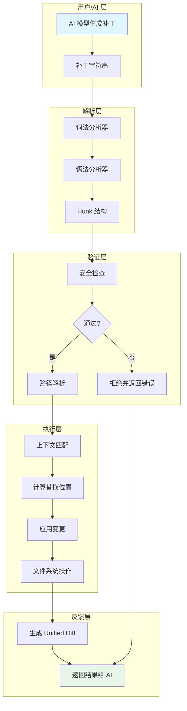
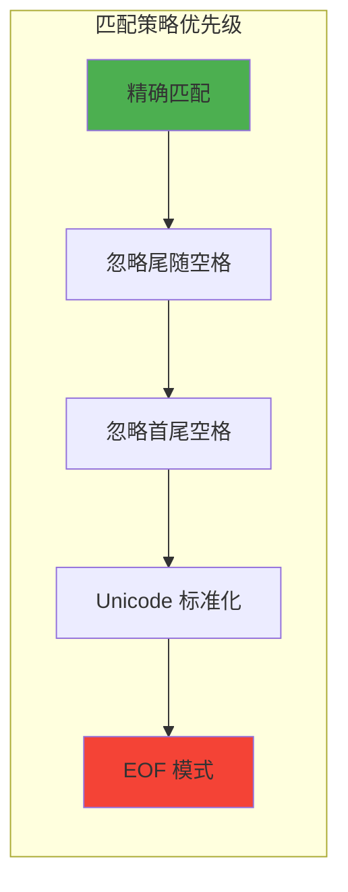
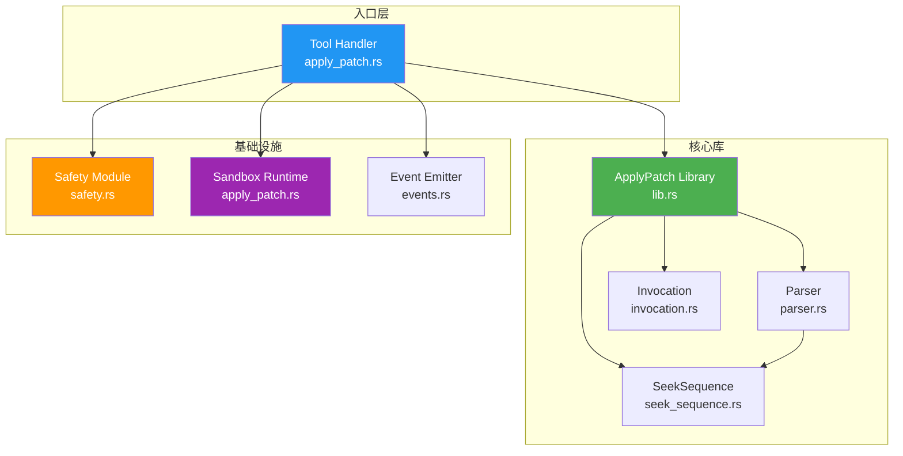
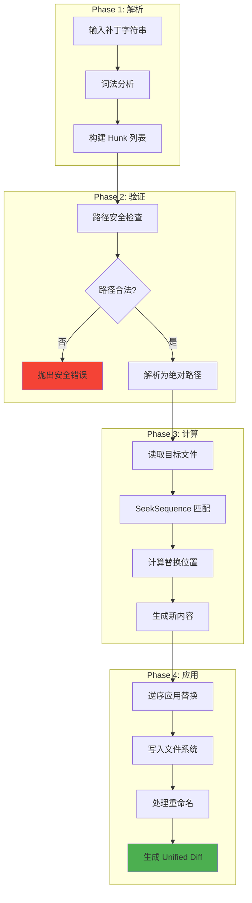
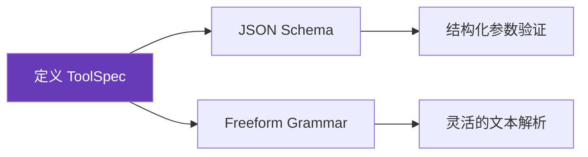
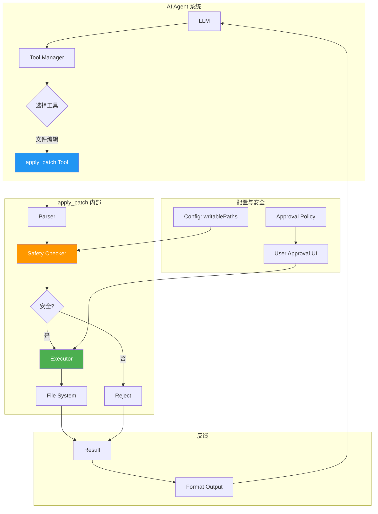
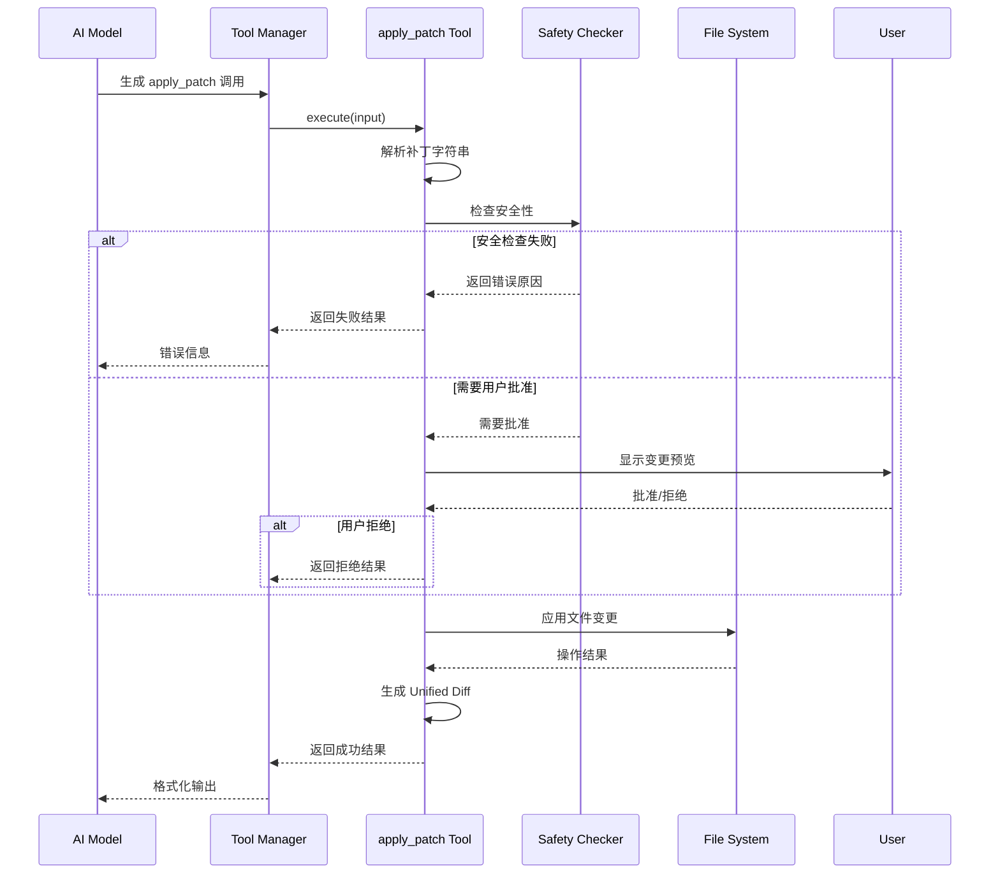
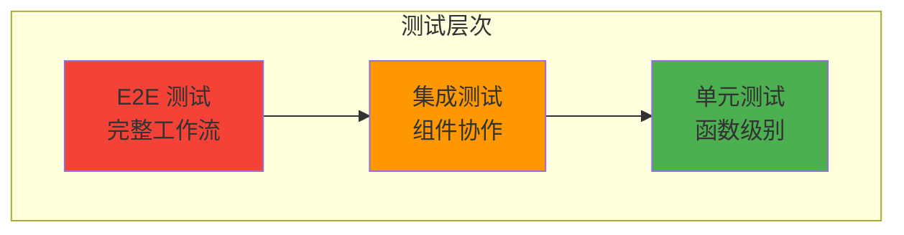

# apply_patch 工具集成指南

本文档详细说明如何将 OpenAI Codex 项目中的 `apply_patch` 工具集成到自己的 AI 编码助手中。

## 1. 概述

### 1.1 什么是 apply_patch？

`apply_patch` 是一种文件操作工具，使用特殊的补丁格式来执行文件的添加、删除和更新操作。与传统的 `sed`/`awk` 或直接文件写入相比，它具有以下优势：

| 特性 | apply_patch | sed/awk | 直接写入 |
|------|-------------|---------|----------|
| 多文件操作 | ✅ 一次处理多个文件 | ❌ 单文件 | ❌ 单文件 |
| 原子性 | ✅ 整体成功或失败 | ❌ | ❌ |
| 上下文验证 | ✅ 匹配前后文 | ❌ | ❌ |
| 文件重命名 | ✅ 内置支持 | ❌ 需要组合命令 | ❌ |
| 容错匹配 | ✅ 多级回退策略 | ❌ | ❌ |
| Unicode 支持 | ✅ 标准化处理 | ⚠️ 有限 | ✅ |

### 1.2 整体架构



## 2. 补丁格式规范

### 2.1 基本结构

```
*** Begin Patch
[一个或多个文件操作]
*** End Patch
```

### 2.2 三种文件操作

#### 添加文件 (Add File)
```
*** Add File: <相对路径>
+文件内容行1
+文件内容行2
```

#### 删除文件 (Delete File)
```
*** Delete File: <相对路径>
```

#### 更新文件 (Update File)
```
*** Update File: <相对路径>
[可选: *** Move to: <新路径>]
@@ [可选的上下文标识]
 上下行（空格前缀）
-要删除的行（-前缀）
+要添加的行（+前缀）
 上下行（空格前缀）
```

### 2.3 上下文匹配规则



**上下文行数建议**：
- 默认显示 3 行上下文
- 如果 3 行不足以唯一标识，使用 `@@` 指定类/函数名
- 极端情况可使用多个 `@@` 语句

### 2.4 完整示例

```
*** Begin Patch
*** Add File: utils/helper.py
+def greet(name):
+    return f"Hello, {name}!"
+
+def calculate(a, b):
+    return a + b
*** Update File: src/main.py
*** Move to: src/app.py
@@ class Application
@@     def run(self)
         self.init()
-        print("Starting...")
+        print("Starting application...")
         self.load_config()
*** Delete File: old/deprecated.py
*** End Patch
```

## 3. 核心实现组件

### 3.1 组件依赖图



### 3.2 数据结构定义

```typescript
// 补丁操作类型
interface Hunk {
  type: 'AddFile' | 'DeleteFile' | 'UpdateFile';
  path: string;           // 相对路径
  movePath?: string;      // 可选的重命名目标
  chunks?: Chunk[];       // UpdateFile 的变更块
  contents?: string;      // AddFile 的内容
}

// 变更块
interface Chunk {
  contextBefore: string[];
  contextAfter: string[];
  deletes: string[];
  inserts: string[];
  header?: string;        // @@ 后面的标识
}

// 文件变更结果
interface FileChange {
  type: 'Add' | 'Delete' | 'Update';
  content?: string;
  unifiedDiff?: string;
  movePath?: string;
}

// 应用结果
interface ApplyPatchResult {
  success: boolean;
  changes: Map<string, FileChange>;
  error?: string;
}
```

### 3.3 核心算法流程



## 4. 集成步骤详解

### 4.1 阶段一：定义工具规范



**方式 A：JSON Schema（推荐新手）**

```typescript
const applyPatchToolSpec = {
  name: "apply_patch",
  description: "使用补丁格式编辑文件，支持添加、删除、更新操作",
  parameters: {
    type: "object",
    properties: {
      input: {
        type: "string",
        description: "完整的补丁字符串"
      }
    },
    required: ["input"]
  }
};
```

**方式 B：Freeform Grammar（更灵活）**

```typescript
const applyPatchGrammar = `
Patch := "*** Begin Patch" NEWLINE { FileOp } "*** End Patch" NEWLINE
FileOp := AddFile | DeleteFile | UpdateFile
AddFile := "*** Add File: " path NEWLINE { "+" line NEWLINE }
DeleteFile := "*** Delete File: " path NEWLINE
UpdateFile := "*** Update File: " path NEWLINE [ MoveTo ] { Hunk }
MoveTo := "*** Move to: " newPath NEWLINE
Hunk := "@@" [ header ] NEWLINE { HunkLine } [ "*** End of File" NEWLINE ]
HunkLine := (" " | "-" | "+") text NEWLINE
`;
```

### 4.2 阶段二：实现解析器

```typescript
// 解析器核心逻辑
class ApplyPatchParser {
  parse(patchText: string): Hunk[] {
    const lines = patchText.split('\n');
    const hunks: Hunk[] = [];
    let i = 0;

    // 验证开始标记
    if (lines[i++] !== '*** Begin Patch') {
      throw new ParseError('Missing Begin Patch marker');
    }

    while (i < lines.length) {
      const line = lines[i];

      if (line === '*** End Patch') break;

      if (line.startsWith('*** Add File: ')) {
        const result = this.parseAddFile(lines, i);
        hunks.push(result.hunk);
        i = result.nextIndex;
      }
      else if (line.startsWith('*** Delete File: ')) {
        hunks.push({
          type: 'DeleteFile',
          path: line.substring(15).trim()
        });
        i++;
      }
      else if (line.startsWith('*** Update File: ')) {
        const result = this.parseUpdateFile(lines, i);
        hunks.push(result.hunk);
        i = result.nextIndex;
      }
      else {
        throw new ParseError(`Unknown operation at line ${i}: ${line}`);
      }
    }

    return hunks;
  }

  private parseAddFile(lines: string[], start: number): ParseResult<Hunk> {
    const path = lines[start].substring(14).trim();
    const contents: string[] = [];
    let i = start + 1;

    while (i < lines.length && lines[i].startsWith('+')) {
      contents.push(lines[i].substring(1));
      i++;
    }

    return {
      hunk: { type: 'AddFile', path, contents: contents.join('\n') },
      nextIndex: i
    };
  }

  private parseUpdateFile(lines: string[], start: number): ParseResult<Hunk> {
    const path = lines[start].substring(17).trim();
    let i = start + 1;
    let movePath: string | undefined;
    const chunks: Chunk[] = [];

    // 检查是否有 Move to
    if (lines[i]?.startsWith('*** Move to: ')) {
      movePath = lines[i].substring(13).trim();
      i++;
    }

    // 解析 chunks
    while (i < lines.length && lines[i].startsWith('@@')) {
      const chunkResult = this.parseChunk(lines, i);
      chunks.push(chunkResult.chunk);
      i = chunkResult.nextIndex;
    }

    return {
      hunk: { type: 'UpdateFile', path, movePath, chunks },
      nextIndex: i
    };
  }
}
```

### 4.3 阶段三：实现上下文匹配

```typescript
// 多级匹配策略
class SeekSequence {
  // 匹配策略优先级
  private strategies = [
    this.exactMatch.bind(this),
    this.ignoreTrailingWhitespace.bind(this),
    this.ignoreAllWhitespace.bind(this),
    this.unicodeNormalize.bind(this)
  ];

  findSequence(
    haystack: string[],
    needle: string[],
    startFrom: number = 0
  ): number | null {
    for (const strategy of this.strategies) {
      const result = strategy(haystack, needle, startFrom);
      if (result !== null) return result;
    }
    return null;
  }

  private exactMatch(
    haystack: string[],
    needle: string[],
    start: number
  ): number | null {
    for (let i = start; i <= haystack.length - needle.length; i++) {
      if (this.matchesAt(haystack, needle, i, (a, b) => a === b)) {
        return i;
      }
    }
    return null;
  }

  private ignoreTrailingWhitespace(
    haystack: string[],
    needle: string[],
    start: number
  ): number | null {
    const normalize = (s: string) => s.trimEnd();
    for (let i = start; i <= haystack.length - needle.length; i++) {
      if (this.matchesAt(haystack, needle, i,
        (a, b) => normalize(a) === normalize(b))) {
        return i;
      }
    }
    return null;
  }

  private unicodeNormalize(
    haystack: string[],
    needle: string[],
    start: number
  ): number | null {
    const normalize = (s: string) => s.normalize('NFC');
    for (let i = start; i <= haystack.length - needle.length; i++) {
      if (this.matchesAt(haystack, needle, i,
        (a, b) => normalize(a) === normalize(b))) {
        return i;
      }
    }
    return null;
  }
}
```

### 4.4 阶段四：实现应用逻辑

```typescript
class ApplyPatchExecutor {
  constructor(
    private fs: FileSystem,
    private cwd: string
  ) {}

  async apply(hunks: Hunk[]): Promise<ApplyPatchResult> {
    const changes = new Map<string, FileChange>();

    try {
      for (const hunk of hunks) {
        const absolutePath = path.resolve(this.cwd, hunk.path);

        switch (hunk.type) {
          case 'AddFile':
            await this.applyAddFile(absolutePath, hunk, changes);
            break;

          case 'DeleteFile':
            await this.applyDeleteFile(absolutePath, hunk, changes);
            break;

          case 'UpdateFile':
            await this.applyUpdateFile(absolutePath, hunk, changes);
            break;
        }
      }

      return { success: true, changes };
    } catch (error) {
      return {
        success: false,
        changes,
        error: error.message
      };
    }
  }

  private async applyAddFile(
    absPath: string,
    hunk: Hunk,
    changes: Map<string, FileChange>
  ): Promise<void> {
    // 检查文件是否已存在
    if (await this.fs.exists(absPath)) {
      throw new Error(`File already exists: ${hunk.path}`);
    }

    // 确保目录存在
    await this.fs.mkdirp(path.dirname(absPath));

    // 写入文件
    await this.fs.writeFile(absPath, hunk.contents);

    changes.set(hunk.path, {
      type: 'Add',
      content: hunk.contents
    });
  }

  private async applyUpdateFile(
    absPath: string,
    hunk: Hunk,
    changes: Map<string, FileChange>
  ): Promise<void> {
    // 读取原文件
    const original = await this.fs.readFile(absPath);
    const lines = original.split('\n');

    // 收集所有替换
    const replacements: Replacement[] = [];

    for (const chunk of hunk.chunks) {
      const contextLines = [
        ...chunk.contextBefore,
        ...chunk.deletes
      ];

      // 找到匹配位置
      const seek = new SeekSequence();
      const startPos = seek.findSequence(lines, contextLines);

      if (startPos === null) {
        throw new Error(
          `Context not found for chunk in ${hunk.path}: ` +
          contextLines.slice(0, 3).join('\n')
        );
      }

      // 计算替换范围
      const deleteStart = startPos + chunk.contextBefore.length;
      const deleteEnd = deleteStart + chunk.deletes.length;

      replacements.push({
        start: deleteStart,
        end: deleteEnd,
        newLines: chunk.inserts
      });
    }

    // 逆序应用替换（避免索引偏移）
    replacements.sort((a, b) => b.start - a.start);

    let newLines = [...lines];
    for (const rep of replacements) {
      newLines = [
        ...newLines.slice(0, rep.start),
        ...rep.newLines,
        ...newLines.slice(rep.end)
      ];
    }

    const newContent = newLines.join('\n');

    // 处理重命名
    if (hunk.movePath) {
      const newAbsPath = path.resolve(this.cwd, hunk.movePath);
      await this.fs.rename(absPath, newAbsPath);
    }

    // 写入新内容
    const targetPath = hunk.movePath || hunk.path;
    await this.fs.writeFile(
      path.resolve(this.cwd, targetPath),
      newContent
    );

    changes.set(hunk.path, {
      type: 'Update',
      content: newContent,
      movePath: hunk.movePath,
      unifiedDiff: this.generateDiff(original, newContent)
    });
  }

  private generateDiff(original: string, modified: string): string {
    // 使用 diff 库生成 unified diff
    const diff = createTwoFilesPatch('original', 'modified', original, modified);
    return diff;
  }
}
```

### 4.5 阶段五：添加安全检查

```typescript
class SafetyChecker {
  constructor(
    private writablePaths: string[],
    private cwd: string
  ) {}

  assessPatch(hunks: Hunk[]): SafetyResult {
    for (const hunk of hunks) {
      const absPath = path.resolve(this.cwd, hunk.path);

      // 检查路径是否在允许范围内
      if (!this.isPathWritable(absPath)) {
        return {
          safe: false,
          reason: `Path not in writable scope: ${hunk.path}`
        };
      }

      // 检查路径遍历攻击
      if (hunk.path.includes('..')) {
        return {
          safe: false,
          reason: `Path traversal detected: ${hunk.path}`
        };
      }

      // 检查敏感文件
      if (this.isSensitiveFile(hunk.path)) {
        return {
          safe: false,
          reason: `Cannot modify sensitive file: ${hunk.path}`
        };
      }
    }

    return { safe: true };
  }

  private isPathWritable(absPath: string): boolean {
    return this.writablePaths.some(wp =>
      absPath.startsWith(path.resolve(this.cwd, wp))
    );
  }

  private isSensitiveFile(path: string): boolean {
    const sensitivePatterns = [
      '.env',
      '.git/',
      'credentials',
      'secrets',
      'private_key'
    ];
    return sensitivePatterns.some(p =>
      path.toLowerCase().includes(p.toLowerCase())
    );
  }
}
```

### 4.6 阶段六：集成到工具系统

```typescript
// 完整的工具集成
class ApplyPatchTool implements Tool {
  name = 'apply_patch';
  description = '使用补丁格式编辑文件';

  private parser = new ApplyPatchParser();
  private executor: ApplyPatchExecutor;
  private safetyChecker: SafetyChecker;

  constructor(
    private config: {
      cwd: string;
      writablePaths: string[];
      requireApproval: boolean;
    }
  ) {
    this.executor = new ApplyPatchTool(config.cwd);
    this.safetyChecker = new SafetyChecker(
      config.writablePaths,
      config.cwd
    );
  }

  async execute(params: { input: string }): Promise<ToolResult> {
    try {
      // 1. 解析补丁
      const hunks = this.parser.parse(params.input);

      // 2. 安全检查
      const safety = this.safetyChecker.assessPatch(hunks);
      if (!safety.safe) {
        return {
          success: false,
          error: safety.reason
        };
      }

      // 3. 可选：请求用户批准
      if (this.config.requireApproval) {
        const approved = await this.requestApproval(hunks);
        if (!approved) {
          return {
            success: false,
            error: 'User rejected the patch'
          };
        }
      }

      // 4. 执行补丁
      const result = await this.executor.apply(hunks);

      // 5. 格式化输出
      return {
        success: result.success,
        output: this.formatResult(result)
      };

    } catch (error) {
      return {
        success: false,
        error: error.message
      };
    }
  }

  private formatResult(result: ApplyPatchResult): string {
    const lines: string[] = [];

    for (const [path, change] of result.changes) {
      switch (change.type) {
        case 'Add':
          lines.push(`✅ Created: ${path}`);
          break;
        case 'Delete':
          lines.push(`🗑️ Deleted: ${path}`);
          break;
        case 'Update':
          lines.push(`✏️ Updated: ${path}`);
          if (change.movePath) {
            lines.push(`   → Renamed to: ${change.movePath}`);
          }
          if (change.unifiedDiff) {
            lines.push(change.unifiedDiff);
          }
          break;
      }
    }

    return lines.join('\n');
  }
}
```

## 5. 集成架构图

### 5.1 完整系统架构



### 5.2 工作流程时序图



## 6. 测试策略

### 6.1 测试金字塔



### 6.2 关键测试用例

```typescript
describe('ApplyPatchTool', () => {
  // 基础操作测试
  test('should add a new file', async () => {
    const patch = `
*** Begin Patch
*** Add File: test.txt
+Hello World
*** End Patch
`;
    const result = await tool.execute({ input: patch });
    expect(result.success).toBe(true);
    expect(await fs.readFile('test.txt')).toBe('Hello World');
  });

  // 上下文匹配测试
  test('should match context with fuzzy matching', async () => {
    await fs.writeFile('test.py', 'def foo():\n    pass\n');
    const patch = `
*** Begin Patch
*** Update File: test.py
@@ def foo():
-    pass
+    return 42
*** End Patch
`;
    const result = await tool.execute({ input: patch });
    expect(result.success).toBe(true);
  });

  // 安全检查测试
  test('should reject path traversal', async () => {
    const patch = `
*** Begin Patch
*** Delete File: ../../../etc/passwd
*** End Patch
`;
    const result = await tool.execute({ input: patch });
    expect(result.success).toBe(false);
    expect(result.error).toContain('Path traversal');
  });

  // 多文件操作测试
  test('should handle multiple file operations', async () => {
    const patch = `
*** Begin Patch
*** Add File: a.txt
+content a
*** Update File: b.txt
@@
-old
+new
*** Delete File: c.txt
*** End Patch
`;
    const result = await tool.execute({ input: patch });
    expect(result.success).toBe(true);
    expect(result.changes.size).toBe(3);
  });
});
```

## 7. 最佳实践

### 7.1 给 AI 的提示词模板

```markdown
## apply_patch 工具使用说明

使用 apply_patch 工具来编辑文件。补丁格式如下：

*** Begin Patch
[文件操作]
*** End Patch

三种操作类型：
1. *** Add File: <path> - 创建新文件
2. *** Delete File: <path> - 删除文件
3. *** Update File: <path> - 更新文件

重要规则：
- 必须使用相对路径，禁止绝对路径
- 更新时提供足够的上下文（至少3行）
- 使用 @@ 标识符帮助定位代码块
- 所有新行必须以 + 开头
```

### 7.2 错误处理建议

| 错误类型 | 处理策略 |
|---------|---------|
| 解析失败 | 返回详细行号和期望内容 |
| 上下文不匹配 | 返回期望的上下文和实际文件内容 |
| 路径不安全 | 明确说明安全策略限制 |
| 文件不存在 | 提示使用 Add File 或检查路径 |
| 权限不足 | 提示用户检查文件权限 |

### 7.3 性能优化建议

1. **批量操作**：将多个小补丁合并为一个
2. **缓存文件内容**：避免重复读取
3. **异步 I/O**：并行处理独立文件
4. **增量 diff**：大文件只传输变更部分

## 8. 参考资源

- **Codex 源码位置**：`venders/codex/codex-rs/apply-patch/`
- **核心文件**：
  - `lib.rs` - 主库入口
  - `parser.rs` - 补丁解析
  - `seek_sequence.rs` - 序列匹配算法
- **测试用例**：`tests/suite/` 目录
- **工具说明**：`apply_patch_tool_instructions.md`
