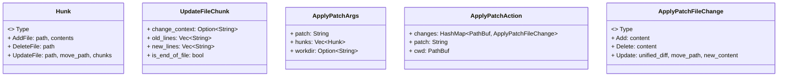
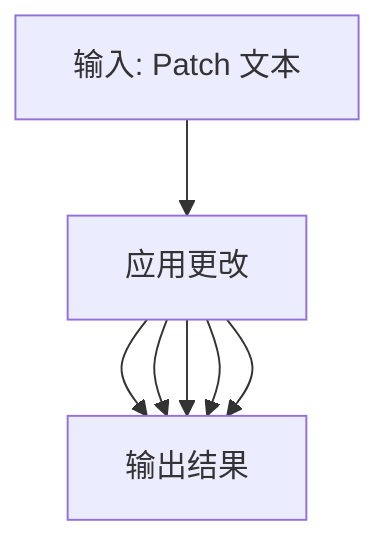
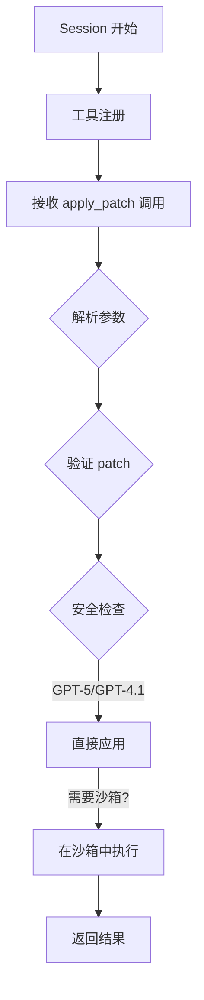

# Codex apply_patch 工具深度解析

## 概述

`apply_patch` 是 OpenAI Codex 项目中用于文件编辑的核心工具。它使用一种简化的、面向文件的 diff 格式，使 AI 模型能够安全、精确地修改文件系统中的文件。该工具使用 Rust 实现，设计为独立的 crate，可被 codex 核心系统调用。

## 1. 工具原理

### 1.1 设计目标
`apply_patch` 工具旨在解决以下问题：
1. **AI 模型编辑文件的挑战**：传统 diff 格式对 AI 模型来说复杂且容易出错
2. **安全性**: 需要确保文件修改操作是可控的、可验证的
3. **简洁性**: 格式需要足够简单，便于 AI 生成和解析

### 1.2 Patch 格式规范

```
Patch := Begin { FileOp } End
Begin := "*** Begin Patch" NEWLINE
End := "*** End Patch" NEWLINE
FileOp := AddFile | DeleteFile | UpdateFile
AddFile := "*** Add File: " path NEWLINE { "+" line NEWLINE }
DeleteFile := "*** Delete File: " path NEWLINE
UpdateFile := "*** Update File: " path NEWLINE [ MoveTo ] { Hunk }
MoveTo := "*** Move to: " newPath NEWLINE
Hunk := "@@" [ header ] NEWLINE { HunkLine } [ "*** End of File" NEWLINE ]
HunkLine := (" " | "-" | "+") text NEWLINE
```

### 1.3 三种文件操作

| 操作 | 语法 | 说明 |
|------|------|------|
| **Add File** | `*** Add File: <path>` | 创建新文件，后续行必须以 `+` 开头 |
| **Delete File** | `*** Delete File: <path>` | 删除现有文件 |
| **Update File** | `*** Update File: <path>` | 修改现有文件，支持重命名 |

### 1.4 示例

```
*** Begin Patch
*** Add File: hello.txt
+Hello world
+Second line
*** Update File: src/app.py
*** Move to: src/main.py
@@ def greet():
-    print("Hi")
+    print("Hello, world!")
*** Delete File: obsolete.txt
*** End Patch
```

## 2. 架构设计

### 22.1 模块结构

```
codex-rs/apply-patch/
├── src/
│   ├── lib.rs              # 核心库入口，导出公共 API
│   ├── parser.rs           # Patch 格式解析器
│   ├── invocation.rs       # Shell 命令解析与验证
│   ├── seek_sequence.rs    # 文本序列匹配算法
│   ├── standalone_executable.rs # 独立可执行程序入口
│   └── main.rs              # 二进制入口点
├── tests/
│   ├── all.rs               # 测试入口
│   ├── suite/
│   │   ├── scenarios.rs     # 场景测试
│   │   ├── cli.rs            # CLI 测试
│   │   └── tool.rs           # 工具测试
│   └── fixtures/scenarios/   # 测试场景数据
└── apply_patch_tool_instructions.md  # GPT-4.1 使用指南
```

### 2.2 核心数据结构



### 2.3 栺处理流程



## 3. 核心实现详解
### 3.1 解析器 (parser.rs)

解析器负责将 Patch 文本转换为结构化的 `Hunk` 列表。

**关键函数：**
- `parse_patch(patch: &str)`: 主入口函数，解析 patch 文本
- `parse_one_hunk(lines, line_number)`: 解析单个文件操作
- `parse_update_file_chunk(lines, line_number, allow_missing_context)`: 解析更新操作中的 chunk

**解析模式:**
1. **严格模式**: 精确匹配格式
2. **宽松模式**: 兼容 GPT-4.1 生成的 heredoc 格式

**Marker 常量:**
```rust
const BEGIN_PATCH_MARKER: &str = "*** Begin Patch";
const END_PATCH_MARKER: &str = "*** End Patch";
const ADD_FILE_MARKER: &str = "*** Add File: ";
const DELETE_FILE_MARKER: &str = "*** Delete File: ";
const UPDATE_FILE_MARKER: &str = "*** Update File: ";
const MOVE_TO_MARKER: &str = "*** Move to: ";
const EOF_MARKER: &str = "*** End of File";
const CHANGE_CONTEXT_MARKER: &str = "@@ ";
```

### 3.2 文本序列匹配 (seek_sequence.rs)

`seek_sequence` 函数实现了智能的文本匹配算法，支持多级回退策略：

**匹配策略（按优先级）:**
1. **精确匹配**: 逐字节匹配
2. **尾部空白忽略**: `trim_end()` 比较
3. **前后空白忽略**: `trim()` 比较
4. **Unicode 标准化**: 将特殊 Unicode 字符转换为 ASCII

```rust
fn seek_sequence(lines, pattern, start, eof) -> Option<usize> {
    // 1. 精确匹配
    for i in search_start..= {
        if lines[i..i + pattern.len()] == *pattern {
            return Some(i);
        }
    }

    // 2. rstrip 匹配
    for i in search_start..= {
        if trim_end_match(&lines[i..], pattern) {
            return Some(i);
        }
    }

    // 3. trim 匹配
    for i in search_start..= {
        if trim_match(&lines[i..], pattern) {
            return Some(i);
        }
    }

    // 4. Unicode 标准化匹配
    for i in search_start..= {
        if normalise_match(&lines[i..], pattern) {
            return Some(i);
        }
    }

    None
}
```
**Unicode 标准化映射:**
```rust
fn normalise(s: &str) -> String {
    s.trim().chars().map(|c| match c {
        // 破折号变体 -> '-'
        '\u{2010}' | '\u{2011}' | ... => '-',
        // 引号变体 -> '\'' 或 '"'
        '\u{2018}' | '\u{2019}' => ... => '\'',
        '\u{201C}' | '\u{201D}' => ... => '"',
        // 空格变体 -> ' '
        '\u{00A0}' | '\u{2002}' | ... => ' ',
        _ => other,
    }).collect()
}
```

### 3.3 调用验证 (invocation.rs)

处理多种调用格式，确保安全执行：

**支持的调用格式:**
1. **直接调用**: `apply_patch <patch>`
2. **Shell Heredoc**: `bash -lc "apply_patch <<'EOF'\n...\nEOF"`
3. **带 cd 命令**: `cd dir && apply_patch <<'EOF'\n...\nEOF`

**验证流程:**
```rust
pub fn maybe_parse_apply_patch_verified(argv, cwd) {
    // 1. 检测隐式调用
    if is_implicit_patch(argv) {
        return CorrectnessError(ImplicitInvocation);
    }

    // 2. 解析 patch
    match maybe_parse_apply_patch(argv) {
        Body(args) => {
            // 3. 验证文件路径
            verify_paths(&args, cwd)
        }
        // ...
    }
}
```

**Shell 脚本解析**:
使用 Tree-sitter Bash 语法解析器识别 heredoc 模式:
```rust
static APPLY_PATCH_QUERY: LazyLock<Query> = LazyLock::new(|| {
    Query::new(&BASH, r#"
        (
          program
            . (redirected_statement
                body: (command name: (command_name (word) @apply_name) .)
                (#any-of? @apply_name "apply_patch" "applypatch")
                redirect: (heredoc_redirect
                            . (heredoc_start)
                            . (heredoc_body) @heredoc
                            . (heredoc_end)
                            .))
            .)
    "#)
});
```

### 3.4 核心应用逻辑 (lib.rs)

**主要函数:**

1. **`apply_patch(patch, stdout, stderr)`**
   - 解析 patch 文本
   - 应用更改到文件系统
   - 输出结果摘要

2. **`apply_hunks_to_files(hunks)`**
   - 遍历所有 hunk
   - 执行 Add/delete/update 操作
   - 返回受影响的路径

3. **`derive_new_contents_from_chunks(path, chunks)`**
   - 读取原文件内容
   - 计算替换位置
   - 应用替换生成新内容

4. **`compute_replacements(original_lines, path, chunks)`**
   - 查找上下文位置
   - 定位 old_lines
   - 计算替换范围

**Update File 夽理流程:**
```mermaid
flowchart TD
    A[读取原文件] --> B[按行分割]
    B --> C[处理每个 chunk]
    C --> D[查找上下文 change_context]
    D --> E[定位 old_lines]
    E --> F{计算替换]
    F --> G[应用替换]
    G --> H[生成新内容]
    H --> I[写入文件]
```
## 4. apply_patch_tool_instructions.md 详解

### 4.1 文件用途

`apply_patch_tool_instructions.md` 是为 GPT-4.1 模型定制的工具使用指南，作为 **工具描述** 注入到模型的系统提示中。

### 4.2 关键内容
1. **格式规范**: 宪法定义的完整语法
2. **上下文建议**: 如何使用 `@@` 标记提供上下文
3. **示例**: 客户端完整的使用示例
4. **注意事项**: 强调相对路径和必选操作头

### 4.3 与 crate 的关系


**代码中的引用:**
```rust
// lib.rs
pub const APPLY_PATCH_TOOL_INSTRUCTIONS: &str = include_str!("../apply_patch_tool_instructions.md");
```
这个常量在创建工具时被使用:
```rust
// 工具创建
pub(crate) fn create_apply_patch_freeform_tool() -> ToolSpec {
    ToolSpec::Freeform(FreeformTool {
        name: "apply_patch".to_string(),
        description: "Use the `apply_patch` tool to edit files...",
        format: FreeformToolFormat {
            definition: APPLY_PATCH_LARK_GRAMMAR.to_string(),
            ...
        },
    })
}
```
## 5. 与 Codex 核心集成

### 5.1 工具处理器注册

在 `codex-rs/core/src/tools/handlers/apply_patch.rs` 中注册为工具处理器:


### 5.2 核心集成点
1. **工具注册**: 在 `codex_protocol` 中定义工具规格
2. **调用拦截**: `intercept_apply_patch` 函数拦截 shell 命令中的 apply_patch 调用
3. **安全验证**: `assess_patch_safety` 检查操作安全性
4. **沙箱执行**: 通过 `ApplyPatchRuntime` 在沙箱中执行

### 5.3 沙箱策略
```rust
pub enum SandboxPolicy {
    WorkspaceWrite {
        writable_roots: Vec<PathBuf>,
        read_only_access: Vec<PathBuf>,
        network_access: bool,
    },
    ExternalSandbox {
        network_access: NetworkAccess,
    },
    DangerousFullAccess, // 无限制
}
```
### 5.4 宯议流程
```rust
pub async fn handle(invocation: ToolInvocation) -> Result<ToolOutput, FunctionCallError> {
    // 1. 解析输入
    let patch_input = parse_arguments(&arguments)?;

    // 2. 验证 patch
    let changes = maybe_parse_apply_patch_verified(&command, &cwd)?;

    // 3. 应用更改
    match apply_patch(turn, changes).await {
        InternalApplyPatchInvocation::Output(item) => {
            // 直接输出结果
        },
        InternalApplyPatchInvocation::DelegateToExec(apply) => {
            // 需要沙箱执行
        let result = orchestrator.run(&mut runtime, &req, ...).await?;
        emitter.finish(event_ctx, result).await
    }
}
```
## 6. 测试体系

### 6.1 测试结构
```
tests/
├── all.rs                    # 测试入口
└── suite/
    ├── mod.rs              # 测试模块
    ├── scenarios.rs         # 场景测试
    ├── cli.rs               # CLI 测试
    └── tool.rs               # 工具集成测试
```
### 6.2 场景测试

每个场景测试包含:
```
scenarios/XXX_name/
├── input/              # 初始文件状态
│   └── ...files...
├── expected/           # 期望的最终状态
│   └── ...files...
└── patch.txt           # patch 内容
```

**测试流程:**
```rust
fn run_apply_patch_scenario(dir: &Path) {
    // 1. 创建临时目录
    let tmp = tempdir()?;

    // 2. 复制输入文件
    copy_dir_recursive(&input_dir, tmp.path())?;

    // 3. 读取并应用 patch
    let patch = fs::read_to_string(dir.join("patch.txt"))?;
    Command::new("apply_patch")
        .arg(patch)
        .current_dir(tmp.path())
        .output()?;

    // 4. 比较结果
    let expected = snapshot_dir(&expected_dir)?;
    let actual = snapshot_dir(tmp.path())?;
    assert_eq!(actual, expected);
}
```
### 6.3 测试场景列表

| 场景 | 描述 |
|------|------|
| 001_add_file | 创建新文件 |
| 002_multiple_operations | 多文件操作 |
| 003_multiple_chunks | 多 chunk 更新 |
| 004_move_to_new_directory | 移动文件到新目录 |
| 005_rejects_empty_patch | 拒绝空 patch |
| 006_rejects_missing_context | 拒绝缺少上下文的 patch |
| 007_rejects_missing_file_delete | 拒绝删除不存在的文件 |
| 008_rejects_empty_update_hunk | 拒绝空的更新 hunk |
| 009_requires_existing_file_for_update | 更新需要文件存在 |
| 010_move_overwrites_existing_destination | 移动覆盖已存在的目标 |
| 011_add_overwrites_existing_file | 添加覆盖已存在的文件 |
| 012_delete_directory_fails | 删除目录失败 |
| 013_rejects_invalid_hunk_header | 拒绝无效的 hunk 头 |
| 014_update_file_appends_trailing_newline | 更新追加尾部换行 |
| 015_failure_after_partial_success | 部分成功后失败保留更改 |
| 016_pure_addition_update_chunk | 纯添加更新 chunk |
| 017-020_whitespace_* | 空白处理测试 |
| 019_unicode_simple | Unicode 测试 |
| 020_delete_file_success | 成功删除文件 |
| 021_update_file_deletion_only | 仅删除的更新 |
| 022_update_file_end_of_file_marker | 文件结束标记测试 |
```

## 7. 设计亮点总结

### 7.1 格式设计
- **简洁性**: 比 unified diff 更简单，易于 AI 生成
- **安全性**: 强制要求操作头，避免意外操作
- **灵活性**: 支持 add/delete/update/move 操作
- **容错性**: 多级匹配策略，宽松的空白处理

### 7.2 实现设计
- **模块化**: 解析、验证、应用分离
- **可测试性**: 场景驱动的测试设计
- **安全性**: 多层安全检查
- **可扩展性**: 支持多种调用格式

### 7.3 集成设计
- **工具抽象**: 统一的工具处理器接口
- **沙箱隔离**: 支持沙箱执行模式
- **事件系统**: 完整的事件发射机制
- **错误处理**: 详细的错误分类和消息

### 7.4 容错处理
- **空白容忍**: 多级空白处理策略
- **Unicode 兼容**: 智能字符转换
- **Heredoc 支持**: 兼容 shell heredoc 格式
- **路径解析**: 相对/绝对路径自动转换

## 8. 最佳实践建议

### 8.1 使用建议
1. **总是使用相对路径**: 避免绝对路径
2. **提供足够的上下文**: 3 行上下文确保唯一性
3. **使用 @@ 标记**: 在需要时提供额外的上下文
4. **避免空操作**: patch 必须包含实际更改

### 8.2 调试建议
1. **使用 --codex-run-as-apply-patch 标志**: 内部调试入口
2. **检查解析错误**: 详细的错误信息帮助定位问题
3. **验证文件状态**: 应用前检查文件是否存在

### 8.3 扩展建议
1. **自定义匹配策略**: 可扩展 `seek_sequence` 添加新策略
2. **新的文件操作**: 可扩展 `Hunk` 枚举
3. **自定义沙箱策略**: 实现新的 `SandboxPolicy`
