# OpenAI Codex CLI 架构分析文档

> 基于源代码的深度架构分析
> 分析日期: 2026-03-02
> 项目版本: 最新 master 分支

---

## 目录

1. [项目概述](#1-项目概述)
2. [整体架构](#2-整体架构)
3. [核心模块详解](#3-核心模块详解)
4. [工具系统架构](#4-工具系统架构)
5. [沙箱安全机制](#5-沙箱安全机制)
6. [MCP 协议集成](#6-mcp-协议集成)
7. [IDE 集成架构](#7-ide-集成架构)
8. [TypeScript SDK](#8-typescript-sdk)
9. [数据流与状态管理](#9-数据流与状态管理)
10. [构建与部署](#10-构建与部署)
11. [总结](#11-总结)

---

## 1. 项目概述

### 1.1 项目简介

OpenAI Codex CLI 是一个由 OpenAI 开发的命令行编码代理工具，可以在本地计算机上运行。它能够：

- 理解自然语言指令并执行编程任务
- 读写文件、应用补丁、执行 shell 命令
- 通过沙箱机制确保安全执行
- 支持 IDE 集成和 MCP 协议

### 1.2 技术栈

| 层级 | 技术选型 |
|------|----------|
| **核心实现** | Rust (Edition 2024, 67 crates) |
| **分发包装** | TypeScript/Node.js |
| **程序化 API** | TypeScript SDK |
| **终端 UI** | Ratatui 0.29 |
| **异步运行时** | Tokio 1.x |
| **构建系统** | Bazel + Cargo |
| **数据库** | SQLite (via SQLx) |
| **序列化** | serde/serde_json |

### 1.3 项目结构

```
codex/
├── codex-cli/           # Node.js 分发包装器
├── codex-rs/            # Rust 核心实现 (67 个 crate)
│   ├── cli/             # 命令行入口
│   ├── tui/             # 终端用户界面
│   ├── core/            # 核心业务逻辑
│   ├── exec/            # 无头执行模式
│   ├── app-server/      # IDE 集成服务器
│   ├── mcp-server/      # MCP 服务器实现
│   ├── config/          # 配置管理
│   ├── protocol/        # 协议定义
│   ├── state/           # 状态数据库
│   └── ...              # 其他工具 crate
├── sdk/typescript/      # TypeScript SDK
├── shell-tool-mcp/      # MCP Shell 工具
├── docs/                # 文档
└── scripts/             # 构建脚本
```

---

## 2. 整体架构

### 2.1 系统架构图

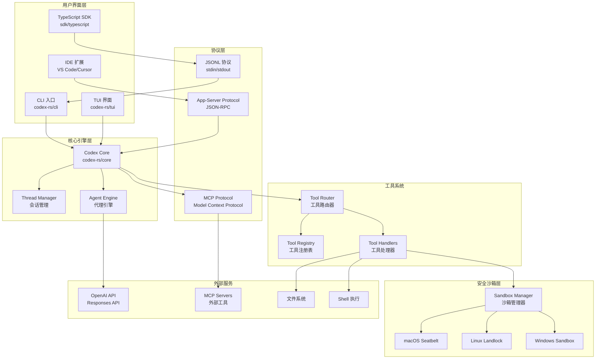

### 2.2 组件关系图

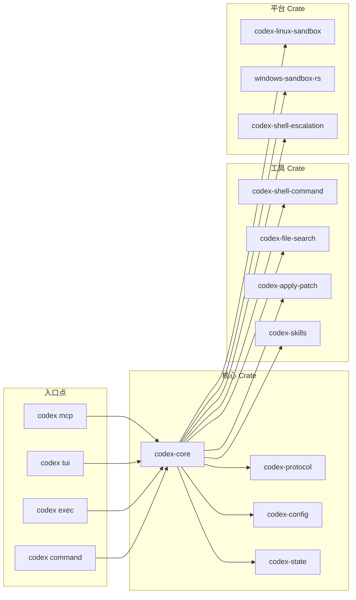

---

## 3. 核心模块详解

### 3.1 codex-core

核心模块是整个系统的心脏，包含代理逻辑、工具协调、状态管理等关键功能。

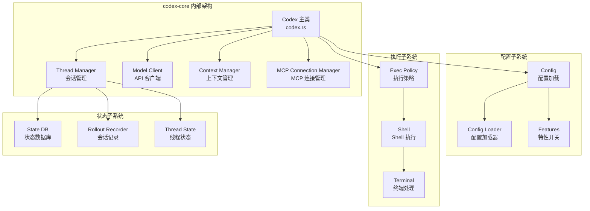

#### 关键文件说明

| 文件 | 职责 |
|------|------|
| `codex.rs` | 核心代理实现，处理用户交互、工具调用、事件流 |
| `thread_manager.rs` | 管理对话线程的生命周期 |
| `client.rs` | 与 OpenAI API 通信的客户端 |
| `exec_policy.rs` | 执行策略检查和管理 |
| `mcp_connection_manager.rs` | MCP 服务器连接管理 |
| `state_db.rs` | SQLite 状态持久化 |
| `safety.rs` | 平台沙箱获取和配置 |

### 3.2 CLI 入口 (codex-rs/cli)

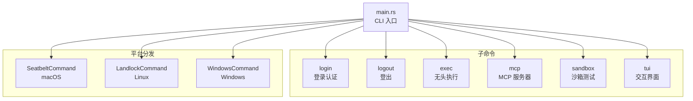

### 3.3 TUI 模块 (codex-rs/tui)

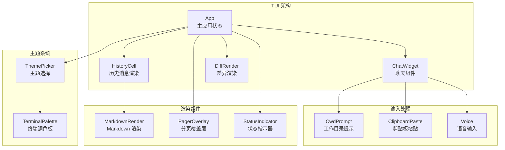

---

## 4. 工具系统架构

### 4.1 工具系统概览

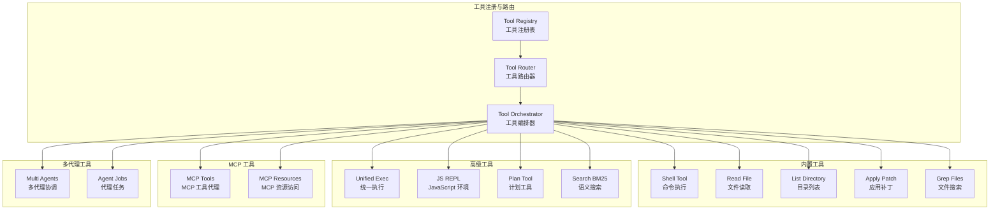

### 4.2 工具处理器列表

| 处理器文件 | 功能描述 |
|-----------|----------|
| `shell.rs` | Shell 命令执行，支持多种后端 |
| `read_file.rs` | 文件读取，支持编码检测 |
| `list_dir.rs` | 目录列表，支持过滤 |
| `apply_patch.rs` | 应用 unified diff 补丁 |
| `grep_files.rs` | 文件内容搜索 |
| `unified_exec.rs` | 统一执行环境 (ConPTY) |
| `js_repl.rs` | JavaScript REPL 环境 |
| `plan.rs` | 计划制定工具 |
| `search_tool_bm25.rs` | BM25 语义搜索 |
| `mcp.rs` | MCP 工具调用代理 |
| `mcp_resource.rs` | MCP 资源访问 |
| `multi_agents.rs` | 多代理协调执行 |
| `agent_jobs.rs` | 批量代理任务 |
| `view_image.rs` | 图像查看工具 |
| `request_user_input.rs` | 请求用户输入 |

### 4.3 工具执行流程

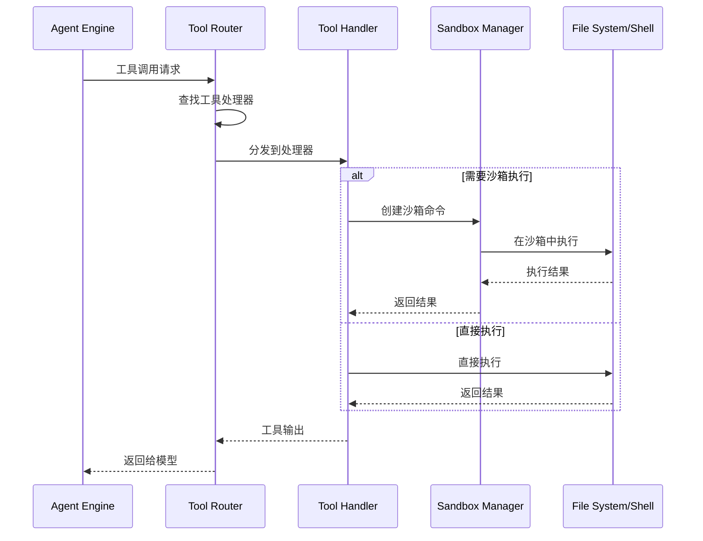

---

## 5. 沙箱安全机制

### 5.1 沙箱架构

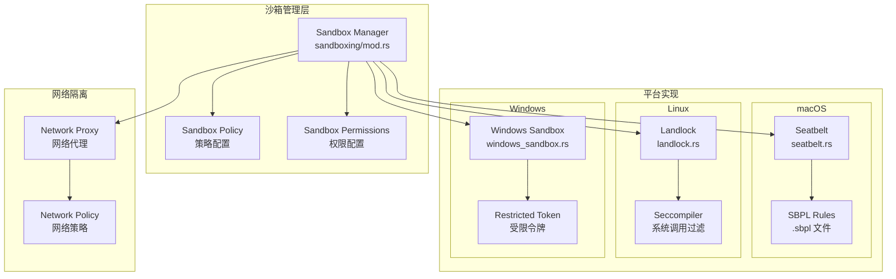

### 5.2 沙箱类型

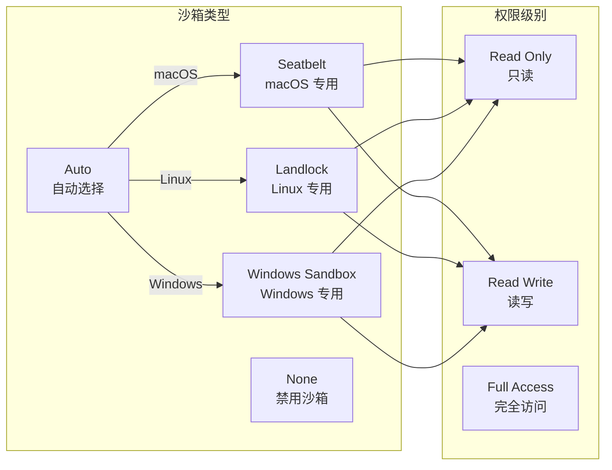

### 5.3 沙箱执行流程

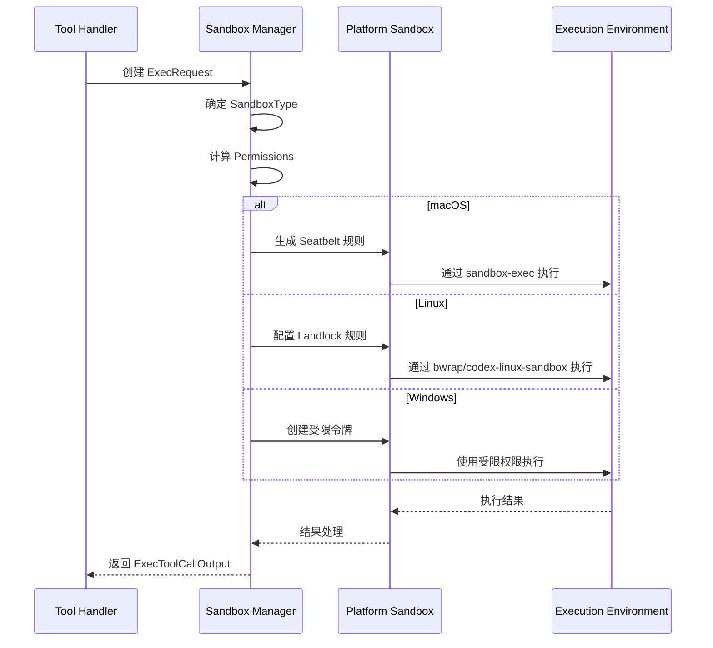

---

## 6. MCP 协议集成

### 6.1 MCP 架构

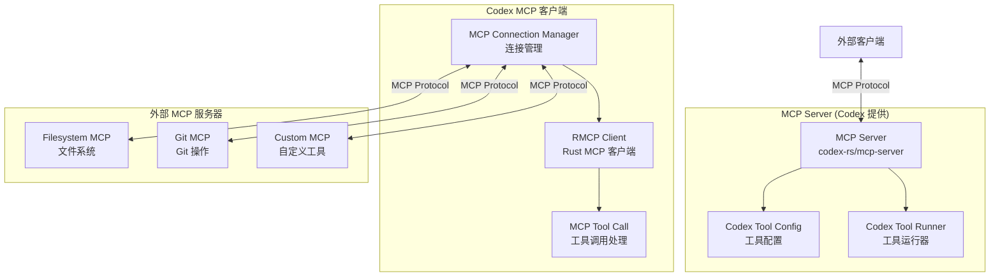

### 6.2 MCP Server 实现

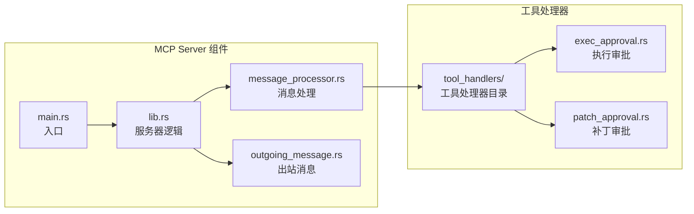

### 6.3 MCP 工具调用流程

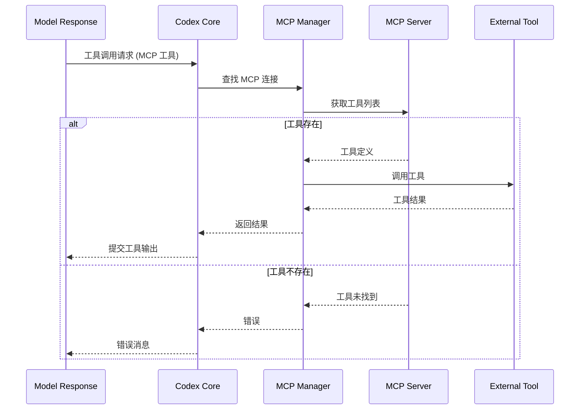

---

## 7. IDE 集成架构

### 7.1 App-Server 架构

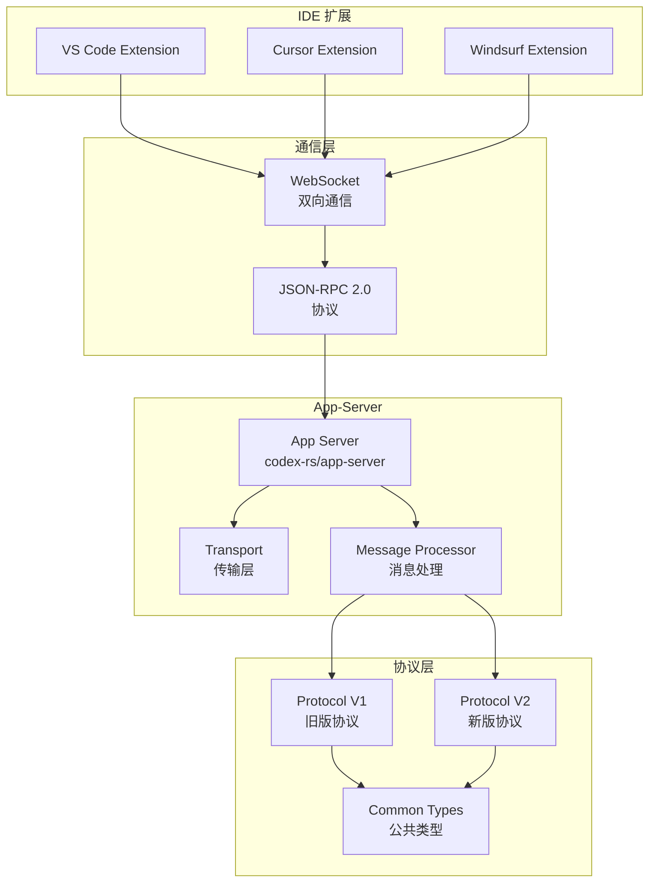

### 7.2 App-Server Protocol

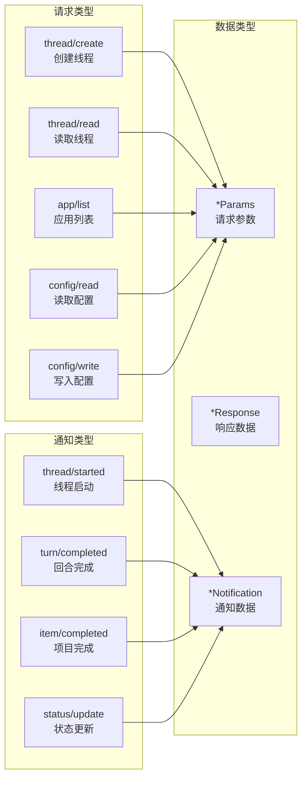

---

## 8. TypeScript SDK

### 8.1 SDK 架构

```mermaid
graph TB
    subgraph "SDK 入口"
        Codex[Codex<br/>主类]
        Thread[Thread<br/>会话类]
    end

    subgraph "执行层"
        CodexExec[CodexExec<br/>执行器]
        Spawn[child_process.spawn<br/>进程启动]
        JSONLParser[JSONL Parser<br/>输出解析]
    end

    subgraph "类型定义"
        Events[events.ts<br/>事件类型]
        Items[items.ts<br/>项目类型]
        Options[Options<br/>配置选项]
    end

    subgraph "平台二进制"
        LinuxX64[@openai/codex-linux-x64]
        LinuxArm64[@openai/codex-linux-arm64]
        DarwinX64[@openai/codex-darwin-x64]
        DarwinArm64[@openai/codex-darwin-arm64]
        Win32X64[@openai/codex-win32-x64]
        Win32Arm64[@openai/codex-win32-arm64]
    end

    Codex --> Thread
    Thread --> CodexExec
    CodexExec --> Spawn
    Spawn --> JSONLParser

    Thread --> Events
    Thread --> Items
    Codex --> Options

    Spawn --> LinuxX64
    Spawn --> LinuxArm64
    Spawn --> DarwinX64
    Spawn --> DarwinArm64
    Spawn --> Win32X64
    Spawn --> Win32Arm64
```

### 8.2 SDK 使用流程

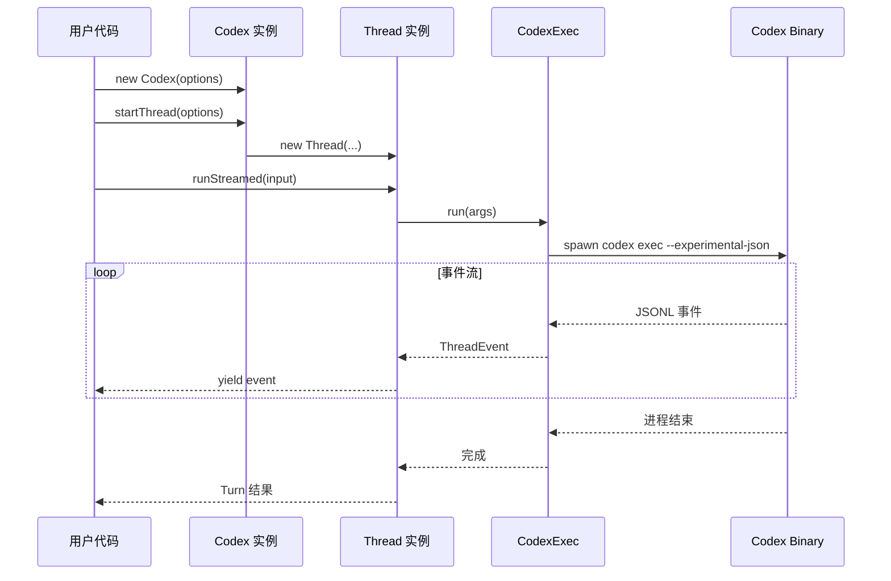

### 8.3 SDK 事件类型

| 事件类型 | 描述 |
|---------|------|
| `thread.started` | 线程启动 |
| `thread.resumed` | 线程恢复 |
| `turn.started` | 回合开始 |
| `turn.completed` | 回合完成 |
| `turn.failed` | 回合失败 |
| `item.started` | 项目开始 |
| `item.completed` | 项目完成 |
| `agent_message` | 代理消息 |
| `file_change` | 文件变更 |
| `exec_output` | 执行输出 |

---

## 9. 数据流与状态管理

### 9.1 完整请求流程

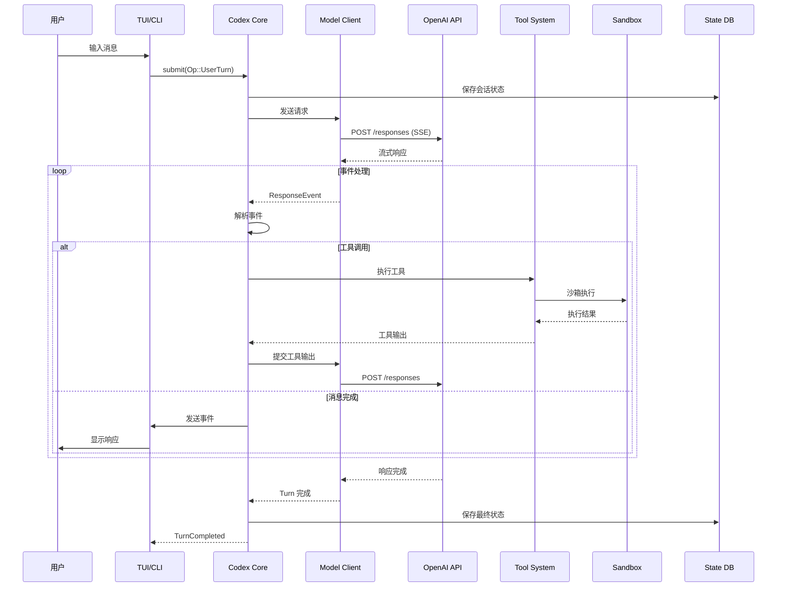

### 9.2 状态持久化

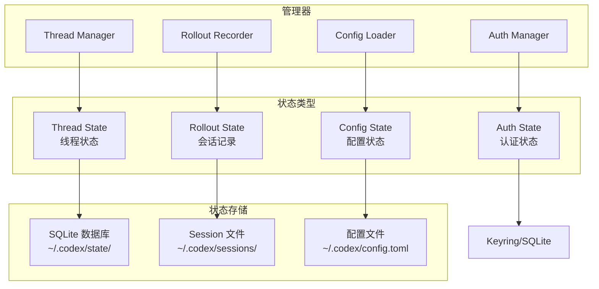

### 9.3 配置层次结构

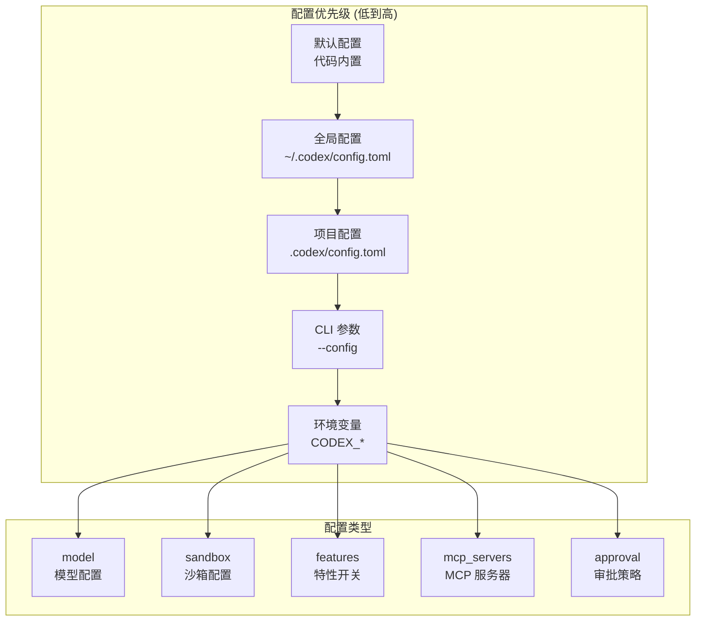

---

## 10. 构建与部署

### 10.1 构建系统

```mermaid
graph TB
    subgraph "构建工具"
        Bazel[Bazel<br/>主构建系统]
        Cargo[Cargo<br/>Rust 构建]
        PNPM[PNPM<br/>Node.js 包管理]
        Just[Just<br/>任务运行器]
    end

    subgraph "构建产物"
        Binaries[平台二进制<br/>codex-*]
        NPM[NPM 包<br/>@openai/codex]
        SDK[SDK 包<br/>@openai/codex-sdk]
    end

    subgraph "发布流程"
        GitHub[GitHub Actions]
        Release[GitHub Release]
        NPMRegistry[NPM Registry]
    end

    Bazel --> Binaries
    Cargo --> Binaries
    PNPM --> NPM
    PNPM --> SDK

    Binaries --> GitHub
    NPM --> GitHub
    SDK --> GitHub

    GitHub --> Release
    GitHub --> NPMRegistry
```

### 10.2 平台支持

| 平台 | 架构 | 目标三元组 | 沙箱机制 |
|------|------|-----------|----------|
| Linux | x64 | `x86_64-unknown-linux-musl` | Landlock + Seccomp |
| Linux | arm64 | `aarch64-unknown-linux-musl` | Landlock + Seccomp |
| macOS | x64 | `x86_64-apple-darwin` | Seatbelt |
| macOS | arm64 | `aarch64-apple-darwin` | Seatbelt |
| Windows | x64 | `x86_64-pc-windows-gnullvm` | Restricted Token |
| Windows | arm64 | `aarch64-pc-windows-gnullvm` | Restricted Token |

### 10.3 依赖关系图

```mermaid
graph BT
    subgraph "核心依赖"
        Tokio[Tokio<br/>异步运行时]
        Reqwest[Reqwest<br/>HTTP 客户端]
        SQLx[SQLx<br/>数据库]
        Serde[Serde<br/>序列化]
    end

    subgraph "UI 依赖"
        Ratatui[Ratatui<br/>TUI 框架]
        Crossterm[Crossterm<br/>终端控制]
    end

    subgraph "协议依赖"
        RMCP[RMCP<br/>MCP 客户端]
        Tungstenite[Tungstenite<br/>WebSocket]
    end

    subgraph "平台依赖"
        Landlock[Landlock<br/>Linux 沙箱]
        Keyring[Keyring<br/>密钥存储]
    end

    codex-core --> Tokio
    codex-core --> Reqwest
    codex-core --> SQLx
    codex-core --> Serde

    codex-tui --> Ratatui
    codex-tui --> Crossterm

    codex-core --> RMCP
    app-server --> Tungstenite

    codex-core --> Landlock
    codex-core --> Keyring
```

---

## 11. 总结

### 11.1 架构特点

1. **模块化设计**: 67 个 Rust crate 实现高度解耦
2. **多入口支持**: CLI、TUI、SDK、MCP Server、App-Server
3. **跨平台沙箱**: macOS Seatbelt、Linux Landlock、Windows Restricted Token
4. **协议丰富**: JSON-RPC、MCP、JSONL、SSE
5. **类型安全**: Rust + TypeScript 双重类型保障

### 11.2 关键技术亮点

| 特性 | 实现方式 |
|------|----------|
| 流式响应 | SSE (Server-Sent Events) + WebSocket |
| 安全执行 | 多平台沙箱 + 网络代理 |
| 工具扩展 | MCP 协议 + 内置工具注册表 |
| IDE 集成 | App-Server Protocol (JSON-RPC over WebSocket) |
| 状态持久化 | SQLite + 文件系统会话 |
| 配置管理 | TOML 多层次配置合并 |

### 11.3 代码规模统计

```
codex-rs/           # 67 crates
├── core/           # 核心逻辑 (~150K LOC)
├── tui/            # 终端 UI (~80K LOC)
├── app-server/     # IDE 集成 (~50K LOC)
├── mcp-server/     # MCP 服务 (~20K LOC)
└── ...             # 其他工具库

sdk/typescript/     # TypeScript SDK (~2K LOC)
codex-cli/          # Node.js 包装器 (~500 LOC)
shell-tool-mcp/     # MCP Shell 工具 (~1K LOC)
```

### 11.4 架构演进建议

1. **核心稳定性**: `codex-core` 已相当成熟，建议保持 API 稳定
2. **协议统一**: V1/V2 协议可考虑统一到 V2
3. **工具扩展**: 建议优先使用 MCP 扩展而非内置工具
4. **测试覆盖**: snapshot 测试覆盖良好，可增加集成测试

---

## 附录: 快速参考

### A. 关键文件路径

| 功能 | 路径 |
|------|------|
| 核心代理逻辑 | `codex-rs/core/src/codex.rs` |
| 工具注册表 | `codex-rs/core/src/tools/registry.rs` |
| 沙箱管理 | `codex-rs/core/src/sandboxing/mod.rs` |
| MCP 连接管理 | `codex-rs/core/src/mcp_connection_manager.rs` |
| TUI 主应用 | `codex-rs/tui/src/app.rs` |
| App-Server | `codex-rs/app-server/src/lib.rs` |
| 协议定义 | `codex-rs/protocol/src/protocol.rs` |
| SDK 入口 | `sdk/typescript/src/codex.ts` |

### B. 常用命令

```bash
# 构建
cargo build --release

# 运行 TUI
cargo run -p codex-cli

# 运行测试
cargo test

# 格式化代码
just fmt

# 生成配置 schema
just write-config-schema

# 运行 MCP server
cargo run -p codex-mcp-server
```

### C. 配置示例

```toml
# ~/.codex/config.toml
model = "codex-1"

[features]
web_search = true

[sandbox]
enabled = true

[mcp_servers.filesystem]
command = "mcp-filesystem"
args = ["/path/to/project"]
```

---

*文档结束*
