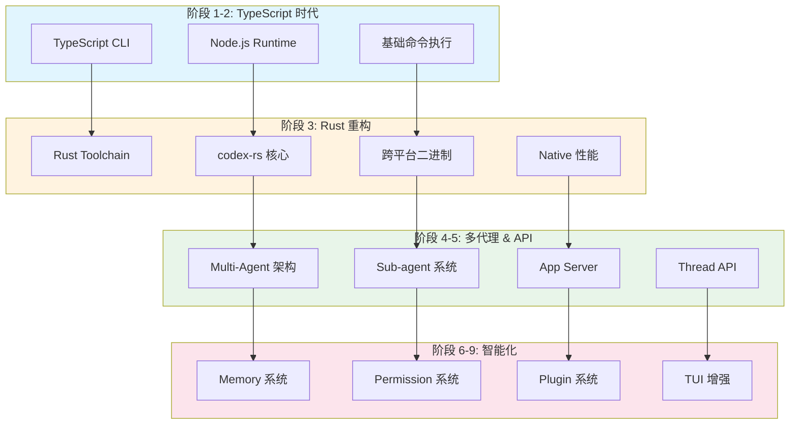
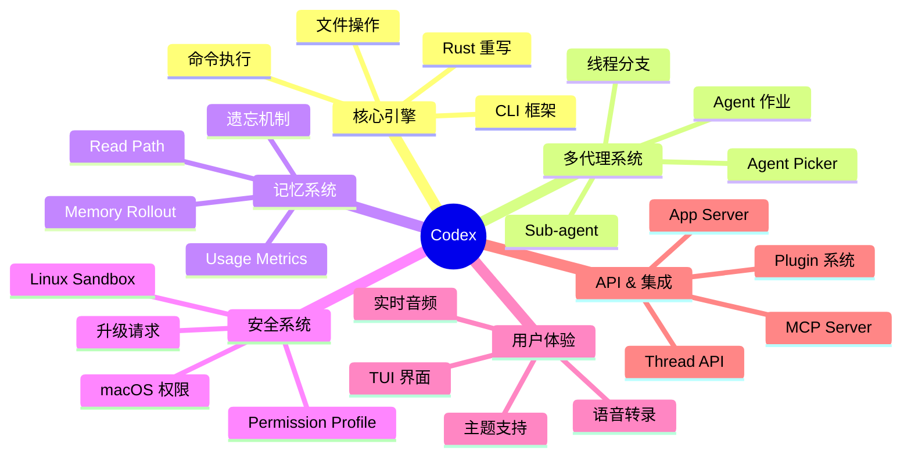
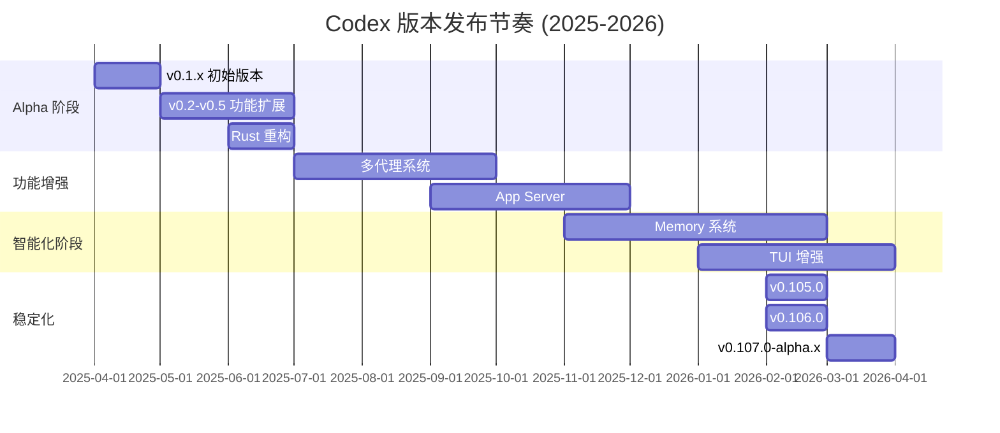
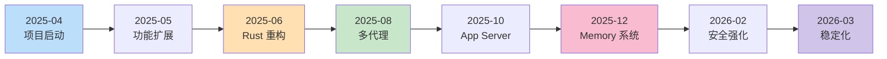
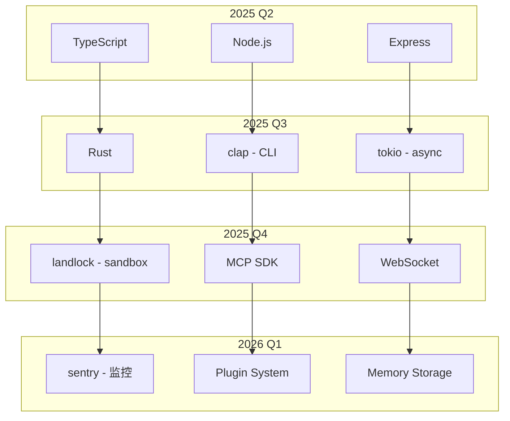

# Codex 项目代码变更脉络分析

> 本文档基于 `venders/codex` 项目的 Git Commit History 梳理，展示项目从 2025年4月至今的演进历程。

## 1. 项目概览

### 1.1 基本统计信息

| 指标 | 数值 |
|------|------|
| 总 Commit 数量 | 15,315+ |
| 主要分支 | main |
| 当前最新版本 | rust-v0.107.0-alpha.9 |
| 项目启动时间 | 2025年4月16日 |
| 开发周期 | ~11个月 |
| 平均每日 Commit | 40-50个 |

### 1.2 主要贡献者 (Top 10)

| 排名 | 贡献者 | Commit 数量 | 主要贡献领域 |
|------|--------|-------------|--------------|
| 1 | Michael Bolin | 5,436+ | 核心架构、项目领导者 |
| 2 | Ahmed Ibrahim | 1,329+ | TUI、CLI、多代理系统 |
| 3 | jif-oai | 1,088+ | 核心功能、记忆系统 |
| 4 | github-actions[bot] | 875+ | CI/CD 自动化 |
| 5 | pakrym-oai | 409+ | 安全、沙箱系统 |
| 6 | dependabot[bot] | - | 依赖更新 |
| 7 | 众多社区贡献者 | - | 功能增强、Bug修复 |

---

## 2. 演进时间线

```mermaid
timeline
    title Codex 项目演进时间线 (2025-2026)

    section 项目初始化
        2025-04 : Initial Commit
        2025-04 : 基础 CLI 框架
        2025-04 : 首个版本发布

    section 功能快速扩展
        2025-04-05 : 添加请求重试机制
        2025-04-05 : Docker 容器支持
        2025-05 : 多模型支持 (o3, o4-mini)

    section Rust 重构期
        2025-05-06 : 引入 Rust 工具链
        2025-05-06 : Rust CLI 发布脚本
        2025-06 : Windows 二进制支持
        2025-06 : Rust 1.89/1.90 升级

    section 多代理和协作
        2025-07-09 : 多代理架构设计
        2025-08 : Agent 作业系统
        2025-09 : 子代理 (Sub-agent) 支持

    section App Server 扩展
        2025-09-10 : App Server 架构
        2025-10 : Thread API
        2025-11 : MCP Server 集成

    section 记忆和智能
        2025-11-2026-02 : Memory Rollout 系统
        2026-01 : Memory Read Path
        2026-02 : Memory Usage Metrics

    section TUI 增强
        2026-01-03 : TUI 界面重构
        2026-02 : 实时音频支持
        2026-03 : 多代理 TUI 集成

    section 安全深化
        2026-02-03 : 沙箱权限系统
        2026-03 : Permission Profile

    section 高级功能
        2026-03 : 记忆污染处理
        2026-03 : 插件系统加载
        2026-03 : 稳定化与优化
```



---

## 3. 详细阶段分析

### 3.1 阶段一：项目初始化 (2025年4月)

**关键 Commit:**

```
59a180dde Initial commit
e4b485068 fix: update package-lock.json name to codex (#4)
cc46d3e35 Update model in code to o4-mini (#39)
3cd31c8e1 add: release script (#96)
```

**特点:**
- 项目从零开始，建立基础 CLI 框架
- 采用 TypeScript 作为主要开发语言
- 首日即有 43 个 commit，显示高强度开发
- 早期版本使用 `o4-mini` 作为默认模型

### 3.2 阶段二：功能快速扩展期 (2025年4月-5月)

**关键 Commit:**

```
1c4e2e19e (feat) basic retries when hitting rate limit errors (#105)
b6846ce07 (fix) update Docker container scripts (#47)
e323b2cc9 remove rg requirement (#50)
```

**特点:**
- 4月达到 261 个 commit，5月 153 个 commit
- 添加请求重试、错误处理等基础能力
- Docker 容器化支持
- 降低外部依赖 (移除 rg 要求)

### 3.3 阶段三：Rust 重构期 (2025年5月-6月)

**关键 Commit:**

```
0b9cb2b9e chore: create a release script for the Rust CLI (#1479)
d0cf03679 feat: include Windows binary of the CLI in the npm release (#2040)
639a6fd2f chore: upgrade to Rust 1.90 (#4124)
```

**特点:**
- 6月 commit 数量降至 44 个，进入架构重构
- 引入 Rust 作为核心组件的开发语言
- 支持跨平台二进制发布
- 建立 `codex-rs` 子项目

### 3.4 阶段四：多代理和协作期 (2025年7月-9月)

**关键 Commit:**

```
dcab40123 Agent jobs (spawn_agents_on_csv) + progress UI (#10935)
d3603ae5d feat: fork thread multi agent (#12499)
51cf3977d chore: new agents name (#12884)
```

**特点:**
- 引入多代理 (Multi-Agent) 架构
- 支持子代理 (Sub-agent) 创建和管理
- Agent 作业系统支持 CSV 批处理
- 线程分支和合并机制

### 3.5 阶段五：App Server 和 API 扩展期 (2025年9月-11月)

**关键 Commit:**

```
21f7032db feat(app-server): thread/unsubscribe API (#10954)
8c1e3f3e6 app-server: Add `ephemeral` field to `Thread` object (#13084)
69d7a456b app-server: Replay pending item requests on `thread/resume` (#12560)
```

**特点:**
- 构建 App Server 架构
- Thread 生命周期管理 (start, resume, unsubscribe)
- 支持临时 (ephemeral) 线程
- 事件重放和状态恢复机制

### 3.6 阶段六：记忆和智能期 (2025年11月-2026年2月)

**关键 Commit:**

```
d4b2c230f feat: memory read path (#11459)
a9f5f633b feat: memory usage metrics (#12120)
382fa338b feat: memories forgetting (#12900)
b64995384 feat: polluted memories (#13008)
```

**特点:**
- Memory Rollout 记录系统
- Memory Read Path 读取路径
- 记忆使用量统计
- 记忆遗忘和污染处理机制
- Rollout Summary 文件系统

### 3.7 阶段七：TUI 增强和用户体验期 (2026年1月-3月)

**关键 Commit:**

```
bc0a5843d Align TUI voice transcription audio with 4o ASR (#13030)
f90e97e41 Add realtime audio device picker (#12850)
5a30cd3f9 feat: better agent picker in TUI (#12332)
4d60c803b feat: cleaner TUI for sub-agents (#12327)
```

**特点:**
- 实时音频设备选择
- 语音转录集成
- 子代理 TUI 界面优化
- Agent 选择器改进
- 主题感知的 diff 背景

### 3.8 阶段八：安全和权限系统深化期 (2026年2月-3月)

**关键 Commit:**

```
a39d76dc4 feat(linux-sandbox): support restricted ReadOnlyAccess in bwrap (#12369)
a4cc1a4a8 feat: introduce Permissions (#11633)
16ca527c8 chore: migrate additional permissions to PermissionProfile (#12731)
```

**特点:**
- Linux 沙箱 (bwrap) 权限控制
- Permission Profile 系统
- macOS 自动化权限管理
- 沙箱升级请求机制

### 3.9 阶段九：高级功能和稳定化期 (2026年3月)

**关键 Commit:**

```
752402c4f feat: load from plugins (#12864)
c76bc8d1c feat: use the memory mode for phase 1 extraction (#13002)
b64995384 feat: polluted memories (#13008)
```

**特点:**
- 插件系统加载机制
- Phase 1 记忆提取
- 记忆污染处理
- 性能优化和稳定性提升

---

## 4. 架构演进图



---

## 5. 功能模块发展图



---

## 6. 版本发布时间线



### 6.1 版本号演进规律

| 版本系列 | 时间范围 | 特点 |
|----------|----------|------|
| 0.1.x | 2025年4月 | 初始功能验证 |
| 0.2-0.5 | 2025年5-6月 | 快速迭代，功能扩展 |
| 0.6-0.9 | 2025年7-9月 | 架构重构，Rust 迁移 |
| 0.10x | 2025年10月-2026年1月 | 多代理，API 成熟 |
| 0.105-0.107 | 2026年2-3月 | 稳定化，记忆系统 |

### 6.2 Alpha 发布节奏

项目采用高频 Alpha 发布策略：
- 每个 stable 版本后有约 10 个 alpha 版本
- Alpha 版本间隔约 1-3 天
- 最新版本: `rust-v0.107.0-alpha.9`

---

## 7. 关键里程碑



### 里程碑详情

| 里程碑 | 时间 | 意义 |
|--------|------|------|
| 🚀 项目启动 | 2025-04-16 | Initial Commit，项目正式开始 |
| ⚡ 功能扩展 | 2025-04~05 | 基础功能完善，261 commit/月 |
| 🦀 Rust 重构 | 2025-05~06 | 引入 Rust，性能提升 |
| 🤖 多代理 | 2025-07~09 | Agent 架构，协作能力 |
| 🌐 App Server | 2025-09~11 | API 服务，Thread 管理 |
| 🧠 Memory | 2025-11~2026-02 | 记忆系统，智能化 |
| 🔒 安全强化 | 2026-02~03 | 沙箱，权限系统 |
| 🎯 稳定化 | 2026-03 | 插件系统，优化完善 |

---

## 8. 开发模式特点

### 8.1 迭代模式

```
高频率小步迭代
├── 每日 40-50 个 commit
├── 每个 PR 聚焦单一功能
├── 快速反馈和修复
└── 持续集成验证
```

### 8.2 测试策略

- **CI/CD 自动化**: GitHub Actions 负责构建和测试
- **多平台支持**: Linux, macOS, Windows 并行测试
- **回归测试**: 每个 PR 都需通过完整测试套件
- **性能监控**: Cargo timings 捕获和分析

### 8.3 代码组织

```
codex/
├── codex-rs/          # Rust 核心实现
│   ├── codex-cli/     # CLI 入口
│   ├── codex-core/    # 核心逻辑
│   └── codex-sandbox/ # 沙箱实现
├── packages/          # TypeScript 包
├── app-server/        # API 服务
└── tests/             # 测试套件
```

### 8.4 发布策略

- **Alpha**: 高频发布，快速验证新功能
- **Stable**: 经过充分测试的稳定版本
- **多渠道**: npm, winget, cargo 等多平台分发

---

## 9. 技术栈演进



---

## 10. 总结与展望

### 10.1 项目成就

1. **快速演进**: 11个月内从零到 15,000+ commit
2. **架构升级**: 从纯 TypeScript 到 Rust + TypeScript 混合架构
3. **功能丰富**: 多代理、记忆系统、安全沙箱等高级特性
4. **生态完善**: App Server、MCP、Plugin 等扩展能力

### 10.2 开发模式启示

- 高频率小步迭代优于大版本发布
- 早期引入 Rust 重构带来长期收益
- 安全和权限系统需要持续投入
- 用户体验 (TUI) 是重要的差异化因素

### 10.3 未来方向 (预测)

基于最新 commit 趋势，项目可能朝向：
- 记忆系统进一步智能化
- 插件生态扩展
- 多代理协作能力增强
- 企业级安全和权限管理

---

> 文档生成时间: 2026-03-05
> 数据来源: `venders/codex` Git Repository
> 分析工具: Git Log, Claude Code
