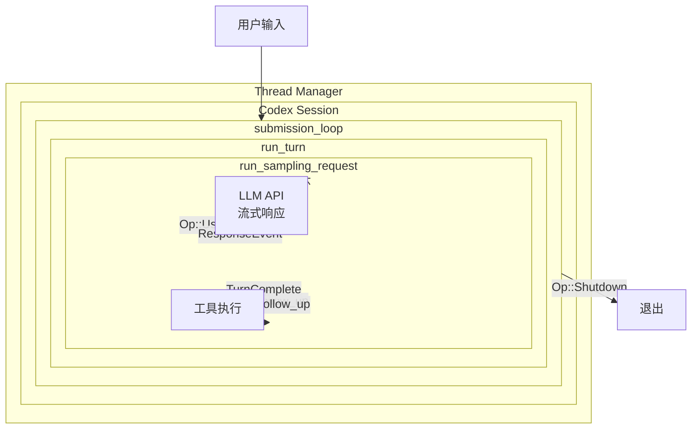
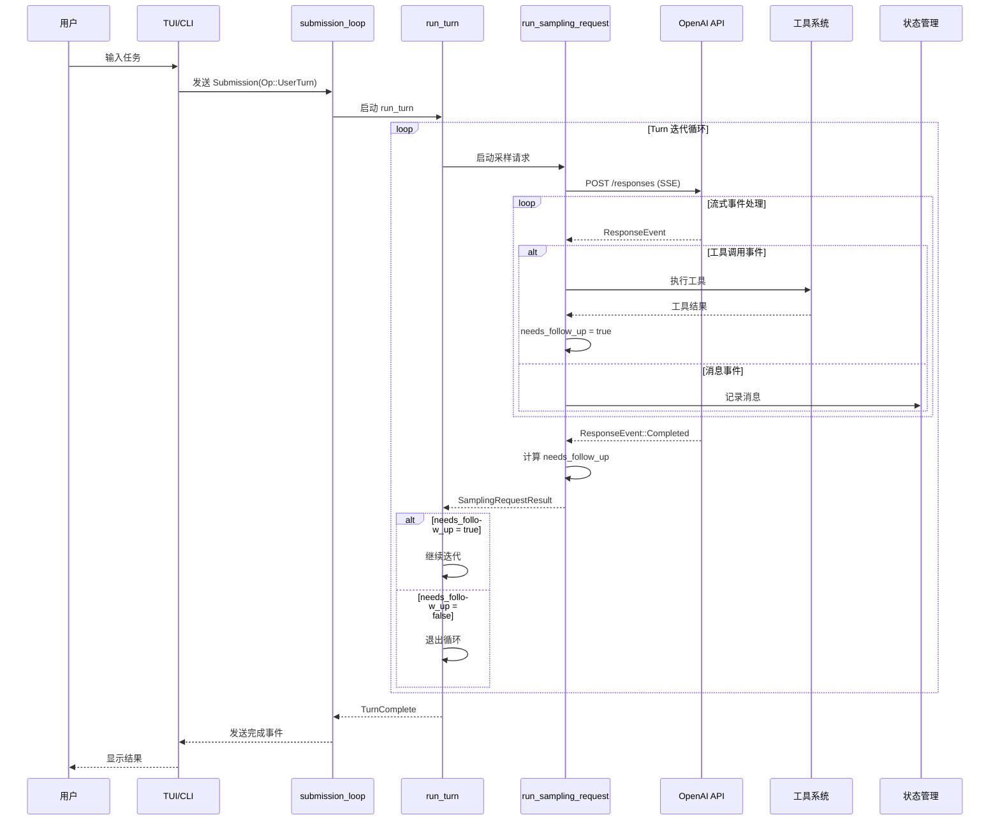
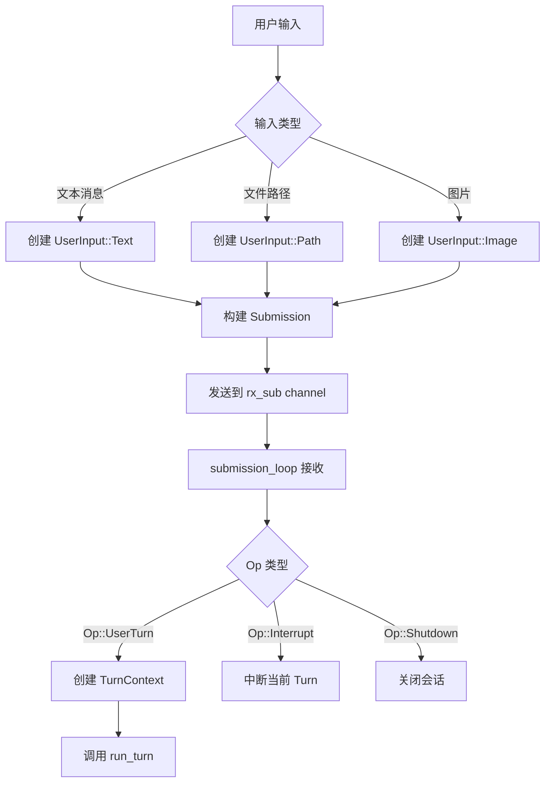
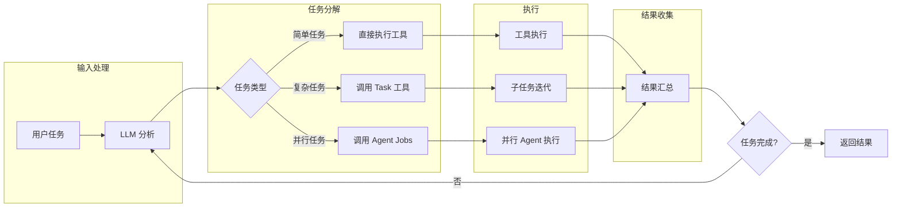
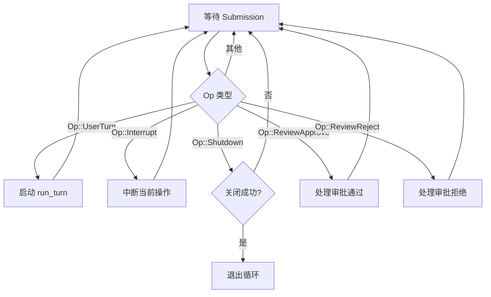
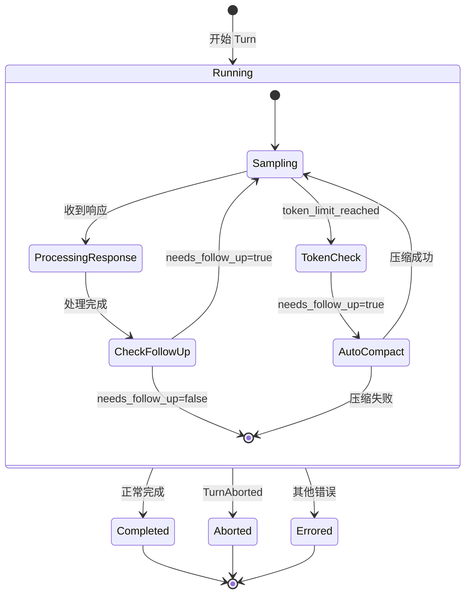
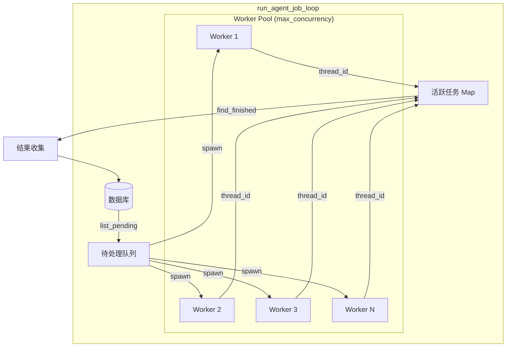
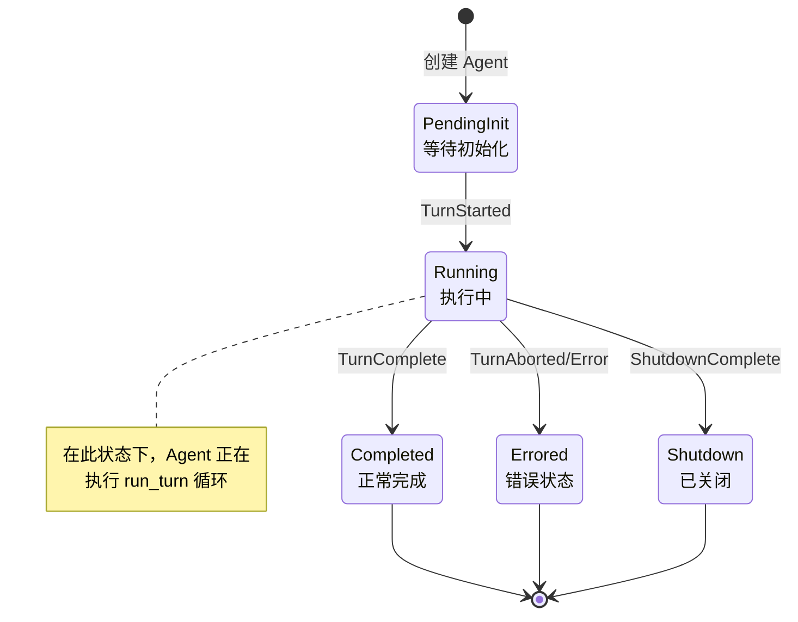
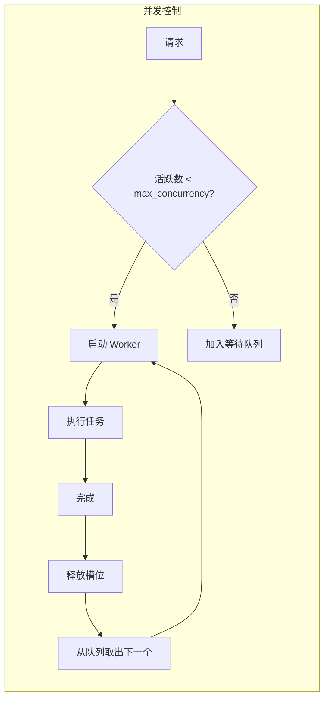

# Codex 事件循环机制深度解析

> 基于 OpenAI Codex 源代码的事件循环机制分析
> 分析日期: 2026-03-05
> 项目版本: 最新 master 分支

---

## 目录

1. [概述](#1-概述)
2. [整体架构图](#2-整体架构图)
3. [用户任务处理流程](#3-用户任务处理流程)
4. [核心循环详解](#4-核心循环详解)
   - 4.1 [submission_loop - 事件分发循环](#41-submission_loop---事件分发循环)
   - 4.2 [run_turn - Turn 核心循环](#42-run_turn---turn-核心循环)
   - 4.3 [run_sampling_request - 采样请求循环](#43-run_sampling_request---采样请求循环)
   - 4.4 [run_agent_job_loop - 批量任务循环](#44-run_agent_job_loop---批量任务循环)
5. [任务完成判断机制](#5-任务完成判断机制)
6. [状态管理](#6-状态管理)
7. [资源管理和限制](#7-资源管理和限制)
8. [关键代码路径总结](#8-关键代码路径总结)
9. [设计模式总结](#9-设计模式总结)

---

## 1. 概述

### 1.1 架构简介

Codex 的事件循环机制采用了**多层嵌套循环**的设计模式，从外到内依次处理：

1. **会话级别事件分发** - 处理用户提交、中断、关闭等操作
2. **Turn 级别迭代** - 单次对话回合的执行与迭代
3. **采样请求级别** - 与 LLM API 的流式交互
4. **批量任务级别** - 并行 Agent 任务管理

### 1.2 核心设计理念

```
用户任务 → submission_loop → run_turn → run_sampling_request → 工具执行
                                    ↑                              |
                                    └──── needs_follow_up ─────────┘
```

- **事件驱动**: 基于 Tokio 异步运行时的事件驱动架构
- **流式处理**: 使用 SSE (Server-Sent Events) 处理 LLM 响应
- **迭代执行**: 通过 `needs_follow_up` 标志决定是否继续迭代
- **取消支持**: 使用 `CancellationToken` 支持优雅取消

### 1.3 与整体架构的关系

本文档聚焦于事件循环机制，是 `codex-arch.md` 的深度补充。整体架构请参阅 `codex-arch.md`。

---

## 2. 整体架构图

### 2.1 三层循环关系图



### 2.2 组件交互时序图



---

## 3. 用户任务处理流程

### 3.1 任务提交流程



### 3.2 任务分解机制

当用户提交一个复杂任务时，Codex 通过以下方式进行任务分解：



### 3.3 核心数据结构

```rust
// 提交操作类型 (codex-rs/core/src/codex.rs)
pub enum Op {
    UserTurn,      // 用户对话回合
    Interrupt,     // 中断当前操作
    Shutdown,      // 关闭会话
    ReviewApprove, // 审批通过
    ReviewReject,  // 审批拒绝
    // ...
}

// 提交结构
pub struct Submission {
    pub id: u64,
    pub op: Op,
    pub turn_input: Option<Vec<UserInput>>,
}

// 用户输入类型
pub enum UserInput {
    Text(String),
    Path(PathBuf),
    Image(ImageContent),
}
```

---

## 4. 核心循环详解

### 4.1 submission_loop - 事件分发循环

**文件位置**: `codex-rs/core/src/codex.rs`
**行号**: 3603-3773

#### 核心逻辑

```rust
async fn submission_loop(
    sess: Arc<Session>,
    config: Arc<Config>,
    rx_sub: Receiver<Submission>
) {
    while let Ok(sub) = rx_sub.recv().await {  // Line 3604
        debug!(?sub, "Submission");
        match sub.op.clone() {
            Op::Interrupt => {
                handlers::interrupt(&sess).await;
            }
            Op::UserTurn => {
                // 创建 TurnContext 并启动 run_turn
                if let Err(e) = run_turn(...).await {
                    // 错误处理
                }
            }
            Op::Shutdown => {
                if handlers::shutdown(&sess, sub.id.clone()).await {
                    break;  // Line 3763 - 退出条件
                }
            }
            Op::ReviewApprove | Op::ReviewReject => {
                // 处理审批响应
            }
            _ => {} // 忽略未知操作
        }
    }
}
```

#### 退出条件

| 条件 | 行号 | 说明 |
|------|------|------|
| `Op::Shutdown` 且 handler 返回 true | 3763 | 正常关闭会话 |

#### 流程图



---

### 4.2 run_turn - Turn 核心循环

**文件位置**: `codex-rs/core/src/codex.rs`
**行号**: 4758-5118

#### 函数签名

```rust
pub(crate) async fn run_turn(
    sess: Arc<Session>,
    turn_context: Arc<TurnContext>,
    input: Vec<UserInput>,
    prewarmed_client_session: Option<ModelClientSession>,
    cancellation_token: CancellationToken,
) -> Option<String>
```

#### 核心循环逻辑

```rust
loop {  // Line 4924
    // ... 设置代码 ...

    let sampling_request_output = match run_sampling_request(...).await {
        Ok(sampling_request_output) => {
            let SamplingRequestResult {
                needs_follow_up,
                last_agent_message,
            } = sampling_request_output;

            // Token 限制处理
            if token_limit_reached && needs_follow_up {
                if run_auto_compact(...).await.is_err() {
                    return None;  // 压缩失败，退出
                }
                continue;  // Line 4979 - 压缩后重新开始
            }

            // 退出条件: 不需要后续处理
            if !needs_follow_up {
                last_agent_message = sampling_request_last_agent_message;
                // ... hook 处理 ...
                break;  // Line 5058 - 正常退出
            }
            continue;  // Line 5064 - 继续迭代
        }
        Err(CodexErr::TurnAborted) => {
            break;  // Line 5083 - 被取消
        }
        Err(CodexErr::InvalidImageRequest()) => {
            // 恢复逻辑: 移除无效图片
            if state.history.replace_last_turn_images("Invalid image") {
                continue;  // Line 5093 - 重试
            }
            break;  // Line 5112 - 恢复失败
        }
        Err(e) => {
            break;  // Line 5112 - 其他错误
        }
    }
}
```

#### 退出条件汇总

| 条件 | 行号 | 说明 |
|------|------|------|
| `!needs_follow_up` | 5058 | Turn 正常完成 |
| `CodexErr::TurnAborted` | 5083 | Turn 被取消 |
| 恢复失败或其他错误 | 5112 | 错误退出 |
| Token 限制 + 压缩失败 | - | 返回 None |

#### 状态图



---

### 4.3 run_sampling_request - 采样请求循环

**文件位置**: `codex-rs/core/src/codex.rs`
**行号**: 6169-6350

#### 结果结构

```rust
#[derive(Debug)]
struct SamplingRequestResult {
    needs_follow_up: bool,           // 是否需要后续处理
    last_agent_message: Option<String>,  // 最后的代理消息
}
```

#### 核心循环逻辑

```rust
let mut needs_follow_up = false;
let mut last_agent_message = None;

let outcome: CodexResult<SamplingRequestResult> = loop {  // Line 6189
    let event = match stream.next().or_cancel(&cancellation_token).await {
        Ok(event) => event,
        Err(CancelErr::Cancelled) => {
            break Err(CodexErr::TurnAborted);  // Line 6193
        },
    };

    match event {
        ResponseEvent::OutputItemDone(item) => {
            let output_result = handle_output_item_done(...).await?;

            // 队列工具调用
            if let Some(tool_future) = output_result.tool_future {
                in_flight.push_back(tool_future);
            }

            // 记录最后消息
            if let Some(agent_message) = output_result.last_agent_message {
                last_agent_message = Some(agent_message);
            }

            // 累积 needs_follow_up
            needs_follow_up |= output_result.needs_follow_up;  // Line 6257
        }

        ResponseEvent::Completed { response_id: _, token_usage, can_append: _ } => {
            // 检查是否有待处理的输入
            needs_follow_up |= sess.has_pending_input().await;  // Line 6347

            break Ok(SamplingRequestResult {  // Line 6349
                needs_follow_up,
                last_agent_message,
            });
        }

        // ... 其他事件处理 ...
    }
}
```

#### 退出条件

| 条件 | 行号 | 说明 |
|------|------|------|
| `ResponseEvent::Completed` | 6349 | 流式响应完成 |
| `CancelErr::Cancelled` | 6193 | 被取消 |

#### 事件处理流程

```mermaid
flowchart TD
    A[等待流事件] --> B{事件类型}

    B --> |OutputItemDone| C[处理输出项]
    C --> D{项类型}
    D --> |工具调用| E[创建 tool_future]
    D --> |消息| F[记录消息]
    E --> G[needs_follow_up \|= true]
    F --> G
    G --> A

    B --> |ContentPartDelta| H[处理增量内容]
    H --> A

    B --> |Completed| I[检查待处理输入]
    I --> J[needs_follow_up \|= has_pending_input]
    J --> K[返回 SamplingRequestResult]

    B --> |Error| L[错误处理]
    L --> A

    B --> |取消| M[返回 TurnAborted]
```

---

### 4.4 run_agent_job_loop - 批量任务循环

**文件位置**: `codex-rs/core/src/tools/handlers/agent_jobs.rs`
**行号**: 571-762

#### 功能说明

`run_agent_job_loop` 用于管理批量 Agent 任务，支持并行执行多个子任务。

#### 核心循环逻辑

```rust
loop {
    let mut progressed = false;

    // 1. 检查取消请求
    if !cancel_requested && db.is_agent_job_cancelled(job_id.as_str()).await? {
        cancel_requested = true;
        // 通知所有活跃的 worker
    }

    // 2. 启动新 worker (不超过并发限制)
    if !cancel_requested && active_items.len() < options.max_concurrency {
        let slots = options.max_concurrency - active_items.len();
        let pending_items = db.list_agent_job_items(...).await?;

        for item in pending_items.take(slots) {
            // 创建子 Agent
            match spawn_worker_agent(...).await {
                Ok(thread_id) => {
                    active_items.insert(thread_id, item.id.clone());
                }
                Err(e) => {
                    // 错误处理
                }
            }
        }
    }

    // 3. 清理过期项
    if reap_stale_active_items(...).await? {
        progressed = true;
    }

    // 4. 查找已完成的线程
    let finished = find_finished_threads(session.clone(), &active_items).await;

    if finished.is_empty() {
        // 退出条件检查
        if cancel_requested {
            if progress.running_items == 0 && active_items.is_empty() {
                break;  // 已取消且所有任务完成
            }
        } else if progress.pending_items == 0
               && progress.running_items == 0
               && active_items.is_empty() {
            break;  // 正常完成
        }

        // 无进展时等待
        if !progressed {
            tokio::time::sleep(STATUS_POLL_INTERVAL).await;
        }
        continue;
    }

    // 5. 处理完成的项
    for (thread_id, item_id) in finished {
        // 获取结果并更新数据库
        active_items.remove(&thread_id);
        // 发送进度更新
    }
}
```

#### 退出条件

| 条件 | 说明 |
|------|------|
| `pending_items == 0 && running_items == 0 && active_items.is_empty()` | 正常完成 |
| `cancel_requested && running_items == 0 && active_items.is_empty()` | 取消后完成 |

#### 并行执行模型



---

## 5. 任务完成判断机制

### 5.1 needs_follow_up 的含义

`needs_follow_up` 是一个布尔标志，用于判断当前 Turn 是否需要继续迭代。

| 值 | 含义 | 行为 |
|-----|------|------|
| `true` | 需要后续处理 | 继续调用 `run_sampling_request` |
| `false` | Turn 完成 | 退出循环，发送 `TurnComplete` 事件 |

### 5.2 needs_follow_up 的来源

```mermaid
flowchart LR
    subgraph 来源
        A[工具调用]
        B[Guardrail 响应]
        C[待处理输入]
    end

    A --> D[needs_follow_up = true]
    B --> D
    C --> E[needs_follow_up \|= has_pending_input]

    D --> F[累积: \|=]
    E --> F

    F --> G{最终值}
    G --> |true| H[继续迭代]
    G --> |false| I[Turn 完成]
```

#### 详细来源说明

| 来源 | 文件 | 行号 | 触发条件 |
|------|------|------|----------|
| 工具调用 | `stream_events_utils.rs` | 155 | 检测到工具调用并创建执行 Future |
| Guardrail 响应 | `stream_events_utils.rs` | 204, 226 | 需要向模型反馈信息 |
| 待处理输入 | `codex.rs` | 6347 | `has_pending_input()` 返回 true |

### 5.3 决策流程图

```mermaid
flowchart TD
    A[开始 Turn] --> B[调用 run_sampling_request]

    B --> C[处理流事件]
    C --> D{有工具调用?}

    D --> |是| E[执行工具]
    E --> F[needs_follow_up \|= true]

    D --> |否| G{有 Guardrail 响应?}
    G --> |是| F
    G --> |否| H[继续处理事件]

    H --> I{流完成?}
    I --> |否| C

    I --> |是| J{has_pending_input?}
    J --> |是| K[needs_follow_up \|= true]
    J --> |否| L[保持当前值]

    F --> M
    K --> M
    L --> M

    M{needs_follow_up?}
    M --> |true| N{token_limit_reached?}
    N --> |是| O[Auto Compact]
    O --> |成功| B
    O --> |失败| P[退出并返回 None]

    N --> |否| B
    M --> |false| Q[发送 TurnComplete]
    Q --> R[Turn 结束]
```

### 5.4 代码级分析

#### 累积逻辑 (codex.rs:6257)

```rust
ResponseEvent::OutputItemDone(item) => {
    let output_result = handle_output_item_done(...).await?;
    // 使用 OR 累积: 任何一个输出项需要 follow-up，整体就需要
    needs_follow_up |= output_result.needs_follow_up;
}
```

#### 最终检查 (codex.rs:6347)

```rust
ResponseEvent::Completed { ... } => {
    // 流完成后，检查是否有待处理的用户输入
    needs_follow_up |= sess.has_pending_input().await;
    break Ok(SamplingRequestResult { needs_follow_up, last_agent_message });
}
```

#### Turn 级决策 (codex.rs:5058)

```rust
if !needs_follow_up {
    // 不需要后续处理，Turn 完成
    last_agent_message = sampling_request_last_agent_message;
    break;  // 退出 run_turn 循环
}
// 否则继续迭代
continue;
```

---

## 6. 状态管理

### 6.1 Turn 状态 (codex-rs/core/src/state/turn.rs)

```rust
pub(crate) struct ActiveTurn {
    pub(crate) tasks: IndexMap<String, RunningTask>,
    pub(crate) turn_state: Arc<Mutex<TurnState>>,
}

#[derive(Default)]
pub(crate) struct TurnState {
    pending_approvals: HashMap<String, oneshot::Sender<ReviewDecision>>,
    pending_user_input: HashMap<String, oneshot::Sender<RequestUserInputResponse>>,
    pending_dynamic_tools: HashMap<String, oneshot::Sender<DynamicToolResponse>>,
    pending_input: Vec<ResponseInputItem>,  // 待处理输入
}

impl TurnState {
    pub(crate) fn has_pending_input(&self) -> bool {
        !self.pending_input.is_empty()
    }
}
```

### 6.2 Agent 状态转换 (codex-rs/core/src/agent/status.rs)



#### 状态判断代码

```rust
pub(crate) fn agent_status_from_event(msg: &EventMsg) -> Option<AgentStatus> {
    match msg {
        EventMsg::TurnStarted(_) => Some(AgentStatus::Running),
        EventMsg::TurnComplete(ev) => Some(AgentStatus::Completed(ev.last_agent_message.clone())),
        EventMsg::TurnAborted(ev) => Some(AgentStatus::Errored(format!("{:?}", ev.reason))),
        EventMsg::Error(ev) => Some(AgentStatus::Errored(ev.message.clone())),
        EventMsg::ShutdownComplete => Some(AgentStatus::Shutdown),
        _ => None,
    }
}

pub(crate) fn is_final(status: &AgentStatus) -> bool {
    !matches!(status, AgentStatus::PendingInit | AgentStatus::Running)
}
```

---

## 7. 资源管理和限制

### 7.1 Agent 守卫机制 (codex-rs/core/src/agent/guards.rs)

```rust
pub(crate) struct AgentGuards {
    pub(crate) max_turns: Option<u32>,       // 最大 Turn 数
    pub(crate) max_tokens: Option<u64>,      // 最大 Token 数
    pub(crate) max_time: Option<Duration>,   // 最大执行时间
}

impl AgentGuards {
    pub(crate) fn check(&self, context: &GuardContext) -> GuardResult {
        if let Some(max) = self.max_turns {
            if context.turn_count >= max {
                return GuardResult::LimitReached("max_turns".into());
            }
        }
        // ... 其他检查
    }
}
```

### 7.2 并发控制



### 7.3 取消机制

```rust
// 使用 CancellationToken 实现优雅取消
pub(crate) async fn with_cancellation<T>(
    token: &CancellationToken,
    future: impl Future<Output = T>,
) -> Result<T, Cancelled> {
    tokio::select! {
        result = future => Ok(result),
        _ = token.cancelled() => Err(Cancelled),
    }
}

// 在循环中检查
loop {
    let event = match stream.next().or_cancel(&cancellation_token).await {
        Ok(event) => event,
        Err(CancelErr::Cancelled) => {
            break Err(CodexErr::TurnAborted);
        },
    };
}
```

---

## 8. 关键代码路径总结

### 8.1 入口点

| 入口 | 文件 | 说明 |
|------|------|------|
| CLI | `codex-rs/cli/main.rs` | 命令行入口 |
| TUI | `codex-rs/tui/src/app.rs` | 终端 UI 入口 |
| SDK | `sdk/typescript/src/codex.ts` | TypeScript SDK 入口 |

### 8.2 核心调用链

```
main.rs
  └── run_tui() / run_exec()
        └── ThreadManager::new()
              └── spawn(submission_loop)  // 启动事件循环
                    └── Op::UserTurn
                          └── run_turn()
                                └── run_sampling_request()
                                      └── stream.next()  // LLM API 流
                                            └── handle_output_item_done()
                                                  └── tool execution
```

### 8.3 关键文件路径表

| 功能 | 文件路径 | 关键行号 |
|------|----------|----------|
| 事件分发循环 | `codex-rs/core/src/codex.rs` | 3603-3773 |
| Turn 执行循环 | `codex-rs/core/src/codex.rs` | 4758-5118 |
| 采样请求循环 | `codex-rs/core/src/codex.rs` | 6169-6350 |
| 批量任务循环 | `codex-rs/core/src/tools/handlers/agent_jobs.rs` | 571-762 |
| 状态管理 | `codex-rs/core/src/state/turn.rs` | - |
| 状态转换 | `codex-rs/core/src/agent/status.rs` | - |
| 事件处理工具 | `codex-rs/core/src/stream_events_utils.rs` | - |
| Agent 控制 | `codex-rs/core/src/agent/control.rs` | - |
| Agent 守卫 | `codex-rs/core/src/agent/guards.rs` | - |

---

## 9. 设计模式总结

### 9.1 使用的模式

| 模式 | 应用场景 | 说明 |
|------|----------|------|
| **事件循环** | submission_loop | 处理用户提交的各种操作 |
| **迭代器模式** | run_turn | 通过 needs_follow_up 控制迭代 |
| **流式处理** | run_sampling_request | 处理 SSE 流式响应 |
| **生产者-消费者** | channel 通信 | Submission 通过 channel 传递 |
| **状态机** | Agent 状态管理 | PendingInit → Running → Completed/Errored |
| **守卫模式** | AgentGuards | 资源限制检查 |
| **取消令牌** | CancellationToken | 优雅取消支持 |

### 9.2 架构特点

1. **分层解耦**: 三层循环各司其职，职责清晰
2. **异步优先**: 基于 Tokio 的全异步设计
3. **流式友好**: 原生支持 SSE 流式处理
4. **取消安全**: 所有阻塞操作都支持取消
5. **状态持久化**: SQLite 支持会话恢复

### 9.3 迭代控制总结

```
┌─────────────────────────────────────────────────────────────┐
│                    needs_follow_up 决策树                    │
├─────────────────────────────────────────────────────────────┤
│                                                             │
│  工具调用? ─────┐                                           │
│       │         │                                           │
│       ▼         │                                           │
│  执行工具 ──────┼──→ needs_follow_up = true ──┐             │
│       │         │                              │             │
│       ▼         │                              │             │
│  Guardrail? ───┤                              │             │
│       │         │                              │             │
│       ▼         │                              │             │
│  反馈模型 ──────┴──→ needs_follow_up = true ──┤             │
│                                                │             │
│  流完成? ──────────────────────────────────────┤             │
│       │                                        │             │
│       ▼                                        │             │
│  has_pending_input? ─→ needs_follow_up = true ─┤             │
│       │                                        │             │
│       ▼                                        ▼             │
│  needs_follow_up? ─────────────────→ 继续迭代 或 完成        │
│                                                             │
└─────────────────────────────────────────────────────────────┘
```

---

## 附录: 常见问题

### Q1: 为什么需要多层循环?

每层循环处理不同粒度的问题:
- `submission_loop`: 处理会话级别的操作（提交、中断、关闭）
- `run_turn`: 处理单次对话的完整生命周期
- `run_sampling_request`: 处理与 LLM 的单次交互

### Q2: needs_follow_up 何时为 false?

当满足以下所有条件时:
1. 没有待执行的工具调用
2. 没有 Guardrail 需要反馈
3. 没有待处理的用户输入
4. LLM 响应正常完成

### Q3: 如何实现任务取消?

1. 使用 `CancellationToken` 发送取消信号
2. 循环中通过 `.or_cancel(&token)` 检查
3. 捕获 `Cancelled` 错误并转换为 `TurnAborted`

### Q4: Auto Compact 是什么?

当 Token 接近限制时，系统会自动压缩对话历史:
1. 保留重要的上下文
2. 移除或总结旧的对话
3. 释放 Token 空间继续执行

---

*文档结束*
