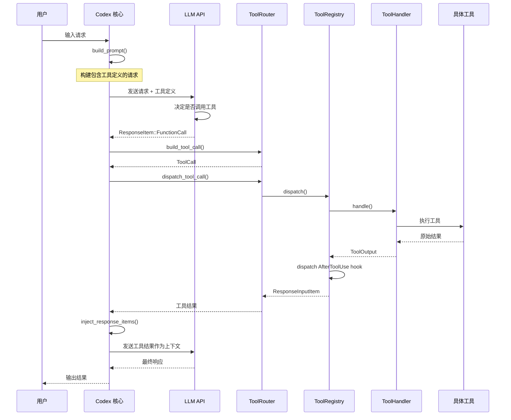
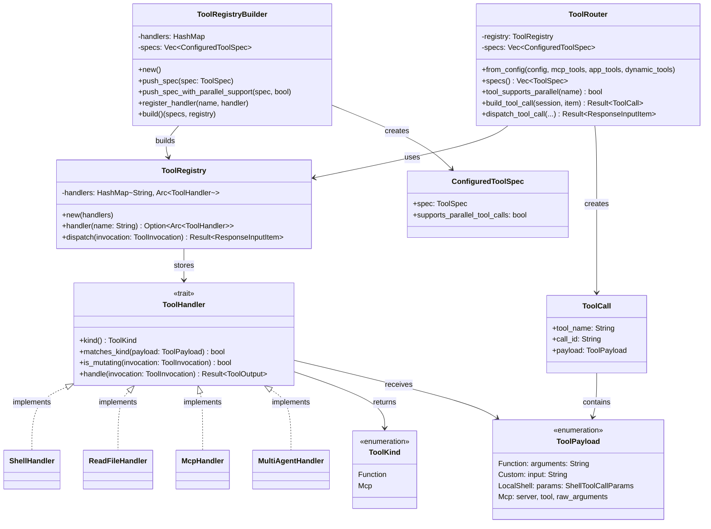
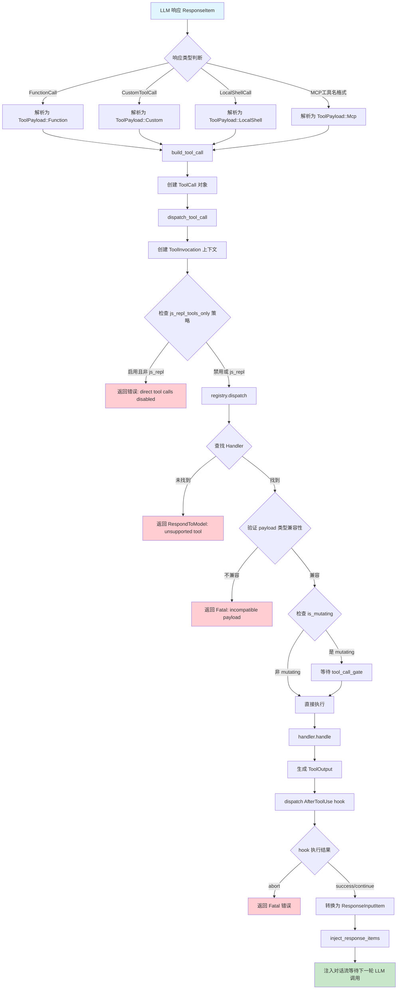
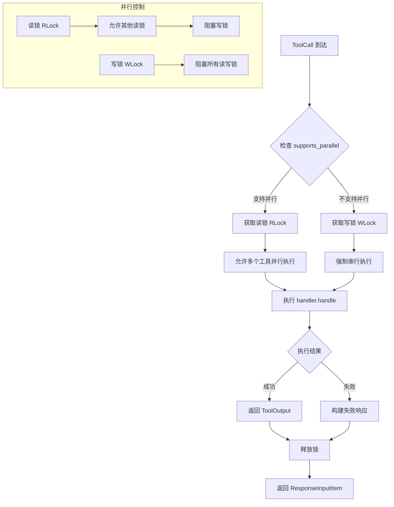

# Codex 工具调用机制深度解析

> 本文档深入解析 OpenAI Codex 的工具调用机制，包括工具的发现、注册、选择、执行和结果处理等完整流程。

## 目录

1. [概述](#1-概述)
2. [工具发现与注册机制](#2-工具发现与注册机制)
3. [工具选择机制](#3-工具选择机制)
4. [工具调用执行流程](#4-工具调用执行流程)
5. [工具返回结果处理](#5-工具返回结果处理)
6. [成功失败判断](#6-成功失败判断)
7. [错误处理与重试机制](#7-错误处理与重试机制)
8. [流程图](#8-流程图)
9. [关键文件索引](#9-关键文件索引)

---

## 1. 概述

### 1.1 工具系统架构

Codex 的工具系统采用分层架构设计，主要由以下几个模块组成：

```
┌─────────────────────────────────────────────────────────────┐
│                      ToolRouter                              │
│  (工具路由器 - 负责工具调用的构建和分发)                       │
├─────────────────────────────────────────────────────────────┤
│                      ToolRegistry                            │
│  (工具注册表 - 存储和管理所有工具处理器)                       │
├─────────────────────────────────────────────────────────────┤
│   ToolHandler Trait (工具处理器接口)                          │
│  ┌─────────┬─────────┬─────────┬─────────┬─────────┐        │
│  │ Shell   │ ReadFile │ MCP    │ Multi   │ Dynamic │ ...    │
│  │ Handler │ Handler  │ Handler│ Agent   │ Tool    │        │
│  └─────────┴─────────┴─────────┴─────────┴─────────┘        │
├─────────────────────────────────────────────────────────────┤
│   ToolSpec (工具规格定义)                                     │
│  - JSON Schema 定义工具参数                                   │
│  - 发送给 LLM 用于工具选择                                    │
└─────────────────────────────────────────────────────────────┘
```

### 1.2 核心设计理念

| 设计原则 | 说明 |
|---------|------|
| **类型安全** | 使用 Rust 的类型系统确保工具调用的安全性 |
| **可扩展性** | 通过 `ToolHandler` trait 支持自定义工具 |
| **异步执行** | 工具调用完全异步，支持并发执行 |
| **沙盒安全** | 多层沙箱策略和审批机制 |
| **并行优化** | 通过读写锁实现精细的并发控制 |
| **Hook 系统** | 支持扩展点的自定义行为 |

---

## 2. 工具发现与注册机制

### 2.1 ToolHandler Trait - 工具处理器核心接口

**文件路径**: `codex-rs/core/src/tools/registry.rs`

```rust
/// 工具类型枚举
#[derive(Clone, Copy, Debug, PartialEq, Eq, Hash)]
pub enum ToolKind {
    Function,  // 标准 JSON 函数调用
    Mcp,       // MCP 协议工具
}

/// 工具处理器 Trait - 所有工具必须实现此接口
#[async_trait]
pub trait ToolHandler: Send + Sync {
    /// 返回工具类型
    fn kind(&self) -> ToolKind;

    /// 检查 payload 类型是否匹配
    fn matches_kind(&self, payload: &ToolPayload) -> bool {
        matches!(
            (self.kind(), payload),
            (ToolKind::Function, ToolPayload::Function { .. })
                | (ToolKind::Mcp, ToolPayload::Mcp { .. })
        )
    }

    /// 判断工具调用是否会修改环境（文件系统、OS 操作等）
    /// 此方法必须保守，如果不确定则返回 true
    async fn is_mutating(&self, _invocation: &ToolInvocation) -> bool {
        false
    }

    /// 执行工具调用并返回结果
    async fn handle(&self, invocation: ToolInvocation)
        -> Result<ToolOutput, FunctionCallError>;
}
```

### 2.2 ToolPayload - 工具调用负载

**文件路径**: `codex-rs/core/src/tools/context.rs`

```rust
/// 工具调用负载枚举
pub enum ToolPayload {
    /// 标准 JSON 函数调用
    Function {
        arguments: String,  // JSON 格式的参数
    },

    /// 自定义/自由格式工具调用（如 apply_patch、js_repl）
    Custom {
        input: String,
    },

    /// 本地 Shell 调用
    LocalShell {
        params: ShellToolCallParams,
    },

    /// MCP 工具调用
    Mcp {
        server: String,         // MCP 服务器名称
        tool: String,           // 工具名称
        raw_arguments: String,  // 原始参数 JSON
    },
}
```

### 2.3 ToolRegistry - 工具注册表

**文件路径**: `codex-rs/core/src/tools/registry.rs`

```rust
/// 工具注册表 - 存储所有工具处理器
pub struct ToolRegistry {
    handlers: HashMap<String, Arc<dyn ToolHandler>>,
}

impl ToolRegistry {
    pub fn new(handlers: HashMap<String, Arc<dyn ToolHandler>>) -> Self {
        Self { handlers }
    }

    /// 根据名称获取工具处理器
    pub fn handler(&self, name: &str) -> Option<Arc<dyn ToolHandler>> {
        self.handlers.get(name).map(Arc::clone)
    }

    /// 分发工具调用
    pub async fn dispatch(
        &self,
        invocation: ToolInvocation,
    ) -> Result<ResponseInputItem, FunctionCallError> {
        // 1. 查找处理器
        // 2. 验证 payload 类型
        // 3. 检查是否为 mutating 操作
        // 4. 执行处理器
        // 5. 触发 AfterToolUse hook
        // 6. 返回结果
    }
}
```

### 2.4 ToolRegistryBuilder - 工具注册构建器

```rust
/// 配置好的工具规格
#[derive(Debug, Clone)]
pub struct ConfiguredToolSpec {
    pub spec: ToolSpec,
    pub supports_parallel_tool_calls: bool,
}

/// 工具注册构建器
pub struct ToolRegistryBuilder {
    handlers: HashMap<String, Arc<dyn ToolHandler>>,
    specs: Vec<ConfiguredToolSpec>,
}

impl ToolRegistryBuilder {
    pub fn new() -> Self;

    /// 添加工具规格
    pub fn push_spec(&mut self, spec: ToolSpec);

    /// 添加支持并行调用的工具规格
    pub fn push_spec_with_parallel_support(
        &mut self,
        spec: ToolSpec,
        supports_parallel_tool_calls: bool
    );

    /// 注册工具处理器
    pub fn register_handler(
        &mut self,
        name: impl Into<String>,
        handler: Arc<dyn ToolHandler>
    );

    /// 构建最终的注册表
    pub fn build(self) -> (Vec<ConfiguredToolSpec>, ToolRegistry);
}
```

### 2.5 build_specs() - 构建工具规格

**文件路径**: `codex-rs/core/src/tools/spec.rs` (行 1645-1840)

```rust
/// 构建工具注册表，同时收集工具规格用于序列化
pub(crate) fn build_specs(
    config: &ToolsConfig,
    mcp_tools: Option<HashMap<String, rmcp::model::Tool>>,
    app_tools: Option<HashMap<String, ToolInfo>>,
    dynamic_tools: &[DynamicToolSpec],
) -> ToolRegistryBuilder {
    let mut builder = ToolRegistryBuilder::new();

    // 1. Shell 工具（根据配置选择不同类型）
    match &config.shell_type {
        ConfigShellToolType::Default => {
            builder.push_spec_with_parallel_support(
                create_shell_tool(request_permission_enabled),
                true,  // 支持并行调用
            );
        }
        ConfigShellToolType::UnifiedExec => {
            builder.push_spec_with_parallel_support(
                create_exec_command_tool(...),
                true,
            );
            builder.push_spec(create_write_stdin_tool());
        }
        // ...
    }

    // 2. MCP 资源工具
    if mcp_tools.is_some() {
        builder.push_spec_with_parallel_support(create_list_mcp_resources_tool(), true);
        builder.push_spec_with_parallel_support(create_read_mcp_resource_tool(), true);
    }

    // 3. 计划工具
    builder.push_spec(PLAN_TOOL.clone());
    builder.register_handler("update_plan", plan_handler);

    // 4. JS REPL 工具
    if config.js_repl_enabled {
        builder.push_spec(create_js_repl_tool());
        builder.register_handler("js_repl", js_repl_handler);
    }

    // 5. 文件系统工具
    if config.experimental_supported_tools.contains(&"read_file".to_string()) {
        builder.push_spec_with_parallel_support(create_read_file_tool(), true);
        builder.register_handler("read_file", read_file_handler);
    }

    // 6. 多智能体协作工具
    if config.collab_tools {
        builder.push_spec(create_spawn_agent_tool(config));
        builder.register_handler("spawn_agent", multi_agent_handler);
        // ...
    }

    builder
}
```

### 2.6 内置工具列表

| 工具名称 | 处理器 | 功能说明 | 支持并行 |
|---------|--------|---------|---------|
| `shell` / `local_shell` | ShellHandler | Shell 命令执行 | ✅ |
| `exec_command` | UnifiedExecHandler | 统一执行命令 | ✅ |
| `read_file` | ReadFileHandler | 读取文件内容 | ✅ |
| `grep_files` | GrepFilesHandler | 搜索文件内容 | ✅ |
| `list_dir` | ListDirHandler | 列出目录内容 | ✅ |
| `view_image` | ViewImageHandler | 查看图片 | ✅ |
| `apply_patch` | ApplyPatchHandler | 应用文件补丁 | ❌ |
| `js_repl` | JsReplHandler | JavaScript REPL | ❌ |
| `update_plan` | PlanHandler | 更新任务计划 | ❌ |
| `request_user_input` | RequestUserInputHandler | 请求用户输入 | ❌ |
| `spawn_agent` | MultiAgentHandler | 生成子智能体 | ❌ |
| MCP 工具 | McpHandler | MCP 协议工具 | ✅ |

---

## 3. 工具选择机制

### 3.1 工具规格转换为 JSON Schema

**文件路径**: `codex-rs/core/src/tools/spec.rs`

```rust
/// 将工具规格转换为 Responses API 兼容的 JSON
pub fn create_tools_json_for_responses_api(
    tools: &[ToolSpec],
) -> Result<Vec<ResponsesApiTool>, anyhow::Error> {
    tools
        .iter()
        .map(|tool| {
            Ok(ResponsesApiTool {
                name: tool.name().to_string(),
                description: tool.description().unwrap_or_default().to_string(),
                strict: true,
                parameters: tool.parameters()?,
            })
        })
        .collect()
}
```

### 3.2 ResponsesApiTool 结构

```rust
/// 发送给 LLM 的工具定义
pub struct ResponsesApiTool {
    pub name: String,
    pub description: String,
    pub strict: bool,
    pub parameters: JsonSchema,
}
```

### 3.3 API 请求构建

**文件路径**: `codex-rs/core/src/client.rs`

```rust
/// 构建 Responses API 请求
pub fn build_responses_request(
    model_info: &ModelInfo,
    instructions: &str,
    prompt: &Prompt,
) -> Result<ResponsesApiRequest, anyhow::Error> {
    let request = ResponsesApiRequest {
        model: model_info.slug.clone(),
        instructions: instructions.clone(),
        input: prompt.get_formatted_input(),
        tools: create_tools_json_for_responses_api(&prompt.tools)?,
        tool_choice: "auto".to_string(),  // 让 LLM 自动决定
        parallel_tool_calls: prompt.parallel_tool_calls,
        // ...
    };
    Ok(request)
}
```

### 3.4 LLM 响应类型

**文件路径**: `codex-rs/protocol/src/models.rs` (行 196-302)

```rust
/// LLM 可能返回的响应项类型
pub enum ResponseItem {
    /// 普通消息
    Message {
        role: String,
        content: String,
    },

    /// 标准 JSON 函数调用
    FunctionCall {
        name: String,
        arguments: String,  // JSON 格式
        call_id: String,
    },

    /// 自定义/自由格式工具调用
    CustomToolCall {
        name: String,
        input: String,
        call_id: String,
    },

    /// 本地 Shell 调用
    LocalShellCall {
        id: Option<String>,
        call_id: Option<String>,
        action: LocalShellAction,
    },

    /// Web 搜索调用
    WebSearchCall {
        id: String,
    },

    /// 推理内容
    Reasoning {
        summary: Vec<ReasoningSummary>,
    },
}
```

---

## 4. 工具调用执行流程

### 4.1 build_tool_call - 构建工具调用

**文件路径**: `codex-rs/core/src/tools/router.rs` (行 67-137)

```rust
/// 从 LLM 响应构建工具调用对象
pub async fn build_tool_call(
    session: &Session,
    item: ResponseItem,
) -> Result<Option<ToolCall>, FunctionCallError> {
    match item {
        // 标准 JSON 函数调用
        ResponseItem::FunctionCall { name, arguments, call_id, .. } => {
            // 检查是否为 MCP 工具（格式：mcp__server__tool）
            if let Some((server, tool)) = session.parse_mcp_tool_name(&name).await {
                Ok(Some(ToolCall {
                    tool_name: name,
                    call_id,
                    payload: ToolPayload::Mcp {
                        server,
                        tool,
                        raw_arguments: arguments,
                    },
                }))
            } else {
                Ok(Some(ToolCall {
                    tool_name: name,
                    call_id,
                    payload: ToolPayload::Function { arguments },
                }))
            }
        }

        // 自定义工具调用
        ResponseItem::CustomToolCall { name, input, call_id, .. } => {
            Ok(Some(ToolCall {
                tool_name: name,
                call_id,
                payload: ToolPayload::Custom { input },
            }))
        }

        // 本地 Shell 调用
        ResponseItem::LocalShellCall { id, call_id, action, .. } => {
            let call_id = call_id.or(id)
                .ok_or(FunctionCallError::MissingLocalShellCallId)?;

            match action {
                LocalShellAction::Exec(exec) => {
                    let params = ShellToolCallParams {
                        command: exec.command,
                        workdir: exec.working_directory,
                        timeout_ms: exec.timeout_ms,
                        sandbox_permissions: Some(SandboxPermissions::UseDefault),
                        // ...
                    };
                    Ok(Some(ToolCall {
                        tool_name: "local_shell".to_string(),
                        call_id,
                        payload: ToolPayload::LocalShell { params },
                    }))
                }
            }
        }

        _ => Ok(None),
    }
}
```

### 4.2 ToolCall 结构

```rust
/// 工具调用对象
#[derive(Clone, Debug)]
pub struct ToolCall {
    pub tool_name: String,
    pub call_id: String,
    pub payload: ToolPayload,
}
```

### 4.3 dispatch_tool_call - 分发工具调用

**文件路径**: `codex-rs/core/src/tools/router.rs` (行 140-189)

```rust
/// 分发工具调用到对应的处理器
pub async fn dispatch_tool_call(
    &self,
    session: Arc<Session>,
    turn: Arc<TurnContext>,
    tracker: SharedTurnDiffTracker,
    call: ToolCall,
    source: ToolCallSource,
) -> Result<ResponseInputItem, FunctionCallError> {
    let ToolCall { tool_name, call_id, payload } = call;
    let payload_outputs_custom = matches!(payload, ToolPayload::Custom { .. });
    let failure_call_id = call_id.clone();

    // 1. 检查 js_repl_tools_only 策略
    if source == ToolCallSource::Direct
        && turn.tools_config.js_repl_tools_only
        && !matches!(tool_name.as_str(), "js_repl" | "js_repl_reset")
    {
        let err = FunctionCallError::RespondToModel(
            "direct tool calls are disabled; use js_repl and codex.tool(...) instead"
                .to_string(),
        );
        return Ok(Self::failure_response(failure_call_id, payload_outputs_custom, err));
    }

    // 2. 创建工具调用上下文
    let invocation = ToolInvocation {
        session,
        turn,
        tracker,
        call_id,
        tool_name,
        payload,
    };

    // 3. 分发到注册表执行
    match self.registry.dispatch(invocation).await {
        Ok(response) => Ok(response),
        Err(FunctionCallError::Fatal(message)) => Err(FunctionCallError::Fatal(message)),
        Err(err) => Ok(Self::failure_response(failure_call_id, payload_outputs_custom, err)),
    }
}
```

### 4.4 ToolInvocation - 工具调用上下文

**文件路径**: `codex-rs/core/src/tools/context.rs`

```rust
/// 工具调用上下文，包含执行所需的所有信息
pub struct ToolInvocation {
    pub session: Arc<Session>,
    pub turn: Arc<TurnContext>,
    pub tracker: SharedTurnDiffTracker,
    pub call_id: String,
    pub tool_name: String,
    pub payload: ToolPayload,
}
```

### 4.5 registry.dispatch - 注册表分发

**文件路径**: `codex-rs/core/src/tools/registry.rs` (行 79-223)

```rust
pub async fn dispatch(
    &self,
    invocation: ToolInvocation,
) -> Result<ResponseInputItem, FunctionCallError> {
    let tool_name = invocation.tool_name.clone();
    let call_id = invocation.call_id.clone();
    let payload_for_response = invocation.payload.clone();

    // 1. 查找处理器
    let handler = match self.handler(tool_name.as_ref()) {
        Some(handler) => handler,
        None => {
            let message = unsupported_tool_call_message(&invocation.payload, tool_name.as_ref());
            return Err(FunctionCallError::RespondToModel(message));
        }
    };

    // 2. 验证 payload 类型兼容性
    if !handler.matches_kind(&invocation.payload) {
        let message = format!("tool {tool_name} invoked with incompatible payload");
        return Err(FunctionCallError::Fatal(message));
    }

    // 3. 检查是否为 mutating 操作
    let is_mutating = handler.is_mutating(&invocation).await;

    // 4. 执行处理器
    let result = async {
        // 如果是 mutating 操作，等待 tool_call_gate
        if is_mutating {
            invocation.turn.tool_call_gate.wait_ready().await;
        }
        handler.handle(invocation).await
    }.await;

    // 5. 触发 AfterToolUse hook
    let hook_abort_error = dispatch_after_tool_use_hook(AfterToolUseHookDispatch {
        invocation: &invocation,
        output_preview: output_preview.clone(),
        success,
        executed: true,
        duration,
        mutating: is_mutating,
    }).await;

    if let Some(err) = hook_abort_error {
        return Err(err);
    }

    // 6. 转换结果
    match result {
        Ok(output) => Ok(output.into_response(&call_id, &payload_for_response)),
        Err(err) => Err(err),
    }
}
```

### 4.6 并行执行控制

**文件路径**: `codex-rs/core/src/tools/parallel.rs`

```rust
/// 工具调用运行时
pub struct ToolCallRuntime {
    tool_name: String,
    supports_parallel: bool,
    router: Arc<ToolRouter>,
}

impl ToolCallRuntime {
    /// 处理单个工具调用
    pub(crate) fn handle_tool_call(
        self,
        call: ToolCall,
        cancellation_token: CancellationToken,
    ) -> impl Future<Output = Result<ResponseInputItem, CodexErr>> {
        async move {
            // 根据是否支持并行获取不同锁
            let result = if self.supports_parallel {
                // 支持并行：获取读锁（允许多个并行调用）
                let _guard = self.parallel_tool_calls_lock.read().await;
                self.execute_call(&call).await
            } else {
                // 不支持并行：获取写锁（强制串行）
                let _guard = self.parallel_tool_calls_lock.write().await;
                self.execute_call(&call).await
            };

            // 处理取消
            tokio::select! {
                result = async { result } => result,
                _ = cancellation_token.cancelled() => {
                    Ok(Self::aborted_response(&call, elapsed.as_secs_f32()))
                }
            }
        }
    }

    /// 构建取消响应
    fn aborted_response(call: &ToolCall, secs: f32) -> ResponseInputItem {
        match &call.payload {
            ToolPayload::Custom { .. } => ResponseInputItem::CustomToolCallOutput {
                call_id: call.call_id.clone(),
                output: FunctionCallOutputPayload {
                    body: FunctionCallOutputBody::Text(Self::abort_message(call, secs)),
                    ..Default::default()
                },
            },
            ToolPayload::Mcp { .. } => ResponseInputItem::McpToolCallOutput {
                call_id: call.call_id.clone(),
                result: Err(Self::abort_message(call, secs)),
            },
            _ => ResponseInputItem::FunctionCallOutput {
                call_id: call.call_id.clone(),
                output: FunctionCallOutputPayload {
                    body: FunctionCallOutputBody::Text(Self::abort_message(call, secs)),
                    ..Default::default()
                },
            },
        }
    }
}
```

---

## 5. 工具返回结果处理

### 5.1 ToolOutput - 工具输出类型

**文件路径**: `codex-rs/core/src/tools/context.rs`

```rust
/// 工具调用输出的统一类型
pub enum ToolOutput {
    /// 函数式工具输出
    Function {
        /// 输出体（文本或结构化内容）
        body: FunctionCallOutputBody,
        /// 是否成功（None 表示不确定，默认成功）
        success: Option<bool>,
    },

    /// MCP 工具输出
    Mcp {
        /// MCP 调用结果
        result: Result<CallToolResult, String>,
    },
}

impl ToolOutput {
    /// 转换为响应项
    pub fn into_response(self, call_id: &str, payload: &ToolPayload) -> ResponseInputItem {
        match self {
            ToolOutput::Function { body, success } => {
                // 自由格式工具使用 CustomToolCallOutput
                if matches!(payload, ToolPayload::Custom { .. }) {
                    return ResponseInputItem::CustomToolCallOutput {
                        call_id: call_id.to_string(),
                        output: FunctionCallOutputPayload { body, success },
                    };
                }
                // 标准函数工具使用 FunctionCallOutput
                ResponseInputItem::FunctionCallOutput {
                    call_id: call_id.to_string(),
                    output: FunctionCallOutputPayload { body, success },
                }
            }
            // MCP 工具直接使用 MCP 结果封装
            ToolOutput::Mcp { result } => ResponseInputItem::McpToolCallOutput {
                call_id: call_id.to_string(),
                result,
            },
        }
    }

    /// 用于日志的成功判断
    pub fn success_for_logging(&self) -> bool {
        match self {
            ToolOutput::Function { success, .. } => success.unwrap_or(true),
            ToolOutput::Mcp { result } => result.is_ok(),
        }
    }
}
```

### 5.2 FunctionCallOutputBody - 输出体类型

```rust
/// 函数调用输出体
pub enum FunctionCallOutputBody {
    /// 纯文本输出
    Text(String),

    /// 结构化内容项列表
    ContentItems(Vec<FunctionCallOutputContentItem>),
}

/// 内容项类型
pub enum FunctionCallOutputContentItem {
    InputText { text: String },
    InputImage { image_url: String },
    InputResource { uri: String, mime_type: String },
}
```

### 5.3 ResponseInputItem - 响应项类型

**文件路径**: `codex-rs/protocol/src/models.rs` (行 151-166)

```rust
/// 输入项类型，用于将工具结果注入到 LLM 对话流中
pub enum ResponseInputItem {
    /// 普通消息
    Message {
        role: String,
        content: String,
    },

    /// 标准 JSON 函数工具输出
    FunctionCallOutput {
        call_id: String,
        output: FunctionCallOutputPayload,
    },

    /// MCP 工具输出（直接使用 MCP 结果封装）
    McpToolCallOutput {
        call_id: String,
        result: Result<CallToolResult, String>,
    },

    /// 自由格式工具输出（如 apply_patch、js_repl）
    CustomToolCallOutput {
        call_id: String,
        output: FunctionCallOutputPayload,
    },
}
```

### 5.4 结果注入对话流

**文件路径**: `codex-rs/core/src/codex.rs`

```rust
/// 将响应项注入到当前会话
pub async fn inject_response_items(
    &self,
    input: Vec<ResponseInputItem>,
) -> Result<(), Vec<ResponseInputItem>> {
    let mut active = self.active_turn.lock().await;
    match active.as_mut() {
        Some(at) => {
            let mut ts = at.turn_state.lock().await;
            for item in input {
                // 将工具结果添加到待处理输入队列
                ts.push_pending_input(item);
            }
            Ok(())
        }
        None => Err(input),  // 无活跃 turn 时返回错误
    }
}
```

**文件路径**: `codex-rs/core/src/state/turn.rs`

```rust
impl TurnState {
    /// 添加待处理输入
    pub(crate) fn push_pending_input(&mut self, input: ResponseInputItem) {
        self.pending_input.push(input);
    }

    /// 取出所有待处理输入
    pub(crate) fn take_pending_input(&mut self) -> Vec<ResponseInputItem> {
        if self.pending_input.is_empty() {
            return Vec::new();
        }
        let mut ret = Vec::with_capacity(self.pending_input.len());
        std::mem::swap(&mut ret, &mut self.pending_input);
        ret
    }
}
```

---

## 6. 成功失败判断

### 6.1 success_for_logging 方法

```rust
impl ToolOutput {
    /// 用于日志记录的成功判断
    pub fn success_for_logging(&self) -> bool {
        match self {
            // success 为 None 时默认为成功
            ToolOutput::Function { success, .. } => success.unwrap_or(true),
            // MCP 结果根据 Result 判断
            ToolOutput::Mcp { result } => result.is_ok(),
        }
    }
}
```

### 6.2 MCP 结果的成功判断

**文件路径**: `codex-rs/protocol/src/models.rs` (行 1102-1154)

```rust
/// MCP 工具调用结果
pub struct CallToolResult {
    pub content: Vec<serde_json::Value>,
    pub structured_content: Option<serde_json::Value>,
    /// 是否为错误标记
    pub is_error: Option<bool>,
    pub meta: Option<serde_json::Value>,
}

impl From<&CallToolResult> for FunctionCallOutputPayload {
    fn from(call_tool_result: &CallToolResult) -> Self {
        let CallToolResult { content, is_error, .. } = call_tool_result;

        // is_error 不为 Some(true) 即为成功
        let is_success = is_error != &Some(true);

        FunctionCallOutputPayload {
            body,
            success: Some(is_success),
        }
    }
}
```

### 6.3 FunctionCallError 错误类型

**文件路径**: `codex-rs/core/src/function_tool.rs`

```rust
/// 工具调用错误类型
#[derive(Debug, Error, PartialEq)]
pub enum FunctionCallError {
    /// 返回给模型的错误消息（可恢复）
    #[error("{0}")]
    RespondToModel(String),

    /// 缺少本地 Shell 调用 ID
    #[error("LocalShellCall without call_id or id")]
    MissingLocalShellCallId,

    /// 致命错误，中断整个会话
    #[error("Fatal error: {0}")]
    Fatal(String),
}
```

### 6.4 失败响应构建

```rust
impl ToolRouter {
    /// 构建失败响应
    fn failure_response(
        call_id: String,
        payload_outputs_custom: bool,
        err: FunctionCallError,
    ) -> ResponseInputItem {
        let message = err.to_string();

        if payload_outputs_custom {
            ResponseInputItem::CustomToolCallOutput {
                call_id,
                output: FunctionCallOutputPayload {
                    body: FunctionCallOutputBody::Text(message),
                    success: Some(false),  // 明确标记为失败
                },
            }
        } else {
            ResponseInputItem::FunctionCallOutput {
                call_id,
                output: FunctionCallOutputPayload {
                    body: FunctionCallOutputBody::Text(message),
                    success: Some(false),  // 明确标记为失败
                },
            }
        }
    }
}
```

---

## 7. 错误处理与重试机制

### 7.1 CodexErr 错误类型

**文件路径**: `codex-rs/core/src/error.rs` (行 64-230)

```rust
#[derive(Error, Debug)]
pub enum CodexErr {
    /// 流断开错误 - 会话循环会自动重试
    #[error("stream disconnected before completion: {0}")]
    Stream(String, Option<Duration>),

    /// 上下文窗口超出
    #[error("Codex ran out of room in the model's context window...")]
    ContextWindowExceeded,

    /// 重试限制超出
    #[error("{0}")]
    RetryLimit(RetryLimitReachedError),

    /// 沙箱错误
    #[error("sandbox error: {0}")]
    Sandbox(#[from] SandboxErr),

    /// 超时
    #[error("timeout")]
    Timeout,

    /// Turn 被中止
    #[error("turn aborted")]
    TurnAborted,

    /// 用户中断
    #[error("interrupted")]
    Interrupted,

    /// 致命错误
    #[error("fatal: {0}")]
    Fatal(String),

    // ... 其他错误类型
}
```

### 7.2 可重试错误判断

```rust
impl CodexErr {
    /// 判断错误是否可重试
    pub fn is_retryable(&self) -> bool {
        match self {
            // 不可重试的错误
            CodexErr::TurnAborted
            | CodexErr::Interrupted
            | CodexErr::Fatal(_)
            | CodexErr::UsageNotIncluded
            | CodexErr::QuotaExceeded
            | CodexErr::InvalidRequest(_)
            | CodexErr::RetryLimit(_)
            | CodexErr::ContextWindowExceeded
            | CodexErr::Sandbox(_) => false,

            // 可重试的错误
            CodexErr::Stream(..)
            | CodexErr::Timeout
            | CodexErr::UnexpectedStatus(_)
            | CodexErr::ResponseStreamFailed(_)
            | CodexErr::ConnectionFailed(_)
            | CodexErr::InternalServerError
            | CodexErr::InternalAgentDied
            | CodexErr::Io(_)
            | CodexErr::Json(_) => true,
        }
    }
}
```

### 7.3 流重试逻辑

**文件路径**: `codex-rs/core/src/codex.rs`

```rust
/// 处理流错误的重试逻辑
async fn handle_stream_error(err: CodexErr) -> Result<...> {
    if !err.is_retryable() {
        return Err(err);
    }

    let max_retries = provider_config.stream_retry_max_attempts;
    let mut retries = 0;

    loop {
        retries += 1;
        if retries > max_retries {
            return Err(CodexErr::RetryLimit(RetryLimitReachedError {
                status: format!("exceeded {max_retries} stream retry attempts"),
                resets_at: None,
            }));
        }

        // 指数退避
        let delay = Duration::from_millis(1000 * retries as u64);
        tokio::time::sleep(delay).await;

        // 重试采样请求
        match sample_request(...).await {
            Ok(stream) => return Ok(stream),
            Err(e) if e.is_retryable() => continue,
            Err(e) => return Err(e),
        }
    }
}
```

### 7.4 Hook 机制

**文件路径**: `codex-rs/core/src/tools/registry.rs`

```rust
/// 分发 AfterToolUse hook
async fn dispatch_after_tool_use_hook(
    dispatch: AfterToolUseHookDispatch<'_>,
) -> Option<FunctionCallError> {
    // 发送 AfterToolUse hook 事件
    let hook_outcomes = session.hooks().dispatch(HookPayload {
        hook_event: HookEvent::AfterToolUse {
            call_id: invocation.call_id.clone(),
            tool_name: invocation.tool_name.clone(),
            success: dispatch.success,
            duration_ms: dispatch.duration.as_millis() as u64,
            output_preview: dispatch.output_preview.clone(),
            mutating: dispatch.mutating,
        },
    }).await;

    // 处理 hook 结果
    for hook_outcome in hook_outcomes {
        match hook_outcome.result {
            HookResult::Success => {},
            HookResult::FailedContinue(error) => {
                warn!("after_tool_use hook failed; continuing");
            }
            HookResult::FailedAbort(error) => {
                warn!("after_tool_use hook failed; aborting operation");
                return Some(FunctionCallError::Fatal(format!(
                    "after_tool_use hook '{hook_name}' failed and aborted: {error}"
                )));
            }
        }
    }
    None
}
```

---

## 8. 流程图

### 8.1 整体工具调用流程



### 8.2 工具注册架构



### 8.3 工具执行详细流程



### 8.4 并行执行控制流程



---

## 9. 关键文件索引

| 功能模块 | 文件路径 | 关键函数/结构 |
|---------|----------|--------------|
| **工具注册表** | `codex-rs/core/src/tools/registry.rs` | `ToolRegistry`, `ToolHandler`, `dispatch()` |
| **工具路由器** | `codex-rs/core/src/tools/router.rs` | `ToolRouter`, `build_tool_call()`, `dispatch_tool_call()` |
| **工具规格** | `codex-rs/core/src/tools/spec.rs` | `build_specs()`, `create_tools_json_for_responses_api()` |
| **工具上下文** | `codex-rs/core/src/tools/context.rs` | `ToolInvocation`, `ToolPayload`, `ToolOutput` |
| **并行执行** | `codex-rs/core/src/tools/parallel.rs` | `ToolCallRuntime`, `handle_tool_call()` |
| **工具编排器** | `codex-rs/core/src/tools/orchestrator.rs` | `run()`, `ToolRuntime` trait |
| **协议模型** | `codex-rs/protocol/src/models.rs` | `ResponseItem`, `ResponseInputItem`, `FunctionCallOutputPayload` |
| **MCP 协议** | `codex-rs/protocol/src/mcp.rs` | `CallToolResult` |
| **MCP 工具调用** | `codex-rs/core/src/mcp_tool_call.rs` | `handle_mcp_tool_call()` |
| **动态工具** | `codex-rs/protocol/src/dynamic_tools.rs` | `DynamicToolSpec`, `DynamicToolCallRequest` |
| **错误类型** | `codex-rs/core/src/error.rs` | `CodexErr`, `is_retryable()` |
| **函数工具错误** | `codex-rs/core/src/function_tool.rs` | `FunctionCallError` |
| **核心会话** | `codex-rs/core/src/codex.rs` | `inject_response_items()`, 会话主循环 |
| **Turn 状态** | `codex-rs/core/src/state/turn.rs` | `push_pending_input()`, `take_pending_input()` |
| **Shell 处理器** | `codex-rs/core/src/tools/handlers/shell.rs` | `ShellHandler`, `ShellCommandHandler` |
| **ReadFile 处理器** | `codex-rs/core/src/tools/handlers/read_file.rs` | `ReadFileHandler` |
| **MCP 处理器** | `codex-rs/core/src/tools/handlers/mcp.rs` | `McpHandler` |
| **多智能体处理器** | `codex-rs/core/src/tools/handlers/multi_agents.rs` | `MultiAgentHandler` |
| **客户端请求** | `codex-rs/core/src/client.rs` | `build_responses_request()` |
| **流事件处理** | `codex-rs/core/src/stream_events_utils.rs` | `handle_output_item_done()` |

---

## 总结

Codex 的工具调用机制是一个精心设计的系统，具有以下特点：

1. **统一的工具接口**：所有工具通过 `ToolHandler` trait 实现统一的调用接口
2. **灵活的负载类型**：支持 Function、Custom、LocalShell、MCP 等多种调用格式
3. **智能的工具选择**：LLM 根据 JSON Schema 自动选择合适的工具
4. **安全的执行环境**：沙箱隔离和 mutating 操作的门控机制
5. **高效的并行执行**：通过读写锁实现精细的并发控制
6. **完善的错误处理**：区分可重试和不可重试错误，支持指数退避重试
7. **可扩展的 Hook 系统**：支持工具调用前后的自定义处理

这个设计为构建可靠、安全、高效的 AI 编程助手提供了坚实的基础。
