# Open Notebook 架构分析文档

> 本文档基于 Open Notebook 项目的深入代码分析，详细阐述其系统架构、核心模块、设计模式和实现细节。

---

## 目录

1. [项目概述](#1-项目概述)
2. [整体架构](#2-整体架构)
3. [后端架构详解](#3-后端架构详解)
4. [前端架构详解](#4-前端架构详解)
5. [数据库设计](#5-数据库设计)
6. [关键设计模式](#6-关键设计模式)
7. [部署架构](#7-部署架构)
8. [安全与性能考量](#8-安全与性能考量)
9. [附录](#9-附录)

---

## 1. 项目概述

### 1.1 项目定位

Open Notebook 是一个开源的 Google Notebook LM 替代品，旨在提供一个功能强大、可自托管的 AI 研究助手。其核心价值在于：

- **多模态内容组织**：支持 PDF、视频、音频、网页等多种内容格式的导入与处理
- **多 AI 提供商支持**：集成 16+ AI 服务商（OpenAI、Anthropic、Google、Groq、Ollama 等）
- **专业播客生成**：支持多说话人播客的自动生成
- **语义搜索**：基于向量嵌入的智能内容检索
- **上下文感知对话**：基于知识库内容的 AI 对话系统

### 1.2 技术栈总览

| 层级 | 技术选型 | 版本 |
|------|----------|------|
| **前端框架** | Next.js (App Router) | 16.x |
| **UI 库** | React | 19.x |
| **样式方案** | Tailwind CSS | 4.x |
| **组件库** | Shadcn/ui (Radix UI) | - |
| **状态管理** | Zustand + TanStack Query | - |
| **类型系统** | TypeScript | 5.x |
| **后端框架** | FastAPI (Python) | - |
| **AI 框架** | LangChain + LangGraph | - |
| **AI 抽象** | Esperanto | - |
| **数据库** | SurrealDB | v2 |
| **任务队列** | surreal-commands | - |
| **进程管理** | Supervisord | - |
| **容器化** | Docker + Docker Compose | - |

---

## 2. 整体架构

### 2.1 三层架构图

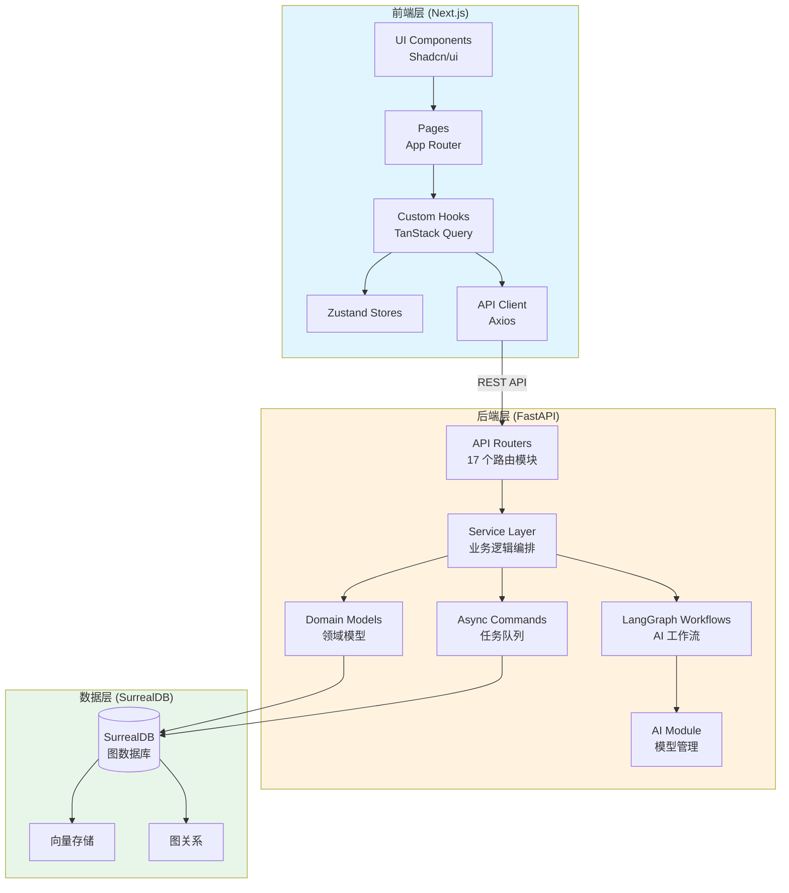

### 2.2 系统组件交互图

```mermaid
graph LR
    subgraph External["外部服务"]
        OpenAI[OpenAI API]
        Anthropic[Anthropic API]
        Google[Google AI]
        Groq[Groq]
        Ollama[Ollama]
        Others[其他 11+ 提供商]
    end

    subgraph Core["核心系统"]
        API[FastAPI Server<br/>:5055]
        Worker[Async Worker<br/>surreal-commands]
        Frontend[Next.js Server<br/>:8502]
        DB[(SurrealDB<br/>:8000)]
    end

    subgraph Storage["存储"]
        SQLite[(SQLite<br/>Checkpoint)]
        DataDir[/data 目录<br/>文件存储]
    end

    Frontend -->|HTTP| API
    API -->|WS/RPC| DB
    Worker -->|WS/RPC| DB
    API -->|AI Requests| OpenAI
    API -->|AI Requests| Anthropic
    API -->|AI Requests| Google
    API -->|AI Requests| Groq
    API -->|AI Requests| Ollama
    Worker -->|AI Requests| OpenAI
    Worker -->|AI Requests| Others
    API --> SQLite
    Worker --> DataDir

    style External fill:#fce4ec
    style Core fill:#e3f2fd
    style Storage fill:#f3e5f5
```

---

## 3. 后端架构详解

### 3.1 目录结构

```
open-notebook/
├── api/                          # FastAPI REST API 层
│   ├── main.py                   # 应用入口、中间件、生命周期
│   ├── routers/                  # 17 个路由模块
│   │   ├── notebooks.py
│   │   ├── sources.py
│   │   ├── notes.py
│   │   ├── chat.py
│   │   ├── podcasts.py
│   │   ├── models.py
│   │   ├── credentials.py
│   │   └── ...
│   ├── models.py                 # Pydantic 请求/响应模型
│   └── *_service.py              # 业务服务层
│
├── open_notebook/               # 核心业务逻辑
│   ├── ai/                      # AI 模型管理
│   │   ├── models.py            # ModelManager 工厂
│   │   ├── provision.py         # LangChain 模型供应
│   │   ├── key_provider.py      # API 密钥管理
│   │   └── connection_tester.py # 连接测试
│   │
│   ├── database/                # 数据库抽象层
│   │   ├── repository.py        # CRUD 操作封装
│   │   └── async_migrate.py     # 数据库迁移
│   │
│   ├── domain/                  # 领域模型
│   │   ├── base.py              # 基类：ObjectModel, RecordModel
│   │   ├── notebook.py          # Notebook, Source, Note, ChatSession
│   │   ├── credential.py        # Credential 凭证模型
│   │   └── content_settings.py  # 内容处理配置
│   │
│   ├── graphs/                  # LangGraph AI 工作流
│   │   ├── chat.py              # 对话工作流
│   │   ├── ask.py               # 多策略搜索工作流
│   │   ├── source.py            # 内容处理工作流
│   │   ├── source_chat.py       # 源文件对话工作流
│   │   ├── transformation.py    # 内容转换工作流
│   │   └── prompt.py            # 通用提示链
│   │
│   ├── podcasts/                # 播客生成
│   │   └── models.py            # EpisodeProfile, SpeakerProfile
│   │
│   └── utils/                   # 工具函数
│       ├── chunking.py          # 文本分块
│       ├── embedding.py         # 嵌入生成
│       ├── context_builder.py   # 上下文构建
│       ├── encryption.py        # Fernet 加密
│       └── error_classifier.py  # 错误分类
│
├── commands/                    # 异步任务命令
│   ├── podcast_commands.py      # 播客生成任务
│   ├── source_commands.py       # 源处理任务
│   └── embedding_commands.py    # 嵌入生成任务
│
├── prompts/                     # Jinja2 提示模板
│   ├── chat/
│   ├── ask/
│   ├── podcast/
│   └── transformation/
│
└── tests/                       # 测试套件
```

### 3.2 核心模块详解

#### 3.2.1 领域模型 (`open_notebook/domain/`)

**基类设计：**

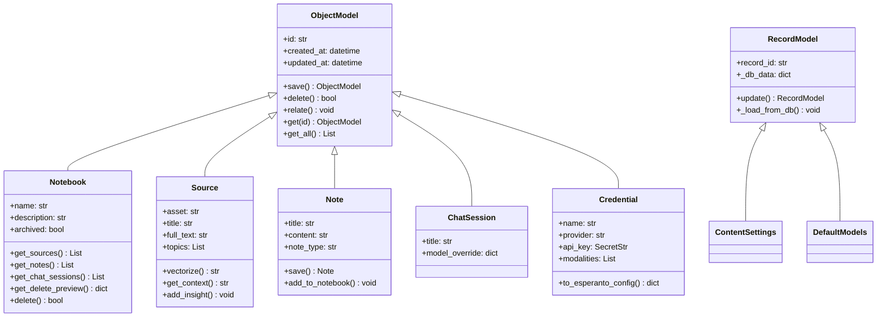

**关键领域对象说明：**

| 模型 | 职责 | 关键方法 |
|------|------|----------|
| `Notebook` | 研究项目容器 | `get_sources()`, `get_notes()`, `delete()` |
| `Source` | 内容项（文件/URL） | `vectorize()`, `get_context()`, `add_insight()` |
| `Note` | 笔记记录 | `save()`, `add_to_notebook()` |
| `ChatSession` | 对话会话 | 继承自 ObjectModel |
| `Credential` | AI 提供商凭证 | `to_esperanto_config()` |

#### 3.2.2 AI 模型管理 (`open_notebook/ai/`)

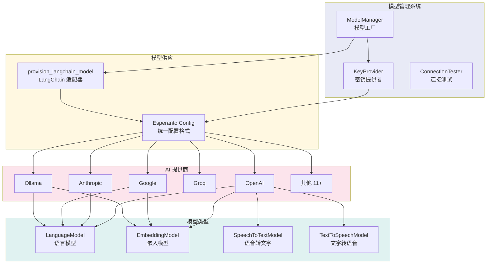

**ModelManager 核心逻辑：**

```python
# 伪代码展示核心逻辑
def get_model(model_id, **kwargs):
    # 1. 尝试从凭证获取配置
    if model.credential:
        config = model.credential.to_esperanto_config()
        return AIFactory.create(config)

    # 2. 回退到环境变量
    key_provider.provision_provider_keys(provider)
    return provision_from_env(provider, model_type)
```

#### 3.2.3 LangGraph 工作流 (`open_notebook/graphs/`)

**Chat 工作流状态机：**

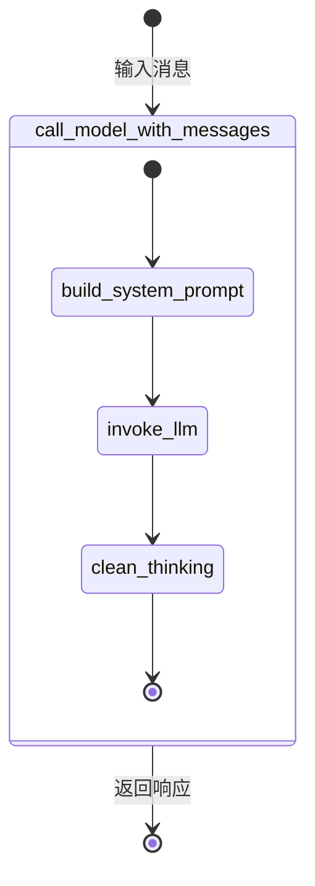

**Ask 多策略搜索工作流：**

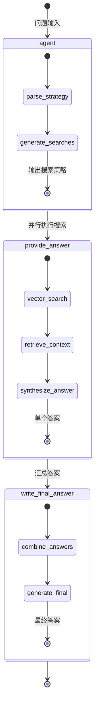

**Source 内容处理工作流：**

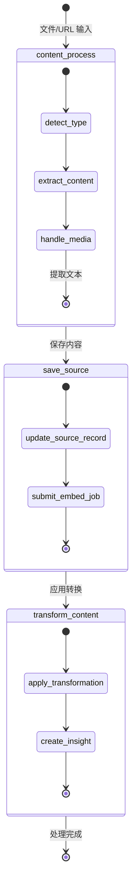

### 3.3 API 层结构

**路由模块总览：**

| 路由模块 | 路径前缀 | 主要功能 |
|----------|----------|----------|
| `auth` | `/api/auth` | 密码认证 |
| `notebooks` | `/api/notebooks` | 研究项目管理 |
| `sources` | `/api/sources` | 内容上传与处理 |
| `notes` | `/api/notes` | 笔记管理 |
| `chat` | `/api/chat` | AI 对话 |
| `ask` | `/api/ask` | 多策略搜索 |
| `podcasts` | `/api/podcasts` | 播客生成 |
| `models` | `/api/models` | 模型配置 |
| `credentials` | `/api/credentials` | 凭证管理 |
| `transformations` | `/api/transformations` | 内容转换 |
| `search` | `/api/search` | 搜索功能 |
| `embeddings` | `/api/embeddings` | 嵌入管理 |
| `commands` | `/api/commands` | 任务状态 |
| `content_settings` | `/api/content-settings` | 内容设置 |
| `default_prompts` | `/api/default-prompts` | 默认提示 |
| `episode_profiles` | `/api/episode-profiles` | 播客配置 |
| `insights` | `/api/insights` | 洞察管理 |

### 3.4 数据流时序图

**聊天请求处理流程：**

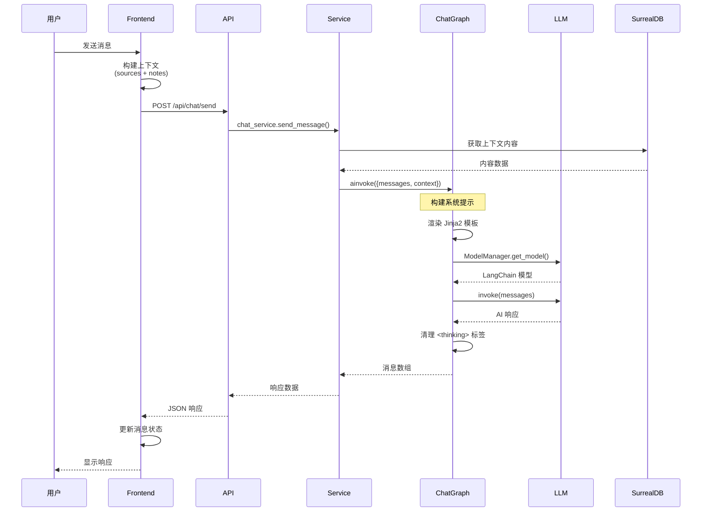

**源文件处理流程：**

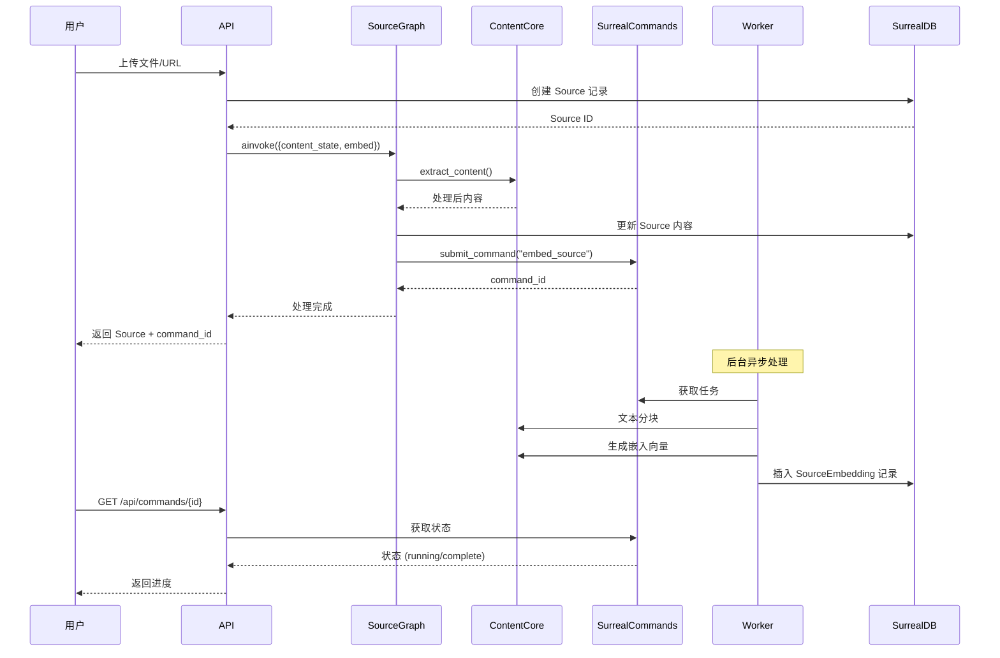

---

## 4. 前端架构详解

### 4.1 Next.js App Router 结构

```
frontend/src/app/
├── (auth)/                       # 认证路由组
│   └── login/
│       └── page.tsx
│
├── (dashboard)/                  # 受保护路由组
│   ├── advanced/                 # 高级功能
│   ├── notebooks/                # 研究项目管理
│   │   ├── page.tsx             # 列表页
│   │   ├── [id]/                # 详情页
│   │   │   ├── page.tsx
│   │   │   └── components/
│   │   └── components/
│   ├── podcasts/                 # 播客管理
│   ├── search/                   # 搜索界面
│   ├── settings/                 # 设置页面
│   │   ├── api-keys/
│   │   ├── models/
│   │   └── credentials/
│   ├── sources/                  # 源文件管理
│   └── transformations/          # 转换管理
│
├── config/
│   └── route.ts                 # 运行时配置
├── layout.tsx                   # 根布局
└── page.tsx                     # 首页
```

### 4.2 状态管理架构

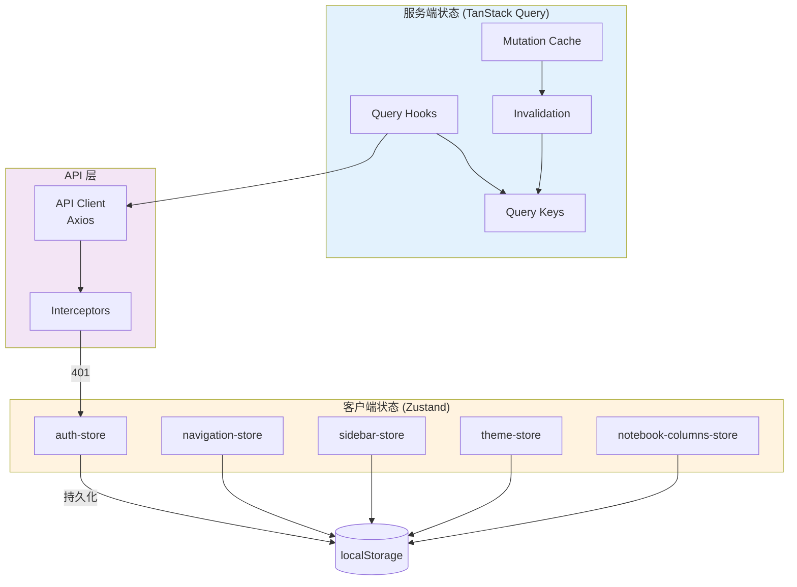

### 4.3 核心组件组织

```mermaid
graph LR
    subgraph Pages["页面层"]
        NP[notebooks/page.tsx]
        NDP[notebooks/[id]/page.tsx]
        SP[sources/page.tsx]
        CP[chat/page.tsx]
    end

    subgraph Features["功能组件层"]
        NCL[NotebookCard]
        SCL[SourceColumn]
        CCL[ChatColumn]
        NCL2[NotesColumn]
        SU[SourceUploader]
    end

    subgraph UI["UI 组件层"]
        B[Button]
        D[Dialog]
        I[Input]
        TA[Textarea]
        S[Select]
        C[Card]
    end

    NP --> NCL
    NDP --> SCL
    NDP --> CCL
    NDP --> NCL2
    SP --> SU

    NCL --> C
    SCL --> C
    SU --> D
    SU --> I
    CCL --> TA
    CCL --> B

    style Pages fill:#e8f5e9
    style Features fill:#fff8e1
    style UI fill:#fce4ec
```

### 4.4 API 集成方式

**API 客户端配置：**

```typescript
// 核心配置 (伪代码)
const apiClient = axios.create({
    timeout: 600000, // 10 分钟超时
});

// 请求拦截器
apiClient.interceptors.request.use((config) => {
    config.baseURL = await getApiUrl();  // 运行时配置
    const auth = localStorage.getItem('auth-storage');
    if (auth?.token) {
        config.headers.Authorization = `Bearer ${token}`;
    }
    return config;
});

// 响应拦截器
apiClient.interceptors.response.use(
    (response) => response,
    (error) => {
        if (error.response?.status === 401) {
            useAuthStore.getState().logout();
            router.push('/login');
        }
        return Promise.reject(error);
    }
);
```

### 4.5 国际化支持

**支持语言：**

| 语言代码 | 语言名称 |
|----------|----------|
| `en-US` | English (US) |
| `pt-BR` | Português (BR) |
| `fr-FR` | Français |
| `it-IT` | Italiano |
| `ja-JP` | 日本語 |
| `ru-RU` | Русский |
| `zh-CN` | 简体中文 |
| `zh-TW` | 繁體中文 |

---

## 5. 数据库设计

### 5.1 SurrealDB 图数据库架构

SurrealDB 是一个多模型数据库，支持文档、图和向量存储。Open Notebook 利用其全部三种能力：

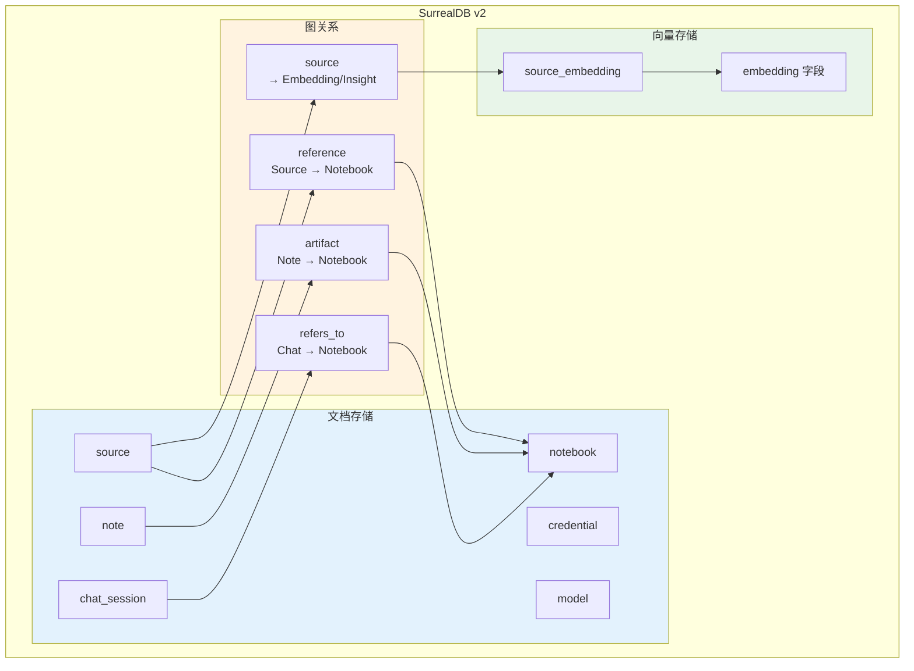

### 5.2 核心表结构 ER 图

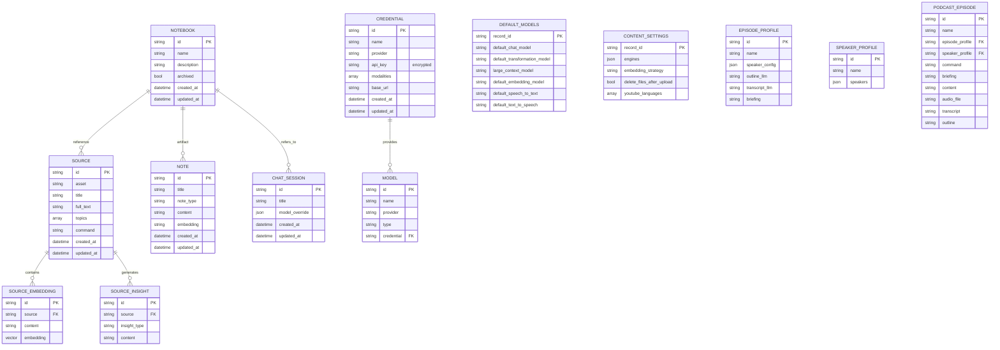

### 5.3 向量搜索实现

**SurrealQL 向量搜索函数：**

```sql
-- 向量搜索存储过程
DEFINE FUNCTION fn::vector_search(
    $embed array,
    $results int,
    $source bool,
    $note bool,
    $minimum_score float
) {
    -- 搜索 Source 嵌入
    IF $source {
        LET $source_results = SELECT
            id,
            source,
            content,
            vector::similarity::cosine(embedding, $embed) AS score
        FROM source_embedding
        WHERE vector::similarity::cosine(embedding, $embed) >= $minimum_score
        ORDER BY score DESC
        LIMIT $results;

        RETURN $source_results;
    }

    -- 搜索 Note 嵌入
    IF $note {
        LET $note_results = SELECT
            id,
            content,
            vector::similarity::cosine(embedding, $embed) AS score
        FROM note
        WHERE embedding IS NOT NONE
        AND vector::similarity::cosine(embedding, $embed) >= $minimum_score
        ORDER BY score DESC
        LIMIT $results;

        RETURN $note_results;
    }
}
```

---

## 6. 关键设计模式

### 6.1 仓库模式 (Repository Pattern)

**数据库抽象层：**

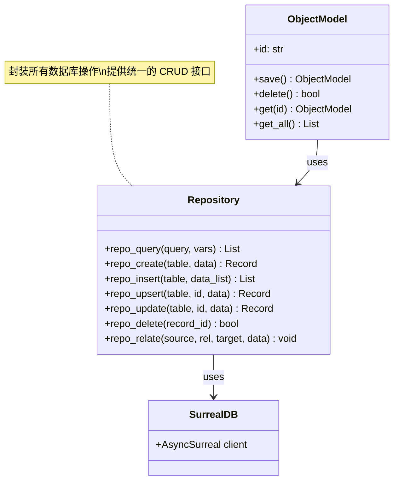

### 6.2 工厂模式 (Factory Pattern)

**模型工厂：**

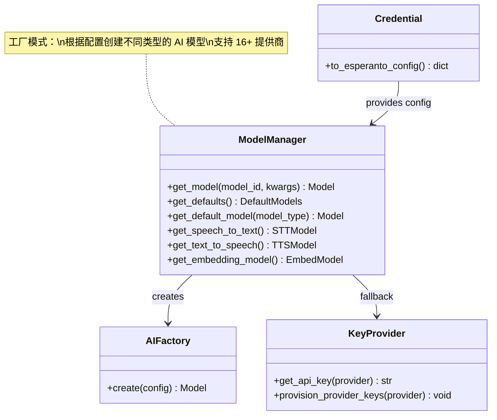

### 6.3 状态机模式 (State Machine Pattern)

**LangGraph 工作流状态机：**

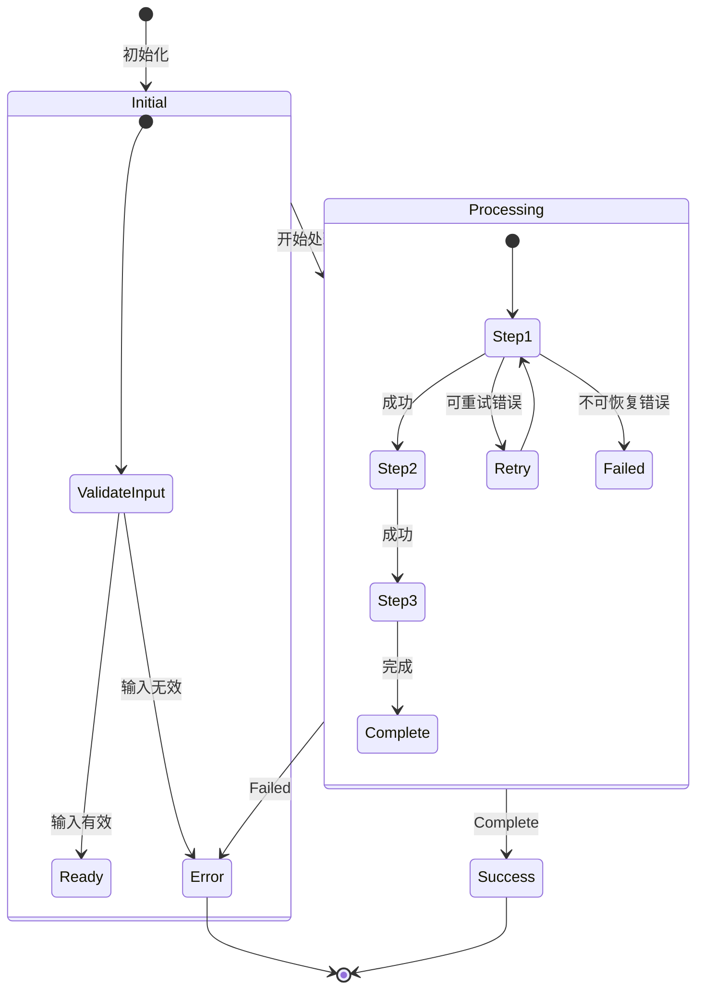

### 6.4 策略模式 (Strategy Pattern)

**多 AI 提供商策略：**

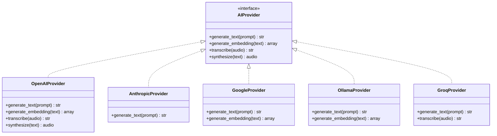

### 6.5 命令模式 (Command Pattern)

**异步任务队列：**

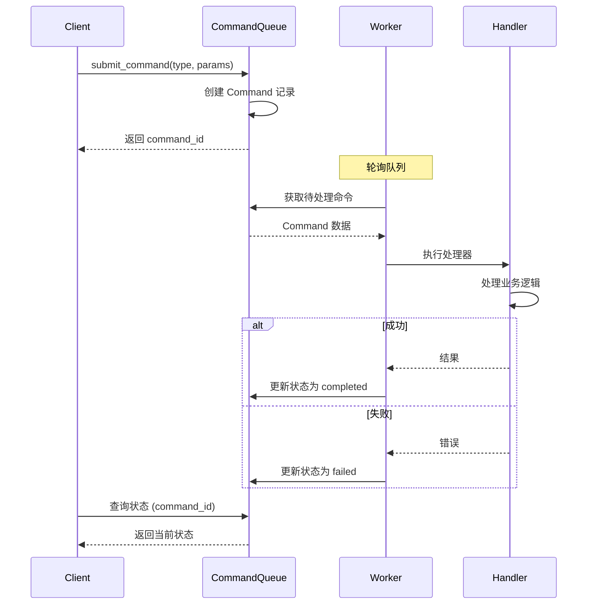

---

## 7. 部署架构

### 7.1 Docker 多容器部署

```mermaid
graph TB
    subgraph DockerHost["Docker Host"]
        subgraph Container1["open_notebook 容器"]
            API[FastAPI<br/>:5055]
            FE[Next.js<br/>:8502]
            WKR[Worker]
            SUP[Supervisord]
        end

        subgraph Container2["surrealdb 容器"]
            SDB[SurrealDB<br/>:8000]
        end

        VOL1[/notebook_data<br/>应用数据]
        VOL2[/surreal_data<br/>数据库文件]
    end

    SUP --> API
    SUP --> FE
    SUP --> WKR

    API --> SDB
    WKR --> SDB
    FE --> API

    Container1 --> VOL1
    Container2 --> VOL2

    USER((用户)) -->|HTTP :8502| FE
    FE -->|API 调用| API

    style Container1 fill:#e3f2fd
    style Container2 fill:#e8f5e9
    style DockerHost fill:#fafafa
```

### 7.2 Supervisord 进程管理

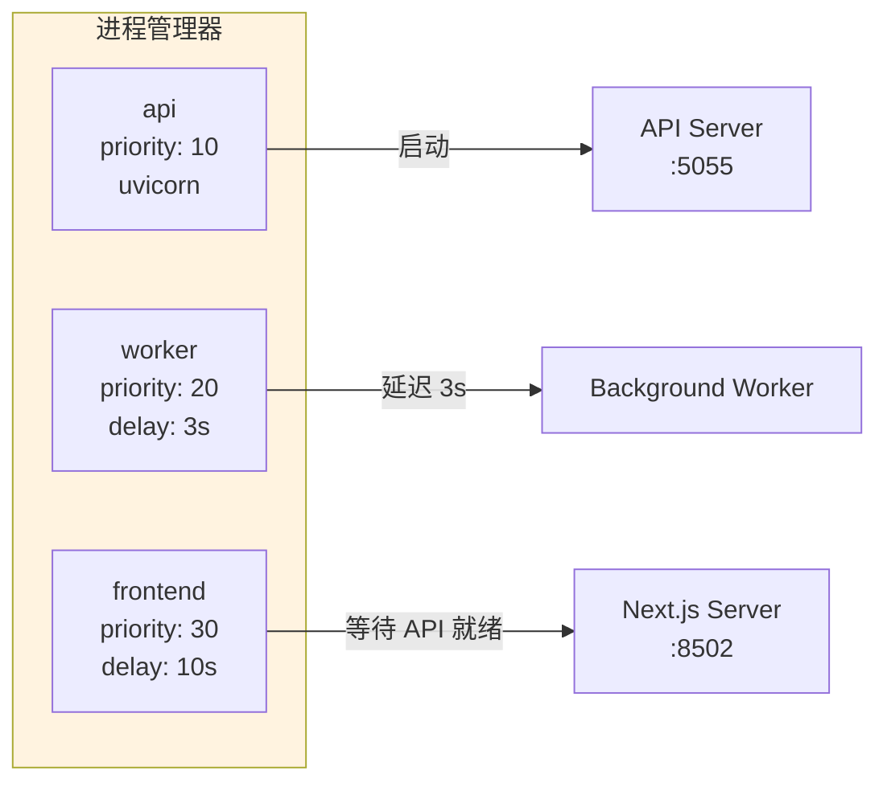

### 7.3 部署流程图

```mermaid
flowchart TD
    A[开始部署] --> B[拉取镜像]
    B --> C{配置检查}

    C -->|缺少加密密钥| D[设置 OPEN_NOTEBOOK_ENCRYPTION_KEY]
    D --> C

    C -->|配置完整| E[docker-compose up]

    E --> F[启动 SurrealDB]
    F --> G[启动 Open Notebook]

    G --> H[运行数据库迁移]
    H --> I[启动 API 服务]

    I --> J[启动 Worker]
    J --> K[等待 API 就绪]

    K --> L[启动 Frontend]
    L --> M[服务就绪]

    M --> N{健康检查}

    N -->|失败| O[检查日志]
    O --> C

    N -->|成功| P[部署完成]

    style A fill:#e8f5e9
    style P fill:#c8e6c9
    style D fill:#ffcdd2
    style O fill:#fff3e0
```

---

## 8. 安全与性能考量

### 8.1 认证机制

```mermaid
sequenceDiagram
    participant U as 用户
    participant F as Frontend
    participant A as API
    participant M as Middleware
    participant D as Database

    U->>F: 访问受保护页面
    F->>F: 检查 auth-store

    alt 未认证
        F->>F: 重定向到 /login
        U->>F: 输入密码
        F->>A: POST /api/auth/login
        A->>D: 验证密码
        D-->>A: 验证结果
        A-->>F: 返回 token
        F->>F: 存储 token 到 localStorage
    end

    F->>A: 请求 + Bearer token
    A->>M: PasswordAuthMiddleware
    M->>M: 验证 token
    alt token 有效
        M->>A: 继续处理请求
        A-->>F: 返回响应
    else token 无效
        M-->>F: 401 Unauthorized
        F->>F: 清除认证状态
        F->>F: 重定向到 /login
    end
```

### 8.2 API 密钥加密

```mermaid
graph LR
    subgraph Encryption["加密流程"]
        PT[明文 API Key]
        FK[Fernet Key<br/>OPEN_NOTEBOOK_ENCRYPTION_KEY]
        CT[密文]
    end

    subgraph Storage["存储"]
        DB[(SurrealDB)]
    end

    PT -->|Fernet 加密| CT
    CT -->|存储| DB
    DB -->|读取| CT
    CT -->|Fernet 解密| PT

    style Encryption fill:#fce4ec
    style Storage fill:#e8f5e9
```

### 8.3 性能优化策略

| 优化策略 | 实现方式 | 效果 |
|----------|----------|------|
| **异步处理** | 所有 I/O 操作使用 async/await | 高并发处理能力 |
| **连接池** | SurrealDB 连接复用 | 减少连接开销 |
| **向量索引** | SurrealDB 内置向量索引 | 快速语义搜索 |
| **缓存** | TanStack Query 客户端缓存 | 减少重复请求 |
| **分块处理** | 大文本分块嵌入 | 支持大文档处理 |
| **后台任务** | surreal-commands 异步队列 | 不阻塞用户操作 |
| **懒加载** | 前端组件按需加载 | 减少初始加载时间 |

### 8.4 监控与日志

**日志级别配置：**

```python
# 关键日志配置
LOGGING = {
    "version": 1,
    "disable_existing_loggers": False,
    "formatters": {
        "default": {
            "format": "%(asctime)s - %(name)s - %(levelname)s - %(message)s"
        }
    },
    "handlers": {
        "console": {
            "class": "logging.StreamHandler",
            "formatter": "default"
        }
    },
    "loggers": {
        "open_notebook": {"level": "INFO"},
        "surreal_commands": {"level": "DEBUG"},  # 事务冲突日志
        "httpx": {"level": "WARNING"},
        "httpcore": {"level": "WARNING"}
    }
}
```

---

## 9. 附录

### 9.1 关键文件路径表

#### 后端核心文件

| 文件路径 | 功能描述 |
|----------|----------|
| `api/main.py` | FastAPI 应用入口，中间件配置 |
| `open_notebook/domain/notebook.py` | 核心领域模型定义 |
| `open_notebook/domain/credential.py` | 凭证模型与加密 |
| `open_notebook/ai/models.py` | 模型管理器工厂 |
| `open_notebook/ai/provision.py` | LangChain 模型供应 |
| `open_notebook/database/repository.py` | 数据库 CRUD 封装 |
| `open_notebook/graphs/chat.py` | 对话工作流 |
| `open_notebook/graphs/ask.py` | 多策略搜索工作流 |
| `open_notebook/graphs/source.py` | 内容处理工作流 |
| `open_notebook/utils/encryption.py` | Fernet 加密工具 |
| `open_notebook/utils/error_classifier.py` | 错误分类器 |

#### 前端核心文件

| 文件路径 | 功能描述 |
|----------|----------|
| `frontend/src/app/layout.tsx` | 根布局 |
| `frontend/src/lib/api/client.ts` | API 客户端配置 |
| `frontend/src/lib/stores/auth-store.ts` | 认证状态管理 |
| `frontend/src/lib/hooks/useNotebookChat.ts` | 聊天功能 Hook |
| `frontend/src/lib/hooks/useAsk.ts` | SSE 流式 Hook |

#### 配置文件

| 文件路径 | 功能描述 |
|----------|----------|
| `docker-compose.yml` | Docker 容器编排 |
| `Dockerfile` | 多阶段构建配置 |
| `supervisord.conf` | 进程管理配置 |
| `pyproject.toml` | Python 依赖管理 |
| `frontend/package.json` | 前端依赖管理 |
| `.env.example` | 环境变量示例 |

### 9.2 常用命令

#### 开发环境

```bash
# 启动开发服务器
docker-compose up -d

# 查看日志
docker-compose logs -f open_notebook

# 进入容器
docker-compose exec open_notebook bash

# 运行测试
uv run pytest

# 数据库迁移
uv run python -m open_notebook.database.migrate
```

#### 生产部署

```bash
# 构建镜像
docker build -t open-notebook:latest .

# 启动服务
docker-compose -f docker-compose.yml up -d

# 健康检查
curl http://localhost:5055/health
curl http://localhost:8502

# 备份数据
docker-compose exec surrealdb surreal export -u root -p root file://backup.surql
```

### 9.3 环境变量配置

```bash
# 必需配置
OPEN_NOTEBOOK_ENCRYPTION_KEY=your-fernet-key-here

# 数据库配置 (默认值适用于 docker-compose)
SURREAL_URL=ws://surrealdb:8000/rpc
SURREAL_USER=root
SURREAL_PASSWORD=root
SURREAL_NAMESPACE=open_notebook
SURREAL_DATABASE=open_notebook

# 可选 AI 提供商 (也可通过 UI 配置)
OPENAI_API_KEY=sk-xxx
ANTHROPIC_API_KEY=sk-ant-xxx
GOOGLE_API_KEY=xxx
GROQ_API_KEY=gsk_xxx
OLLAMA_BASE_URL=http://localhost:11434

# 高级配置
API_URL=https://your-domain.com
CHUNK_SIZE=1000
CHUNK_OVERLAP=200
BASIC_AUTH_USERNAME=admin
BASIC_AUTH_PASSWORD=secret
```

### 9.4 错误处理层次

```mermaid
graph TD
    subgraph Exceptions["自定义异常层次"]
        ONB[OpenNotebookError<br/>基础异常]
        NF[NotFoundError<br/>404]
        II[InvalidInputError<br/>400]
        AU[AuthenticationError<br/>401]
        RL[RateLimitError<br/>429]
        CF[ConfigurationError<br/>422]
        NT[NetworkError<br/>502]
        ES[ExternalServiceError<br/>502]
    end

    ONB --> NF
    ONB --> II
    ONB --> AU
    ONB --> RL
    ONB --> CF
    ONB --> NT
    ONB --> ES

    style Exceptions fill:#fff3e0
```

---

## 总结

Open Notebook 是一个设计精良的开源 AI 研究助手，其架构具有以下显著特点：

1. **清晰的三层架构**：前端 (Next.js) → 后端 (FastAPI) → 数据库 (SurrealDB)，职责分明
2. **多提供商 AI 集成**：通过 Esperanto 库统一 16+ AI 服务商接口
3. **LangGraph 工作流**：使用状态机模式处理复杂 AI 操作
4. **异步优先设计**：全面使用 async/await，高并发处理能力
5. **灵活的凭证系统**：支持数据库存储和环境变量两种配置方式
6. **向量搜索能力**：利用 SurrealDB 内置向量索引实现语义搜索
7. **完善的错误处理**：自定义异常层次，用户友好的错误信息
8. **国际化支持**：8 种语言的本地化支持

该项目是学习现代 AI 应用架构的优秀范例，特别是在多 AI 提供商集成、异步任务处理和向量搜索等方面具有很高的参考价值。
